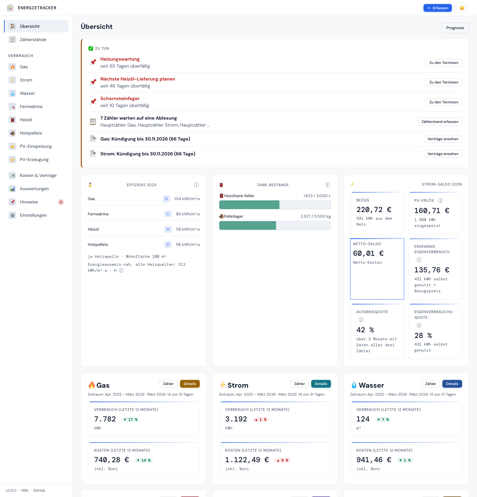
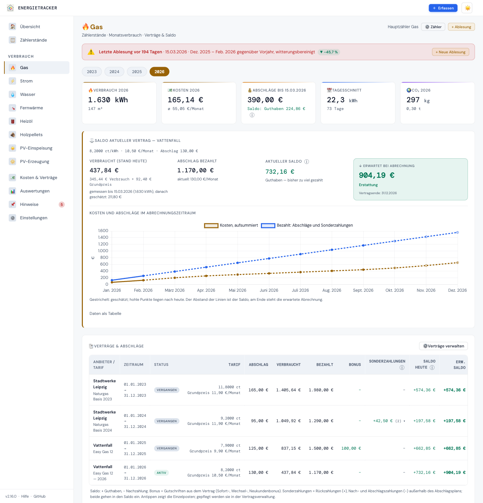
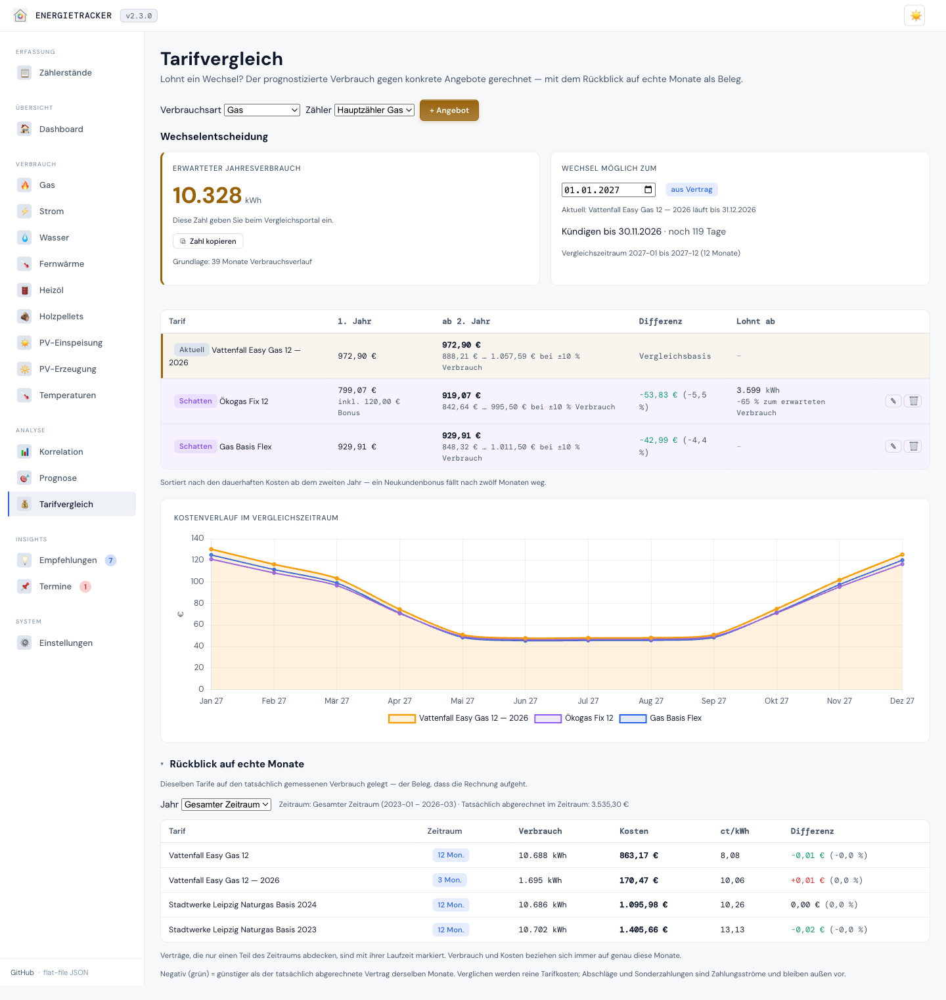

<p align="center"></p>
<p align="center"><a href="README.md">English</a> · <b>Deutsch</b></p>

# Energietracker

**Home Assistant misst — der Energietracker rechnet ab.** Zählerstände rein,
Antworten raus: Bekomme ich Geld zurück? Stimmt die Gasrechnung? Lohnt sich der
Wechsel? Habe ich mehr verbraucht, oder war es nur kälter?

**[▶ Live-Demo ansehen](https://bingerminger.github.io/energietracker/)** — ein
Beispielhaushalt, bis heute fortgeschrieben, in sieben Sprachen, ohne Installation.

[](https://github.com/Bingerminger/energietracker/actions/workflows/ci.yml)
[](https://github.com/Bingerminger/energietracker/actions/workflows/docker-publish.yml)
[](CHANGELOG.md)
[](LICENSE)
[](composer.json)
[](composer.json)
[](tests/)
[](public/locales/)
[](docs/einstieg/funktionen.md)
[](docker-compose.yml)

<p align="center"></p>

## Was er beantwortet

| Frage | Antwort in der App |
|---|---|
| Bekomme ich Geld zurück? | **Saldo** je Vertrag nach Kalender, erwartete Abrechnung und Abschlagsvorschlag — „Guthaben“ oder „Nachzahlung“ wie auf der Rechnung |
| Stimmt meine Jahresabrechnung? | **Rechnungsprüfung** für Gas, Strom, Wasser und Fernwärme: je Abschnitt nachgerechnet, gegen die Rechnung gehalten, das Ergebnis als Sonderzahlung gebucht |
| Soll ich wechseln? | **Wechselentscheidung** mit Kündigungsfrist, Kosten ab dem zweiten Jahr und Gewinnschwelle |
| Mehr verbraucht oder nur kälter? | **Wetterbereinigung** mit Heizgradtagen vom eigenen Standort und einem Heizmodell |
| Was kommt auf mich zu? | **Prognose** mit Unsicherheitsband und Kosten je Monat aus dem gültigen Tarif |
| Wie effizient ist das Haus? | **Effizienz** in kWh/m²·a und eine energieausweis-nahe Kennzahl; mit Wärmepumpe die Jahresarbeitszahl |
| Reicht die Vorauszahlung zur Miete? | **Mietverhältnis**: Heizung und Wasser gegen die Nebenkostenvorauszahlung, Fristen im Kalender, CO₂-Kosten mit dem Vermieter teilen |

Neun Verbrauchsarten: Gas, Strom, Wasser, Fernwärme, Heizöl und Pellets (mit
Tankbuch), PV-Einspeisung und PV-Erzeugung (Eigenverbrauch, Autarkie, Speicher)
und Heizwärme (Wärmemengenzähler oder monatliche Verbrauchsinfo). Dazu
Zählertausch, Subzähler und Gruppen — auch mit einem Vertrag für Hoch- und
Niedertarif —, Belege und Fotos der Zähler, Termine als Kalender-Abo,
Empfehlungen, PDF-Jahresbericht und eine Übersicht für Home Assistant — und eine
Hilfe in der App mit Glossar und ⓘ an jeder Kennzahl.
→ [Alle Funktionen](docs/einstieg/funktionen.md) ·
[Alle Ansichten mit Screenshots](docs/referenz/ansichten.md)

<p align="center"> </p>

## Für wen

- **Haushalte**, die ihre Jahresabrechnung verstehen und vorhersehen wollen —
  in der Mietwohnung wie im Eigenheim.
- **Home-Assistant-Nutzer**: Home Assistant pusht die Zählerstände, der
  Energietracker rechnet Verträge, Abschläge und Prognosen —
  [Anleitung](docs/anleitungen/home-assistant.md).
- **Tüftler**: offene REST-API, CSV und JSON-Backup, keine Datenbank.

| | Home Assistant (Energie) | Energietracker |
|---|---|---|
| Zählerstände | automatisch, in Echtzeit | von Hand, per CSV oder von Home Assistant |
| Kosten | ein Preis je Einheit | Vertrag mit Arbeits- und Grundpreis, Boni, Abschlägen, tagesgenauen Preiswechseln |
| Abrechnung | — | Saldo, erwartete Abrechnung, Rechnungsprüfung, Kündigungsfristen |
| Wetter | — | Heizgradtage vom Standort, Wetterbereinigung |
| Vorausschau | — | Kostenprognose fürs Jahr, Wechselentscheidung |

## Schnellstart

```bash
docker run -d --name energietracker -p 8080:80 \
  -v energietracker-data:/data \
  ghcr.io/bingerminger/energietracker:3.1.0
```

Dann <http://localhost:8080> öffnen. **„Mit Beispieldaten ausprobieren“** zeigt
sofort, wie alles aussieht; eigene Daten gehen dabei nicht verloren.

Ohne Docker genügt PHP ab 8.2: `git clone`, dann
`php -S 127.0.0.1:8080 router.php`. Für den Dauerbetrieb:
[Installation](docs/betrieb/installation.md) ·
[Docker, auch auf der Synology](docs/betrieb/docker.md) ·
[Apache und nginx](docs/betrieb/webserver.md) ·
[Auf dem Handy nutzen](docs/einstieg/handy.md).

> 🔐 Ohne Anmeldung kann jeder, der die App erreicht, alles lesen und ändern —
> im eigenen Heimnetz in Ordnung. Vor dem Zugriff von außen die Anmeldung
> einschalten: [Sicherheit & Netzbetrieb](docs/betrieb/sicherheit.md).

## Deine Daten

Alles bleibt auf deinem Server: keine Konten, keine Werbung, keine Telemetrie,
keine Datenbank — nur JSON-Dateien. Nach außen spricht die App nur mit
Open-Meteo: beim täglichen Wetterabgleich (übermittelt wird der auf rund 1 km
gerundete Standort, abschaltbar) und bei der Ortssuche, wenn du sie benutzt.
Dazu kommen zwei Wege, die du selbst einschaltest: dein eigener
Texterkennungsdienst im Heimnetz, wenn du ihn einträgst, und die
Börsenstrompreise für den Dynamik-Check, wenn du auf „Von SMARD laden“ tippst
(Bundesnetzagentur; dabei geht nichts von dir hinaus). Schriften und Chart.js
liegen im Repository.

## Hilfe und Dokumentation

- In der App: **Hilfe** unten in der Seitenleiste (am iPhone unter „Mehr“) mit
  ersten Schritten und Glossar, dazu ein ⓘ an jeder Kennzahl.
- [Erste Schritte](docs/einstieg/erste-schritte.md) ·
  [Fragen und Antworten](docs/einstieg/faq.md) ·
  [Jahresabrechnung eintragen und prüfen](docs/anleitungen/jahresabrechnung.md) ·
  [Fehlersuche](docs/betrieb/fehlersuche.md)
- Das ganze [Kompendium](docs/README.md): Einstieg · Anleitungen · Verstehen ·
  Referenz · Betrieb · Entwicklung — auf Deutsch und
  [Englisch](docs/en/README.md).
- Fragen, Wünsche und Fehler:
  [GitHub-Issues](https://github.com/Bingerminger/energietracker/issues).

## Länder und Annahmen

Die Oberfläche gibt es auf Deutsch, Englisch, Französisch, Italienisch,
Spanisch, Portugiesisch und Niederländisch; Länderprofile für Deutschland,
Österreich, die Schweiz, Frankreich, Italien, Spanien, Portugal, die
Niederlande und das Vereinigte Königreich setzen Währung, Formate, Zeitzone,
Wetterstandort, Heizgrenze, CO₂-Faktor und Gaseinheiten. Fachlich ist der
Energietracker in Deutschland zu Hause: Effizienzklassen nach GEG, CO₂-Faktoren
nach BAFA und Umweltbundesamt, Sonderkündigungsrecht nach EnWG. Anderswo rechnet
er ohne Klassen und sagt warum; Währungen rechnet er nicht um —
[Länderprofile](docs/verstehen/14-laenderprofile.md).

## Stand und Ausblick

**v3.1.0** ist die aktuelle Version — [CHANGELOG](CHANGELOG.md). Schnittstellen,
CSV-Formate und das Backup-Format ändern sich nur additiv; entfernt wird erst
mit einer neuen Hauptversion und nach Ankündigung. Mit 3.1.0 sind das
Mieter-Paket ([#15](https://github.com/Bingerminger/energietracker/issues/15))
und Verträge je Zählergruppe
([#17](https://github.com/Bingerminger/energietracker/issues/17)) da; was als
Nächstes kommt, steht in der [Roadmap](roadmap.md). Wer von einer privaten
v0.9.0 kommt:
[Migration](docs/anleitungen/migration-v090.md).

## Mitwirken

Pull Requests sind willkommen — Einrichtung, Tests und die Doku-Regeln stehen
in [CONTRIBUTING.de.md](CONTRIBUTING.de.md). Eine neue Sprache ist vor allem
Übersetzung — ein Katalog, ein Eintrag in `languages.json` und die
Schreibweise unter `format.*` —, dazu wenige Zeilen Code für Pluralregel und
Länderzuordnung; die Checkliste steht unter
[Übersetzen und Sprachen](docs/entwicklung/uebersetzen.md).
Sicherheitslücken bitte nicht öffentlich melden, sondern wie in
[SECURITY.md](SECURITY.md) beschrieben.

## Lizenz

Seit Version 3.0.0 steht der Energietracker unter der
[GNU AGPL v3.0 oder neuer](LICENSE) — nutzen, ändern, weitergeben; wer eine
veränderte Fassung als Netzdienst anbietet, legt auch deren Quellcode offen.
Für die eigene Installation ändert sich nichts. Versionen bis 2.16.0 bleiben
unter der MIT-Lizenz verfügbar, unter der sie erschienen sind.

Mitgeliefert werden [Chart.js](https://www.chartjs.org/) (MIT) und die
Schriften DM Sans und DM Mono (SIL Open Font License 1.1); die Wetterdaten
stammen von [Open-Meteo.com](https://open-meteo.com/) unter
[CC BY 4.0](https://creativecommons.org/licenses/by/4.0/) — Einzelheiten in
[CREDITS.md](CREDITS.md), Produktnamen in [TRADEMARKS.md](TRADEMARKS.md).
