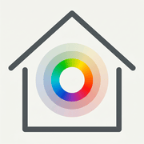
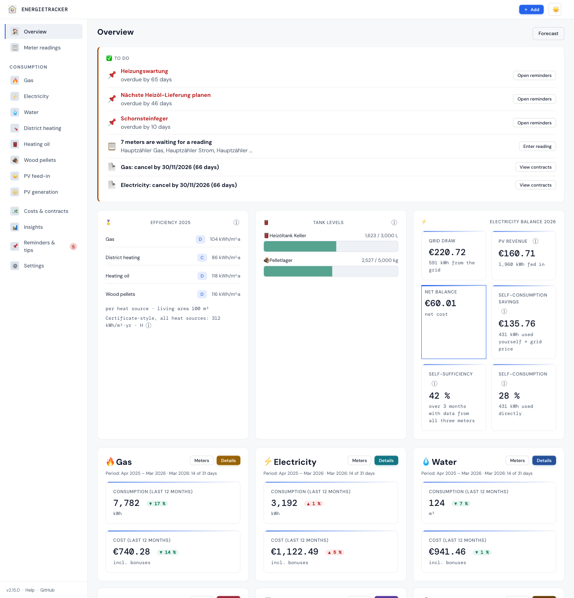
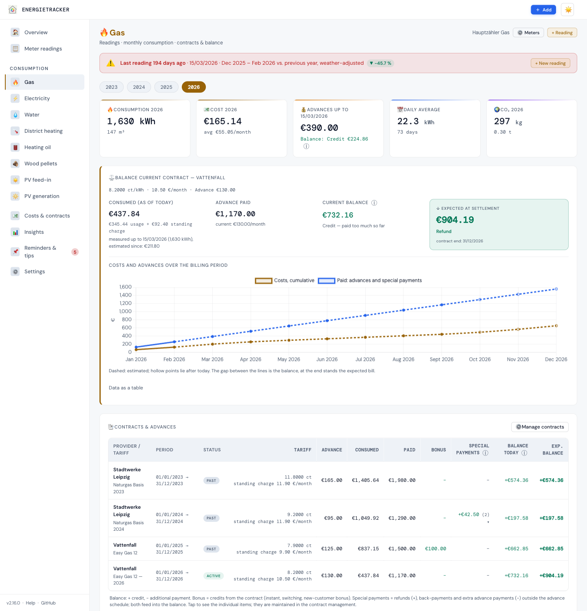
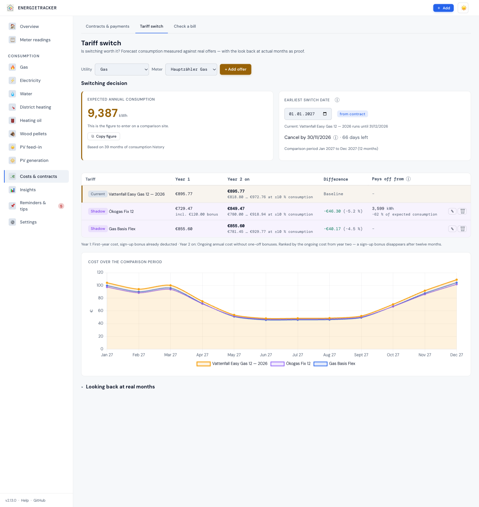

<p align="center"></p>
<p align="center"><b>English</b> · <a href="README.de.md">Deutsch</a></p>

# Energietracker

**Home Assistant measures — the Energietracker does the billing.** Meter
readings in, answers out: Will I get money back? Is my gas bill right? Is
switching worth it? Did I use more, or was it just colder?

**[▶ Try the live demo](https://bingerminger.github.io/energietracker/)** — a
sample household carried forward to today, in seven languages, nothing to install.

[](https://github.com/Bingerminger/energietracker/actions/workflows/ci.yml)
[](https://github.com/Bingerminger/energietracker/actions/workflows/docker-publish.yml)
[](CHANGELOG.md)
[](LICENSE)
[](composer.json)
[](composer.json)
[](tests/)
[](public/locales/)
[](docs/en/einstieg/funktionen.md)
[](docker-compose.yml)

<p align="center"></p>

## What it answers

| Question | Answer in the app |
|---|---|
| Will I get money back? | **Balance** per contract by calendar, the expected bill and a suggested advance — "credit" or "additional payment", as on the bill |
| Is my annual bill right? | **Bill check** for gas, electricity, water and district heating: recalculated per section, held against the bill, the result booked as a special payment |
| Should I switch? | **Switch decision** with notice period, cost from year two and break-even |
| Used more, or just colder? | **Weather adjustment** with heating degree days from your own location and a heating model |
| What lies ahead? | **Forecast** with an uncertainty band and the cost per month from the valid tariff |
| How efficient is the house? | **Efficiency** in kWh/m²·yr and a certificate-style figure; with a heat pump the seasonal performance factor |
| Does my rent prepayment cover it? | **Tenancy**: heating and water against the service charge prepayment, deadlines in the calendar, CO₂ costs shared with the landlord |

Nine utilities: gas, electricity, water, district heating, heating oil and
pellets (with a tank book), PV feed-in and PV generation (self-consumption,
self-sufficiency, storage) and heat (heat meter or monthly consumption
information). Plus meter swaps, sub-meters and groups — also with one contract
for peak and off-peak —, receipts and meter photos, reminders as a calendar
feed, recommendations, a PDF annual report and a summary for Home Assistant —
and help inside the app with a glossary and an ⓘ next to every key figure.
→ [All features](docs/en/einstieg/funktionen.md) ·
[All views with screenshots](docs/en/referenz/ansichten.md)

<p align="center"> </p>

## Who it is for

- **Households** that want to understand and foresee their annual bill — in a
  rented flat or their own house.
- **Home Assistant users**: Home Assistant pushes the readings, the
  Energietracker works out contracts, advances and forecasts —
  [guide](docs/en/anleitungen/home-assistant.md).
- **Tinkerers**: open REST API, CSV and JSON backup, no database.

| | Home Assistant (Energy) | Energietracker |
|---|---|---|
| Readings | automatic, real time | by hand, by CSV or from Home Assistant |
| Cost | one price per unit | a contract with unit price and standing charge, bonuses, advances, price changes to the day |
| Billing | — | balance, expected bill, bill check, notice deadlines |
| Weather | — | heating degree days from your location, weather adjustment |
| Looking ahead | — | cost forecast for the year, switch decision |

## Quick start

```bash
docker run -d --name energietracker -p 8080:80 \
  -v energietracker-data:/data \
  ghcr.io/bingerminger/energietracker:3.2.0
```

Then open <http://localhost:8080>. **"Try with sample data"** shows right away
what everything looks like; your own data is not lost.

Without Docker, PHP 8.2 or later is enough: `git clone`, then
`php -S 127.0.0.1:8080 router.php`. For permanent use:
[Installation](docs/en/betrieb/installation.md) ·
[Docker, also on Synology](docs/en/betrieb/docker.md) ·
[Apache and nginx](docs/en/betrieb/webserver.md) ·
[Use on your phone](docs/en/einstieg/handy.md).

> 🔐 Without sign-in, anyone who can reach the app can read and change
> everything — fine on your own home network. Before allowing access from
> outside, switch sign-in on: [Security & network operation](docs/en/betrieb/sicherheit.md).

## Your data

Everything stays on your server: no accounts, no ads, no telemetry, no
database — just JSON files. The app talks only to Open-Meteo: for the daily
weather sync (it sends your location rounded to about 1 km, and can be switched
off) and the place search, if you use it. Three more paths are yours to switch
on: your own text recognition service in your home network, if you set one up,
your evcc in your home network, when you fetch its charging sessions, and
wholesale electricity prices for the dynamic tariff check, when you tap
“Load from SMARD” (Federal Network Agency; nothing of yours is sent). Fonts and
Chart.js ship with the repository.

## Help and documentation

- In the app: **Help** at the bottom of the sidebar (on the iPhone under
  "More") with first steps and a glossary, plus an ⓘ next to every key figure.
- [Getting started](docs/en/einstieg/erste-schritte.md) ·
  [Questions and answers](docs/en/einstieg/faq.md) ·
  [Enter and check the annual bill](docs/en/anleitungen/jahresabrechnung.md) ·
  [Troubleshooting](docs/en/betrieb/fehlersuche.md)
- The full [compendium](docs/en/README.md): getting started · guides ·
  concepts · reference · operation · development — in English and
  [German](docs/README.md).
- Questions, wishes and bugs:
  [GitHub issues](https://github.com/Bingerminger/energietracker/issues).

## Countries and assumptions

The interface is available in German, English, French, Italian, Spanish,
Portuguese and Dutch; country profiles for Germany, Austria, Switzerland,
France, Italy, Spain, Portugal, the Netherlands and the United Kingdom set
currency, formats, time zone, weather location, heating limit, CO₂ factor and
gas units. In substance the Energietracker is at home in Germany: efficiency
classes per the GModG (formerly GEG), CO₂ factors from BAFA and the German
Environment Agency,
the special right to cancel under the EnWG. Elsewhere it calculates without
classes and says why; it does not convert currencies —
[Country profiles](docs/en/verstehen/14-laenderprofile.md).

## Status and outlook

**v3.2.0** is the current version — [CHANGELOG](CHANGELOG.md) (in German).
APIs, CSV formats and the backup format change only additively; anything is
removed only with a new major version and after notice. 3.2.0 makes the start
easy without taking anything from experienced users: a setup assistant with
example households, three experience levels, animated explainers with your own
data, several people per household and charging sessions from evcc. What comes
next is in the [roadmap](roadmap.md) (in German). Coming from a
private v0.9.0:
[migration](docs/en/anleitungen/migration-v090.md).

## Contributing

Pull requests are welcome — setup, tests and the documentation rules are in
[CONTRIBUTING.md](CONTRIBUTING.md). A new language is mostly translation — a
catalogue, an entry in `languages.json` and its notation under `format.*` — plus
a few lines of code for the plural rule and the country assignment; the
checklist is in [Translating and languages](docs/en/entwicklung/uebersetzen.md).
Please do not report security issues publicly, but as described in
[SECURITY.md](SECURITY.md).

## Licence

Since version 3.0.0 the Energietracker is under the
[GNU AGPL v3.0 or later](LICENSE) — use, change, share; whoever offers a
modified version as a network service shares its source code too. For your own
installation nothing changes. Versions up to 2.16.0 remain available under the
MIT licence they were published with.

It ships [Chart.js](https://www.chartjs.org/) (MIT) and the fonts DM Sans and
DM Mono (SIL Open Font License 1.1); weather data comes from
[Open-Meteo.com](https://open-meteo.com/) under
[CC BY 4.0](https://creativecommons.org/licenses/by/4.0/) — details in
[CREDITS.md](CREDITS.md), product names in [TRADEMARKS.md](TRADEMARKS.md).
