# UI reference — all views

**English** · [Deutsch](../../referenz/ansichten.md)

[← Compendium index](../README.md)

> **Real screenshots.** The following images are **actual screen captures** of the
> running app with the bundled [demo dataset](../../../demo-data/) (light theme; base
> set v1.9.2, sign-in, security card and the capture question v2.6.0, navigation
> v2.11.0, capture, weather data, settings and import preview v2.12.0, help,
> explanations and PV view v2.13.0, overview, gas and analysis v2.15.0). Since
> v2.14.0 the views show the
> English interface; dialogs, the sign-in and the iPhone captures are still
> German. How the images are made: [Screenshots](../entwicklung/screenshots.md).

The app is a single-page application. Since **v2.11.0** its navigation follows
the users' questions: seven areas instead of 17 entries.

| Area | Pages |
|---|---|
| Overview | "To do", key figures, tanks and recommendations at a glance |
| Meter readings | all meters in one go |
| Consumption | one page per active utility |
| Costs & contracts | Contracts & payments · Tariff switch · Check a bill |
| Insights | Analysis · Forecast · Annual report |
| Reminders & tips | Reminders & maintenance · Recommendations (one count in the sidebar) |
| Settings | General · Household & building · Utilities & billing · Weather data · Data · Integrations · Access · Expert · System |

The pages of an area appear as **tabs** above the view. Menu name and page title
match, and the browser tab names the view. Earlier addresses (`#/tariffs`,
`#/temperatures` …) keep working. The sidebar shows only the *active* utilities
(Settings → Utilities & billing → Active utilities) and follows a change
immediately.

**Mac:** sidebar on the left. The top bar holds **＋ Add**: meter readings,
delivery and tank reading for heating oil and pellets, reminder. Next to it the
appearance switch (system, light, dark).

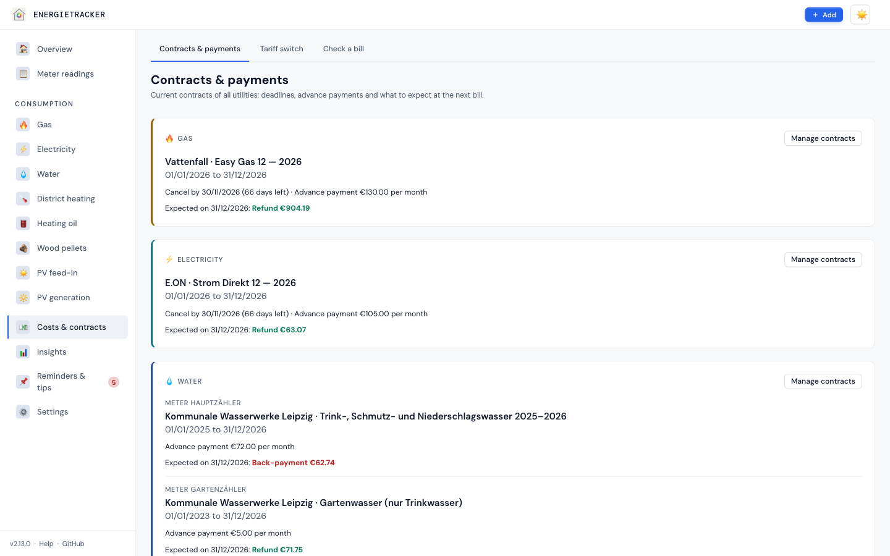

**iPhone:** a tab bar at the bottom, in thumb reach: Overview, Consumption,
**＋ Add**, Costs, More.

- "More" opens the sidebar as a menu.
- The utilities appear as tabs on their page.
- Dialogs slide up as a sheet; header and footer stay in place.
- The back gesture closes a dialog instead of leaving the page.
- Touch targets are at least 44 px, inputs 16 px, so Safari no longer zooms
  on every focus.
- As a home-screen app the page extends under the clock and home indicator.

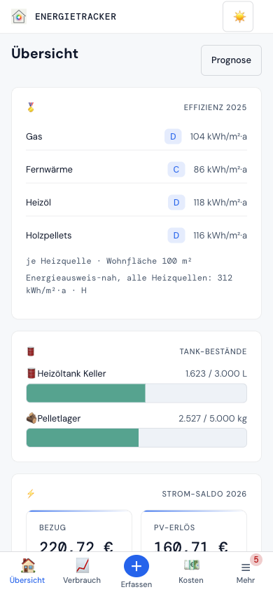 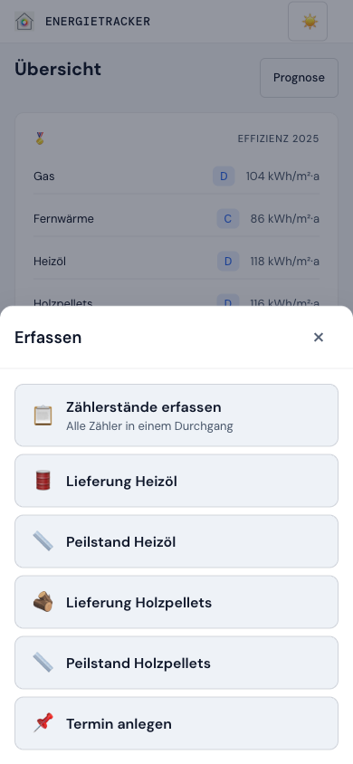

**Explanations on tap (v2.13.0):** technical terms carry an **ⓘ** — heating
degree days, R², moving average, balance, baseline date, break-even, notice deadline
and more. Tapping or clicking opens the explanation: on the Mac as a bubble
below the term, on the iPhone as a sheet above the tab bar. "All terms" leads
to the help (§15); Escape or a tap elsewhere closes it. Up to
v2.12 these explanations lived in tooltips, which the iPhone does not have.
Where an explanation belongs to a single row — why a reading carries "CHECK",
what "FULL" means on a delivery — the ⓘ next to it opens exactly that one.

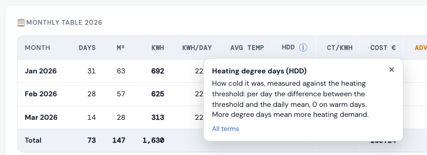 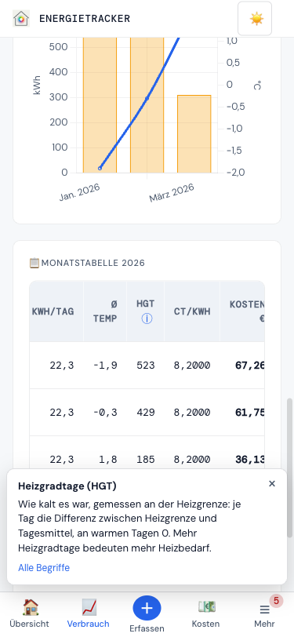

The **help** sits in the footer of the sidebar, on the iPhone under "More".

**Charts (v2.15.0)** follow the same rules everywhere:

- **Partial months** — the first month after installation, the current one, a
  month up to the last reading — appear pale (bars) or as a hollow point at the
  end of a dashed line. The tooltip names the recorded days ("Partial month: 14
  of 31 days recorded"), tables show "14 / 31". Trends and the seasonal profile
  leave them out.
- **Trends** compare the same full months a year earlier. The banner of a
  heating utility is weather-adjusted by the heating model when every month
  involved has a value; the cards on the overview compare measured values. Up to
  v2.14 the last three stood against the three before — heating season against
  summer.
- **Colours** are those of the utility, darkened in the light theme (at least
  3:1 on the card); open charts recolour at once when you switch.
- **Data as a table:** below every chart without a table of its own the numbers
  can be expanded. Screen readers hear a short description with period, total
  and the highest and lowest month.
- **Year and meter in the address:** `#/utility/gas?year=2025` (with several
  meters `&meter=…`) opens exactly that selection — to share, as a bookmark,
  after reloading. Each utility remembers its year.

---

## 1. Overview (dashboard)

The entry point. 12-month figures per utility, efficiency class **per heat
source**, tank levels (oil/pellets), **electricity balance & self-sufficiency** for
PV, the combined consumption history (as many months as set under *Months on
dashboard* in the settings, since v2.9.0) and due appointments. Since v2.10.0 the
**certificate-style figure** appears below the efficiency (with several heat
sources one for all of them together, ⓘ with the reference area and the
months); an incomplete year gets no class but a note instead. The PV card
additionally shows the **self-consumption savings** and, as long as fewer than
twelve months have data from all three meters, over how many months the rates
are calculated. Since
v2.7.0 the efficiency class appears only in countries with a scale (Germany);
elsewhere the card shows kWh/m²·yr and gives the reason ([country profiles](../verstehen/14-laenderprofile.md)).
Since v2.11.0 a due reminder reads "overdue by 65 days" instead of "now". The
header action "Temperatures" is gone; "Add" sits globally in the top bar or
the tab bar.

**"To do" (v2.12.0)** sits at the top: overdue and due reminders, meters whose
last reading is older than set under Settings → General → *Warn after*, notice
deadlines and tanks — each with a button that goes there. With up to two due
meters the entry jumps straight to that meter's card in the capture view; more
are combined into one line ("7 meters are waiting for a reading"). Each line
is tappable as a whole, on the iPhone with "›" instead of a button. The reminder card further
down and the "Active meters" tile per utility are gone; key-figure tiles no
longer lift on hover, because they are not clickable.

**Without data (v2.13.0)** a welcome replaces the empty tiles: what the
Energietracker does, the first steps with ticks taken from the data (location,
first and second reading, contract, optionally Home Assistant) and **"Try with
sample data"**. The app saves the current state first; the way
back is Settings → Data → Snapshots.

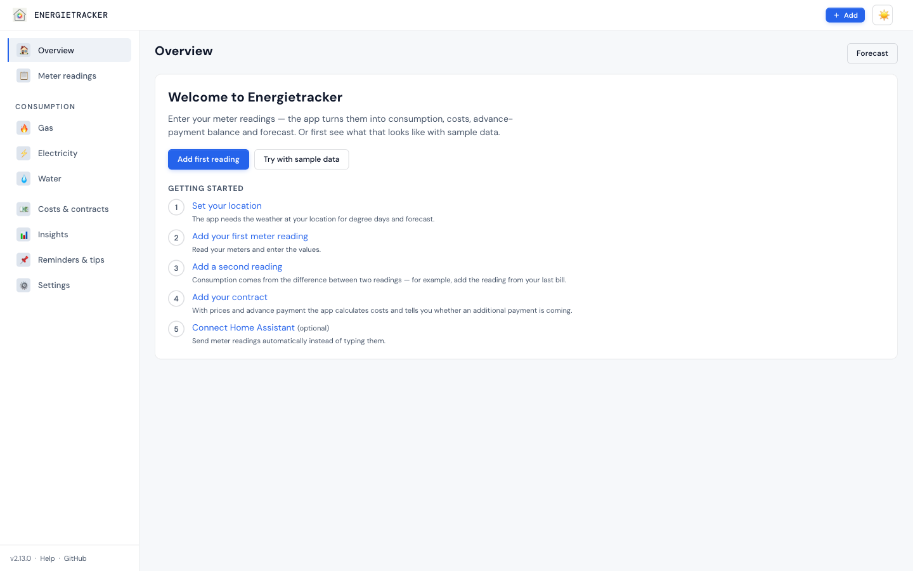

**Period per card (v2.15.0):** every card names its window ("Period:
Apr 2025 – Mar 2026 · Mar 2026: 14 of 31 days") — the utilities end in
different months. The arrow compares the same full months a year earlier; up to
v2.14 the twelve months before, with half a month against a whole one. Below the
history the values can be expanded as a table, and an m³ axis only appears when
there is water.

**PV on the overview (v2.13.0):** the feed-in shows "Feed-in" and
"Remuneration", the generation "Generation" without a cost tile. For both,
more is good: the upward arrow is green. The combined chart now shows only
what is drawn from the grid — up to v2.12 it also stacked the PV kilowatt-hours
as if they were consumption.

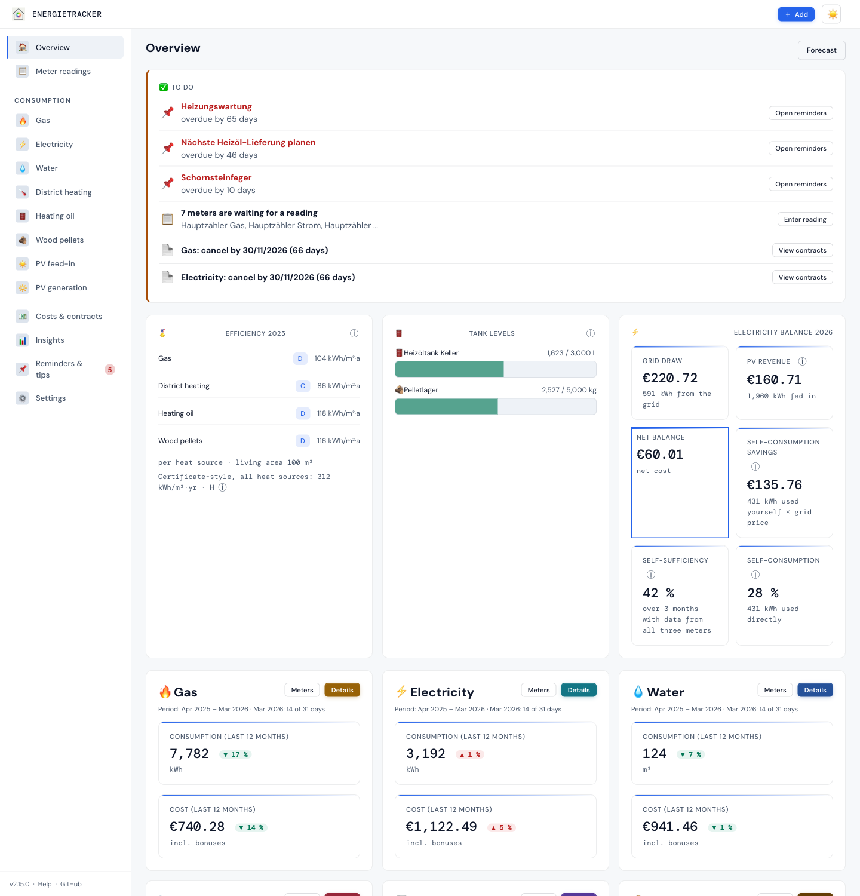

---

## 2. Meter-reading capture (F1004)

The central, mobile-friendly input mask: all active cumulative meters
(gas/electricity/water/district heating/PV) each with the last reading for
orientation — ideal for the monthly reading on the phone.

**Since v2.6.0 with plausibility checks:** while typing, a note appears when the
new reading would mean an unusual daily consumption (more than three times the
usual one), is lower than the last one, lies in the future or when there is
already a reading for that day. On save the app asks per conspicuous card (title:
utility · meter); "Replace" updates the existing reading instead of creating a
second one. Whoever declines keeps the input; the card shows "Not saved – please
check". Details: [Meter readings → plausibility](../verstehen/11-zaehlerstaende.md).

**Since v2.12.0:**

- The date at the top applies to all cards; per card it is collapsed ("Other
  date"). A card with a date of its own keeps it when the top date changes.
- No example value in the field any more — "e.g. 1,395" looked like a
  pre-filled reading. The last reading sits above it.
- The keyboard shows "Next": Enter jumps to the next meter field, from the last
  one to "Save all". On the iPhone the reading can also come from the camera:
  tap the field → "Scan Text" (Live Text; the field is a text field with a
  decimal keyboard for this).
- An error appears below the field instead of only in the title of the ✗.
- After saving, the message names what changed ("Gas +5.4 m³") and offers
  **"Undo"** for ten seconds — it deletes the readings just created.
- **Direct link per meter:** `#/zaehlerstaende?meter=<id>` opens the capture
  view with that meter's card in focus — for a home-screen bookmark, a shortcut
  or "To do".

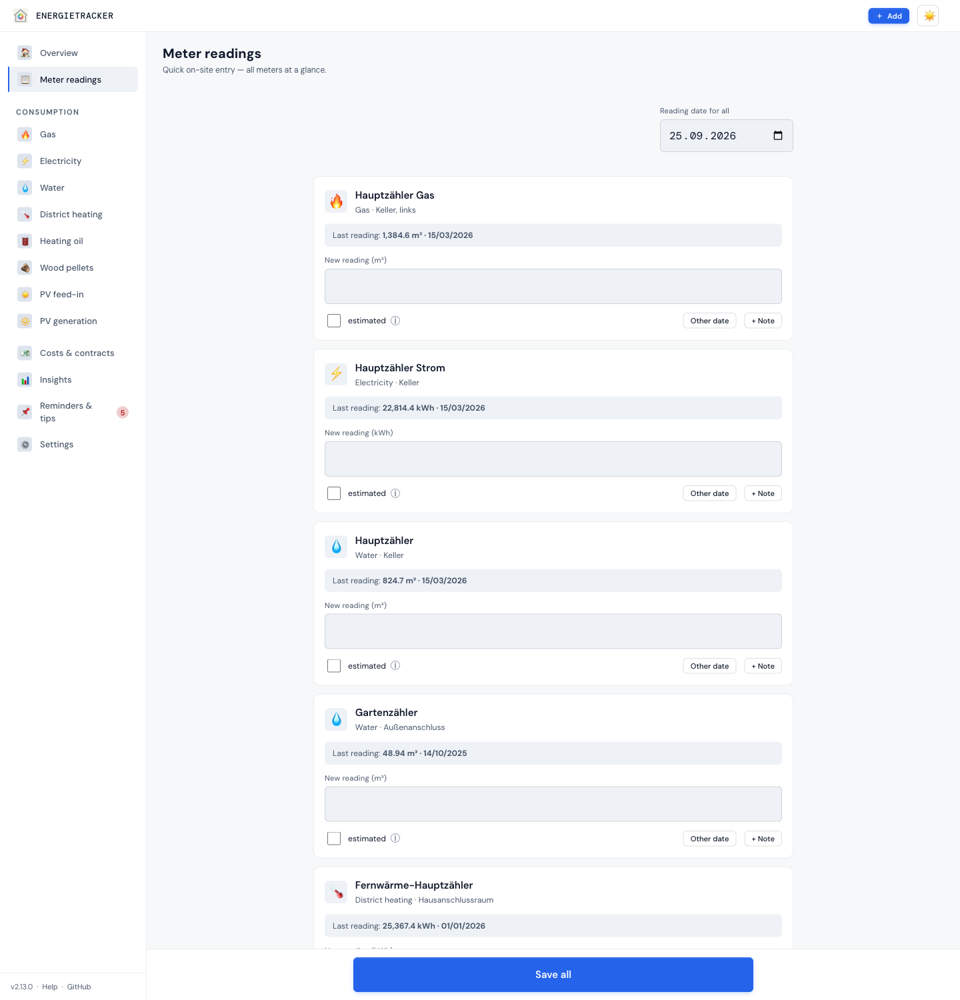

---

## 3. Consumption view — cumulative utilities (gas/electricity/water/district heating)

Identical structure per utility: year selection, meter selection, KPI bar
(consumption, costs, advances with the balance of the months read, daily average,
CO₂), contract/balance card, a consumption chart with a temperature overlay, and a
monthly table with moving averages (MA-3/MA-6) and weather adjustment.

**Balance card (v2.8.0):** computes by calendar up to today — "Consumed (as of
today)" breaks down into working price and base price (minus bonuses); below it,
the card states up to when consumption is measured and from when it is
estimated. "Advance paid" counts the advances as they were debited. If the
expected balance deviates noticeably, the card suggests an advance. The KPI
tiles, by contrast, sum up the months that have been read; if the last reading in
the current year is some time back, the tile is labelled "Advances up to
‹date›". The **Contracts & advances** table lists per contract tariff, advance,
consumed, paid, bonus, **special payments** (since v2.5.1: net from the
customer's perspective; since v2.13.0 the items expand instead of sitting in
the tooltip; gas/electricity/district heating only), balance today and
expected balance. The standing charge is spelled out ("standing charge
12.95 €/month" instead of "13 € base").

**Balance from the customer's side (v2.13.0):** card and tile name the balance
with a word and without a sign — "Credit €120.00" in green, "Additional
payment €60.00" in red, with the period it covers. In tables **+ means credit** and
**− means additional payment**, explained in a line below. Up to v2.12 the app showed
the accounting view (cost − advances, minus = credit) — the opposite of what
the bill says. The API and the CSV export keep their sign.

**No monthly values yet (v2.13.0):** if a meter has no reading or only one,
the page explains that monthly values come from the difference between two
readings and leads to the capture of exactly this meter.

**Since v2.9.0** the card calculates to the day: a switch or a price change in
mid-month applies from its own day. Below the figures, notes appear when they
apply — the contract has expired and runs on without cancellation (status
**RENEWED**, end date = next billing date), the cancellation deadline has been
missed, or an entered price increase is coming up (in Germany with the special
right to cancel under § 41 Abs. 5 EnWG). The "reading overdue" banner follows
the setting *Warn after* (days without a reading; warning from ⅔, alert from
the value itself). Since v2.15.0 it names the trend of the last three full
months against the same months a year earlier ("Dec 2025 – Feb 2026 vs.
previous year, weather-adjusted"), for PV too, where more is good.

**Implausible readings (v2.6.0):** if there are outliers, a falling reading
without a meter swap or an unconfirmed suspect value from Home Assistant, a
notice above the year selection lists the affected readings with a link to the
meter swap. In the readings table they carry "CHECK" or "IMPLAUSIBLE" (since
v2.13.0 with an ⓘ and the reason, before in the tooltip); ✅ confirms a suspect reading — only then does it count. The
reading dialog asks the same questions as the meter-reading capture.

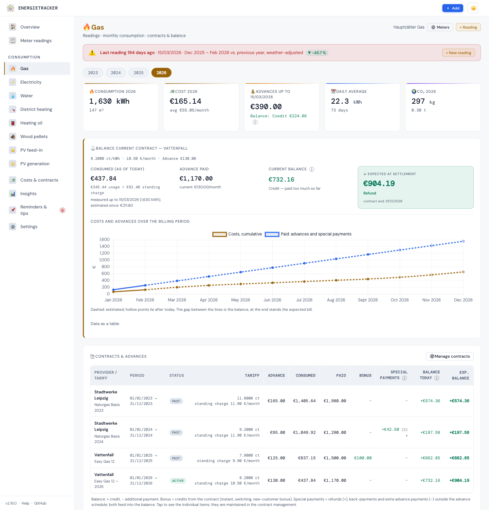

---

## 4. Consumption view — delivery-based utilities (heating oil/pellets)

Instead of meter readings: a tank card and a delivery table (date, quantity,
price, total, supplier). No contract area — the tank invoice is the cost basis.

**Tank log (v2.10.0):** the tank card shows the fill level and the **stock
history** of the selected year — calculated as a solid line, estimated dashed,
known stocks as points — and states below it up to when the calculation is based
on known stocks. Notes appear when levels do not add up, the tank is empty by
calculation or no calculation is possible yet. Below that, the **tank readings**
with "Record tank reading" (date, level, note) and delete. In the delivery
dialog, **"Filled to full"** marks a delivery as an anchor; the table shows it
with "FULL". Months with estimated days carry "≈" in the monthly table; the
ct/kWh column shows the effective price.

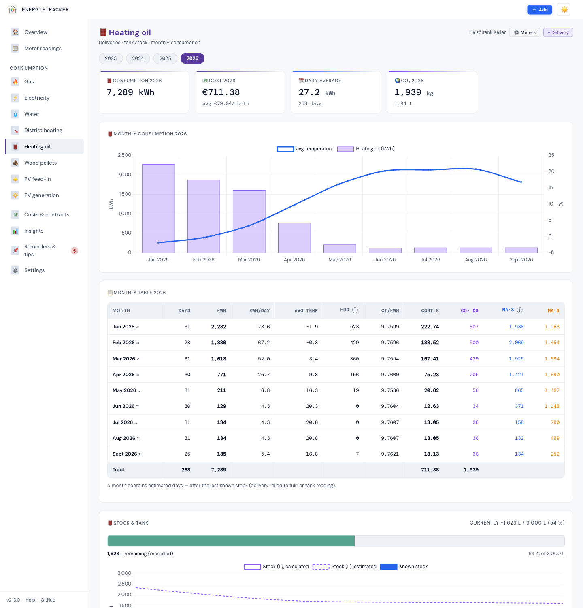

---

## 5. Analysis (heating signature)

An HDD correlation scatter plot with the curves of **all five** models (linear,
polynomial, robust, segmented, sigmoid) and their R² comparison, a year
comparison and anomalies. Above this, the contract reminders appear in three
levels; since v2.9.0, when a notice period is maintained, they name the **cancellation
deadline** ("Cancel … by …, otherwise the contract runs on beyond …"),
otherwise the contract end.

Since v2.8.0: filled points feed the curves, **hollow** ones are your own months
outside the fit (partial month, too few heating degree days or temperatures),
**grey** ones lie before the baseline date. Below the table, a note says that R²
measures the fit to the months shown, not predictive quality. The "Effect of the
measure" card says whether the difference before/after the baseline date is
statistically supported, with a 95 % range. Anomalies measure each month against
its own expectation (heating model or the same month in other years). For
heating oil and pellets a note appears instead of the curves: their monthly
values are distributed by degree days.

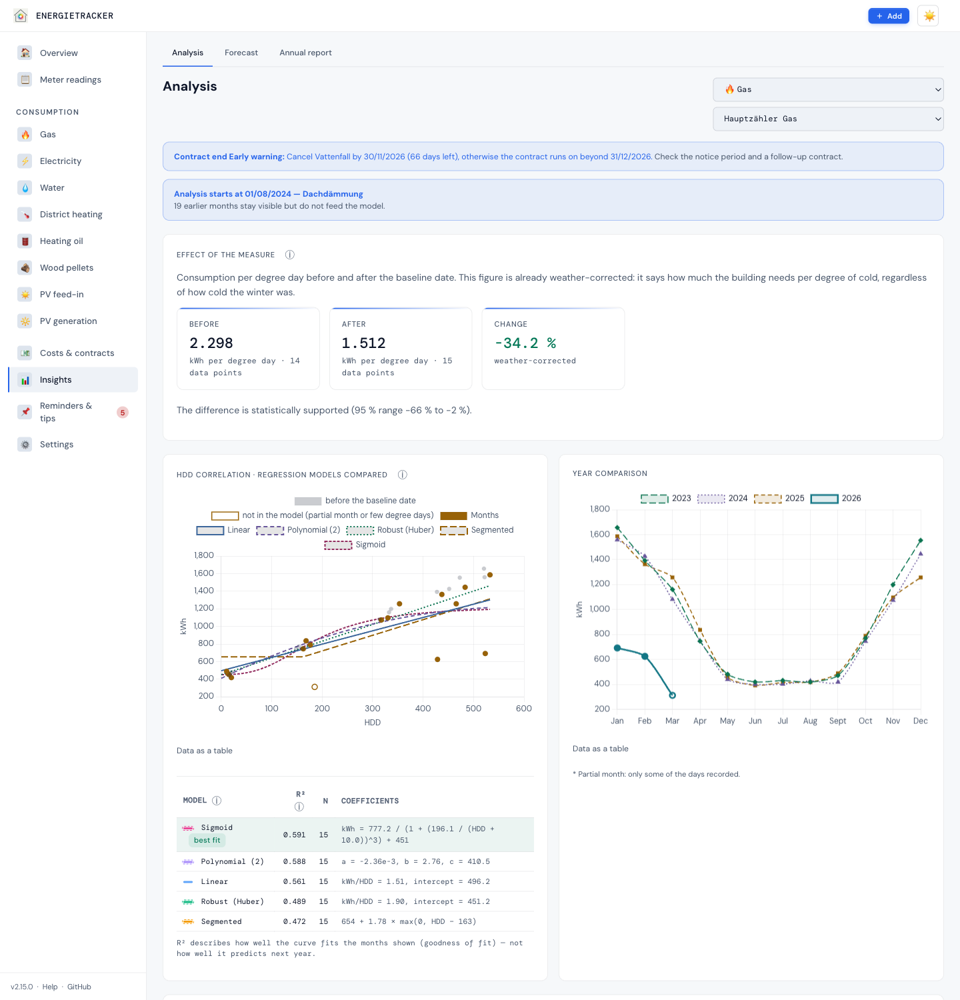

---

## 6. Forecast

Model selection (all five), a 12-month forecast as an R²-weighted blend of
regression and seasonal profile, a cost forecast with the balance of open contracts.

Since v2.8.0 with an **uncertainty band** (the range within which consumption
lies in 80 % of years) and a line for the year ("in 80 % of years between … and
…"). Below it, the source of the heating degree days (climate normal at the
location or your own history) and notices when the history is short. The
"Method" column says per month how it was computed; months after the end of the
contract in which the last contract continues as an assumption carry an
asterisk.

Since v2.13.0 the model name is in the interface language and the balance
column is from the customer's side (+ credit, − additional payment) with an ⓘ. Model
and horizon are pre-set from the settings.

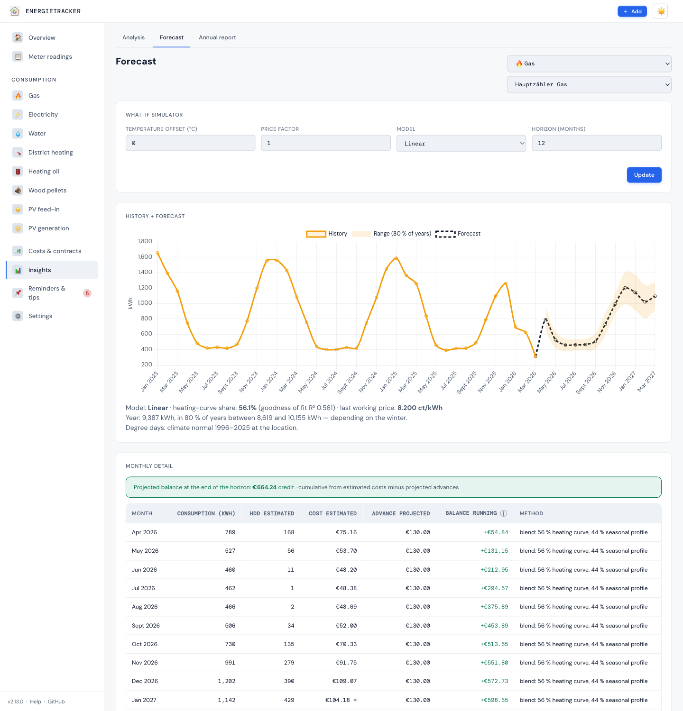

### Annual report (under Insights since v2.11.0)

One year as a PDF: overview per utility, efficiency, monthly tables and open
recommendations. **Open in browser** shows the PDF in a new tab
(`yearly.pdf?inline=1`); in the home-screen app on the iPhone a download often
never arrived. **Download** saves it as before. Up to v2.10 the report lived in
the settings.

---

## 7. Costs & contracts

### Contracts & payments (v2.11.0)

Per utility and meter, the current contract:

- provider, tariff and term, or "renews automatically"
- **Cancel by** with the days left, highlighted from six weeks before; a
  missed deadline in red
- the advance payment per month
- what to expect at the next bill: refund (green) or back-payment (red)

"Manage contracts" leads to the utility's contract list. The figures come from
the same calculation as the utility's balance card. Heating oil and pellets
are no longer listed since v2.13.0 — their costs sit on the deliveries, and the
"Add contract" link led to a page without contracts.

### Check a bill (gas)

Up to v2.10 the bill check sat at the end of the gas page; now it is a page of
its own. It recalculates a gas bill: one section per reading and calorific-value
change, m³ × correction factor × calorific value = kWh, like the lines of the
supplier's bill. Meter and period can be chosen. The gas page links here with
the year on display (`#/bill-check?meter=…&from=…&to=…`).

### Tariff switch (tariff comparison)

Answers the question the Energietracker exists for: **should I switch?** The
view is split into two blocks, and the order is deliberate.

#### Switching decision

At the top sits the **expected annual consumption** from the forecast — exactly
the figure comparison sites ask for as input. One click copies it. The workflow
is therefore: take the number, search elsewhere, enter the offer you found with
**"+ Add offer"** (technically a shadow contract).

There is deliberately no integration with comparison sites. The application
fetches no tariffs from outside; the user enters what they found.

Next to it sits the **switch date**, derived from the contract end and the
notice period. The deadline is shown with the days remaining and highlighted
once it gets tight — it is the thing people miss in everyday life. To model a
different scenario, set the date by hand.

What counts here is not the currently running contract alone but the **binding
chain**: if the follow-on contract has already been signed, the switch for the
next period is done, and the date follows that contract's end. The view states
such a follow-on explicitly. The baseline follows the chain too — each month is
billed with the tariff that applies then, not with the expiring one. A gap of
more than a day ends the chain; after that you are free.

Notice period, minimum term and price guarantee are maintained **on the
contract** (contract management of the respective utility). Without them the
comparison cannot derive a date or warn before a deadline passes.

The ranking shows, per offer:

| Column | Meaning |
|---|---|
| **Year 1** | cost of the first twelve months, sign-up bonus already deducted |
| **Year 2 on** | the ongoing cost, without one-off bonuses |
| **Difference** | against the current contract carried forward |
| **Pays off from** | the annual consumption above which the offer beats the current contract |

Since v2.13.0 this explanation sits below the ranking instead of only in the
tooltip of the column headers; "Pays off from" carries an ⓘ.

**Ranking follows "Year 2 on".** An offer that is only cheap in the first year
does not win the ranking — the year-1 figure still sits beside it so it can be
checked against what the portal displayed.

The **Pays off from** column is the honest answer to an uncertain forecast.
Instead of claiming a saving to the euro, it names the volume at which the
ranking flips: if that is far from the expected consumption, the decision holds
even when the forecast is off. A ±10 % consumption range sits below the annual
figures.

The chart overlays the offers **on top of** the current contract as a cost
curve. Monthly rather than as an annual total, because only then can you see
where the difference comes from — with gas it arises almost entirely in winter.
Months beyond the **price guarantee** are drawn dashed: there the price is an
assumption, not a commitment.

The calculation covers twelve months from the switch date, seasonally weighted.
A switch on 1 July therefore still covers a full winter; a one-twelfth
calculation would get this wrong.

#### Looking back at real months

Below, collapsed: the same tariffs applied to **actually measured** consumption
— "what would tariff X have cost?". This is the proof. Anyone who sees the
maths hold up on real data will also trust the forecast.

Real contracts refer to **exactly the days they cover** — what the bill booked;
contracts with a shorter term carry their month count as a marker, plus an
extrapolation to the full period. **Shadow contracts count as a price sheet for
the whole period** (since v2.9.0): an offer entered only from April to September
used to look cheaper than the same offer for the whole year, because it was
missing the winter.

The **ct/unit** column holds the total cost per kWh or m³ — unit price,
standing charge and bonuses combined. It is the only figure independent of the
term length, and therefore the basis for the ranking. Only pure tariff costs
are compared; advance payments and one-off settlements are cash flows against
the balance and stay out of it (they live in the consumption view). Both
stand below the table since v2.13.0.

Since v2.12.0 the year picker offers only years with consumption data (up to
v2.11 always the last seven years); months follow the language's notation
("Jan 2027"). A year without tariff rows shows a note instead of hiding the
whole retrospective including the picker.

#### Maintaining offers

An offer is captured with the fields a portal result actually carries: unit
price, standing charge, **sign-up bonus as an amount** (not as a credit date —
nobody knows that when entering it), price guarantee and notice period. The
calculated switch date is pre-filled as the start.

Offers can be created, edited and deleted; the delete question names the offer
(v2.12.0). In the contract list they carry
their own marker so they are not mistaken for a running contract. They affect
**neither the balance nor the forecast nor the contract status** — they exist
for this comparison only.

> **Water** stays out: the three-component model (drinking, waste and rainwater)
> needs a calculation of its own. Heating oil and pellets are delivery-based —
> there the delivery invoice is the cost basis.

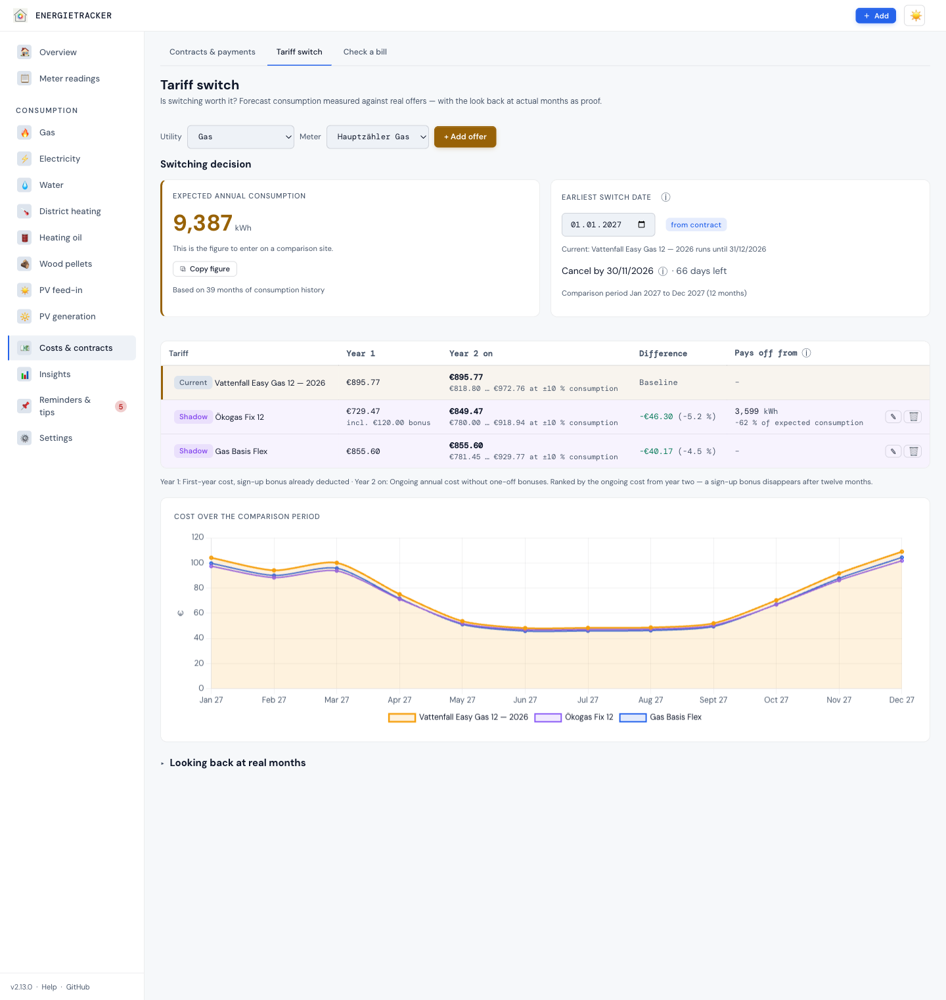

---

## 8. Recommendations

Seven statistical rule families (over-consumption trend, summer base, anomaly, tank
level, contract end, efficiency, …), sorted by urgency, individually hideable.
Purely data-driven, no advertising. Since v2.11.0 under **Reminders & tips**;
the button reads "Hide for 30 days" instead of "✕". Since v2.12.0 the message
names the recommendation and offers **"Undo"** for ten seconds. Since v2.13.0
the page says when there is too little data (no meter with three readings)
that it is too early for recommendations — before, it read "all clear".

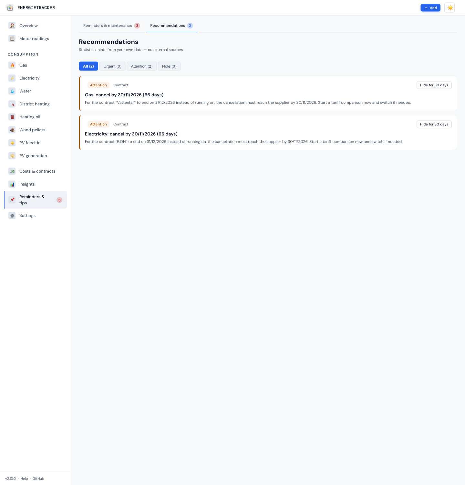

---

## 9. Appointments & maintenance

Recurring appointments (heating service, chimney sweep, calibration deadlines —
since v2.9.0 with a category of its own for heat meter calibration). Due/overdue
ones appear on the dashboard; on completion the next appointment is
rolled forward according to the recurrence. Since v2.11.0 the first tab under
**Reminders & tips**; the count in the sidebar adds due reminders and open
recommendations.

Since v2.12.0 **"Done"** reports the reminder with its next due date and offers
**"Undo"** for ten seconds (date and status as before). A missing title or date
appears at the field instead of in a message at the bottom right; the delete
question names the reminder. An interval in months reads "Every 48 months"
instead of "Every N months (48)".

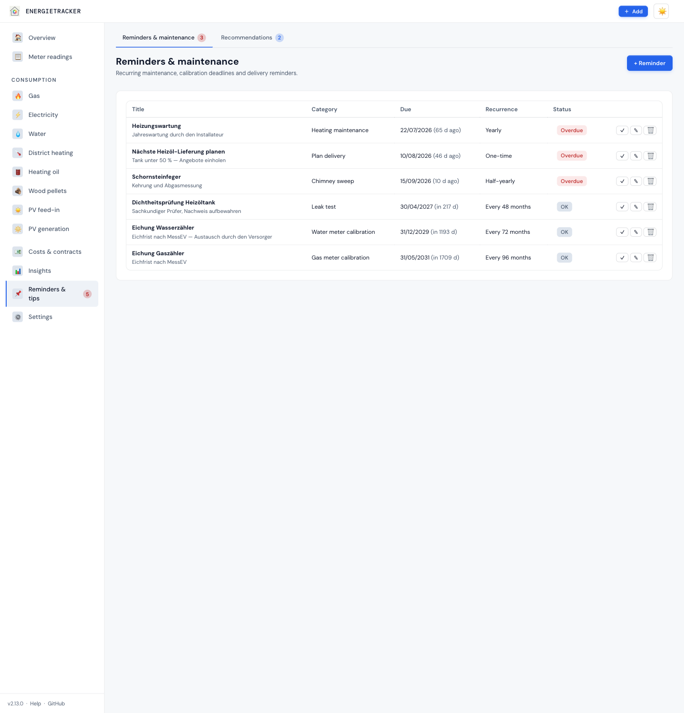

---

## 10. Weather data (settings)

Since v2.11.0 under Settings → Weather data; the address `#/temperatures`
remains. CSV import (drag & drop), Open-Meteo sync for the stored location, a monthly chart
min/avg/max. The basis of every HDD evaluation.

**Since v2.12.0** this is the only place for location and weather:

- **Place search:** enter a name or postcode and pick a hit — coordinates and
  place name are taken over and saved. Only the search text goes to Open-Meteo.
- Latitude, longitude and place name save on change; *Fill weather
  automatically* is a switch on this page.
- The sync saves a changed location first.
- CSV in the usual format `DD.MM.YYYY;avg;min;max` with a decimal comma; tab and
  the old double-quote format are read as well. Up to v2.11 the import also
  split at the decimal comma.

Since v2.8.0 a line above the
chart states up to when measured values and from when forecasts are available;
the option "Also replace existing older values with archive values" cleans up
forecasts that earlier versions stored like measured values. With *Fill weather
automatically* (on by default) the app syncs by itself once a day when
it is opened and loads the climate normal the first time. If the location is
still the country default, a note says so (v2.7.0) — the degree days then use the
weather of another place.

Below the chart, since v2.13.0, the source and licence: "Weather data by
Open-Meteo.com (CC BY 4.0)"; the PDF annual report names it too as soon as it
shows temperatures.

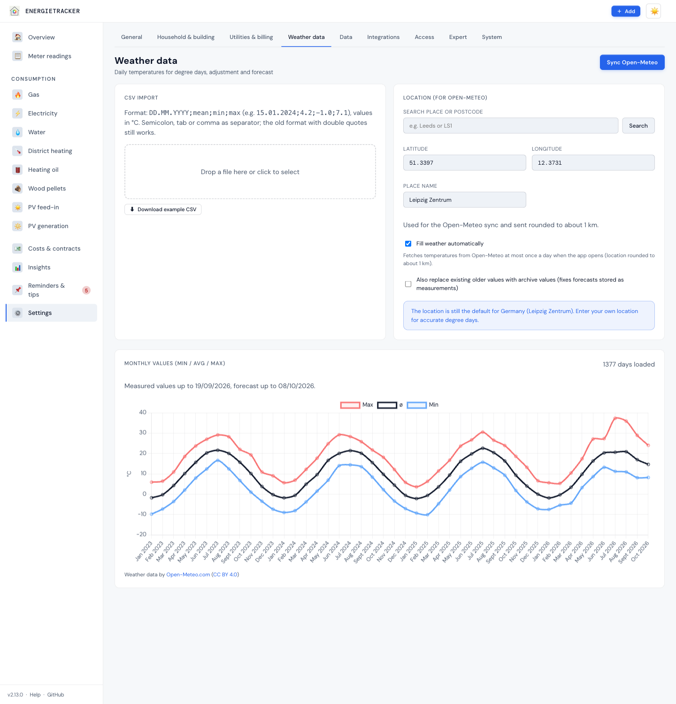

---

## 11. Settings

Since v2.12.0 **nine sub-pages** instead of one long page:

| Page | Contents |
|---|---|
| General | Language & country, overview (months, forecast horizon, warn after days without a reading), contract reminders |
| Household & building | living area, building type, heated basement, hot water; persons in the household |
| Utilities & billing | active utilities, all billing dates in one card, physical constants (gas factors, heating threshold), calorific values and tank warning, CO₂ factors |
| Weather data | §10 |
| Data | CSV export, backup & restore with snapshots, demo data, migration from v0.9.0; link to the annual report |
| Integrations | Home Assistant integration |
| Access | Sign-in & access, embedding |
| Expert | collapsed and with a warning: regression, forecast model, anomaly and recommendation thresholds |
| System | version, licence, system diagnostics |

Each page saves through a bar at the bottom ("Discard" · "Save") that appears
only after a change. Leaving the page with unsaved changes asks first.

**Since v2.13.0:** 18 more fields carry a hint on what they do. The card of
billing dates lists the **PV feed-in** (its remuneration is calculated up to
the billing date); heating oil and pellets are gone there — they have no
advances and therefore no billing date, the fields had no effect. Under Expert
the forecast models carry names instead of keys, and the **forecast band
width** can be set (effective since v2.8.0, until now only via the API). The
Home Assistant card links the guide in the matching language.

The PDF annual report sits under Insights since v2.11.0. After demo data, backup import
or a restore the app restarts, so that sidebar, language and cache match the
new state.

At the top the card **Language & country** (v2.7.0): language, country, currency
and time zone, all taking effect immediately. When the country changes, a dialog
shows the values the country profile would change — current and new side by
side, with the source of the CO₂ factor — and offers "Apply all", "Change
country only" or "Cancel". Since v2.7.0 the gas conversion factors accept the
calorific value in kWh/m³, MJ/m³ or GJ/Smc, with a hint for British, Italian
and Dutch bills.

Since v2.10.0: **CO₂ factors** of the energy sources with their source, all per
kWh (heating oil and pellets were labelled g/L and g/kg respectively, but
calculated per kWh; water stays per m³ and without a source), electricity **per year** as a table; **Building & efficiency** with *Heated
basement* and *Decentralised hot water*. If an installation still carries the old
default values, **"Newer default values available"** appears at the top with the
old and the new value and the button "Use the new values". If only the default
gas factor 11.5 is active, the gas factor table points this out.

**Embedding** (since v2.6.0, Access page): addresses allowed to embed the app,
such as a Home Assistant dashboard. The **🏠 Home Assistant integration
(F1009)** on the Integrations page — manage the API token, maintain meter aliases and copy three
ready-made templates: the REST command, the `secrets.yaml` entry and (since v2.5.3)
an automation built from the aliases that checks `has_value` before every push.
Number fields and billing anchors are validated before saving; errors appear in
red at the field.

**Backup & restore (v2.6.0):** an import is first checked completely and shown as
a preview (what is restored, what stays unchanged for lack of content); a faulty
backup changes nothing and names the findings. Below, the **stored snapshots**
with time, occasion and size — download (⬇️), restore (↩️, the app saves the
current state first) or delete. If the safety snapshot fails, the app asks
whether to restore anyway.

**Sign-in & access (v2.6.0):** shows the mode (no sign-in, password, proxy),
switches password sign-in on, changes the password or switches it off again
(with the current password) and manages **API keys** for scripts (read or
manage, plaintext once, last used). Whatever is fixed by an environment variable
is only displayed here. Since v2.6.0 the Home Assistant card shows when a value
last arrived with the token and warns when sign-in is on but no token exists.

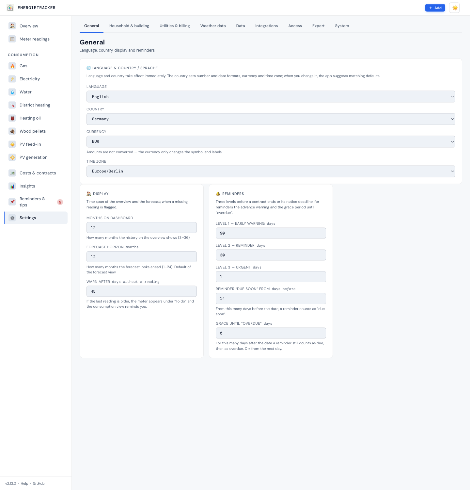

---

## 12. Meters & contracts — incl. topology (F1006)

Meter/device management incl. meter swap (the device chain) and contract maintenance
(working/base price history, advances, bonuses, special payments). Since v2.5.3 the
**meter swap** requires the final reading, shows the last known reading and
summarises the swap before performing it. A **contract** needs a provider or tariff
and at least one working price; the start is prefilled with the day after the
current commitment, and the app asks before a new contract supersedes a running one. Since v2.12.0 the first price rows apply from the contract start and follow it until someone changes their date; a pre-filled row without an amount stays empty. "From start" (up to v2.11 "⇧ Start") sets a row to the contract start. The contract card counts in the right plural ("1 working price"), delete is an outlined button, and the question names the contract. Since v2.9.0 the **Notice period** takes months, weeks or days, plus **Cancellation takes effect** ("automatic", "at the end of the term", "any time, at month end", "any time, to any day") and the **"Renews unless cancelled"** checkbox — clear it once you have cancelled. A meter with *Active* cleared still counts in every total, but no longer appears in the reading entry and raises no warnings. Below the unit prices of a gas contract, **"Convert a price per m³"** (v2.7.0) turns a price per m³ or Smc into ct/kWh and enters it. For oil/pellets only the tank/store
management is relevant here. When creating or editing a tank, **tank capacity** and **initial stock** are captured (instead of a cumulative meter reading), since v2.10.0 optionally the **price of the initial stock** (empty = price of the first delivery). An electricity meter can be flagged as **Heating electricity (heat pump)** — it then counts in the efficiency figure. For cumulative meters the **register digits** can be maintained since v2.6.0 — the evaluation then calculates a rollover (99,999 → 0) correctly; the device line shows them.

**Meter topology:** submeters are shown indented under their parent meter, groups as
an expandable collective entry; **"Group meters"** (up to v2.11 "Merge meters")
combines several existing meters into a group — the meters stay separate, the
group shows the total. A missing selection or name appears at the field. Per
meter, the HA alias (`external_id`) can also be set here.

**CSV import with preview (v2.12.0):** choosing a file only reads it. The
preview shows each row with its effect — new, replaces the existing reading
(with the old value) or unchanged — and the checks of manual entry: decrease,
jump, order of magnitude, future, duplicate date. Conspicuous rows are always
listed, others up to 50. Only "Import N rows" writes; "Choose another file"
starts over.

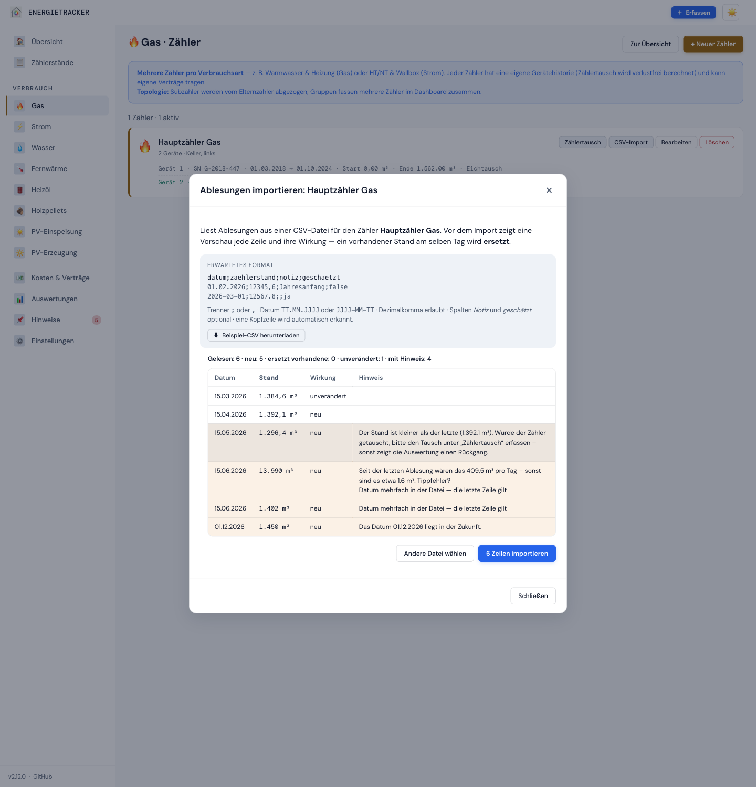

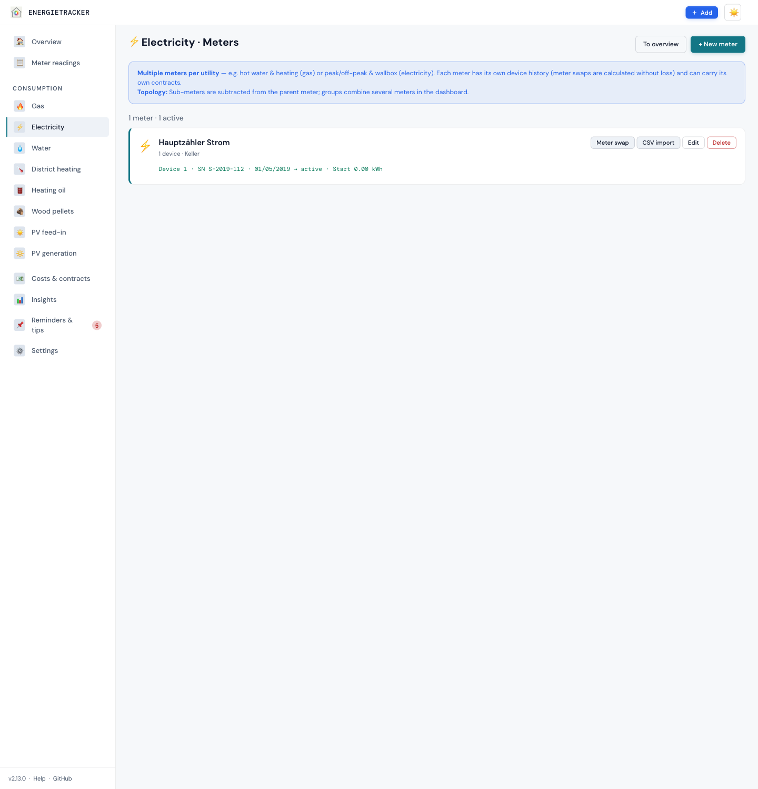

---

## 13. PV — feed-in & generation (F1005)

A dedicated view for photovoltaics: the feed-in meter (remuneration as revenue), the
generation meter, the **electricity balance** (grid import − feed-in) and the
**self-sufficiency rate/self-consumption**. Since v2.10.0 the generation shows
"Generation" and avoided CO₂ instead of "Consumption" and an emission, without a
cost tile; in the tariff switch of the feed-in, the higher remuneration comes
first. PV utilities have no default meter — anyone without a system sees no
phantom meters.

**Since v2.13.0** the feed-in speaks of remuneration throughout: the monthly
table has "Revenue" instead of "Cost" and no advance columns, the contract
table "Earned" and "Received" instead of "Consumed" and "Paid", and an open
claim is green instead of red (legend "+ credit, − reclaim"). Avoided CO₂ has
no minus in front — the word "avoided" carries the direction, as in the annual
report. Both PV utilities drop temperature and heating
degree days; anomalies and the year-on-year comparison rate less feed-in as a
decline, not as a saving.

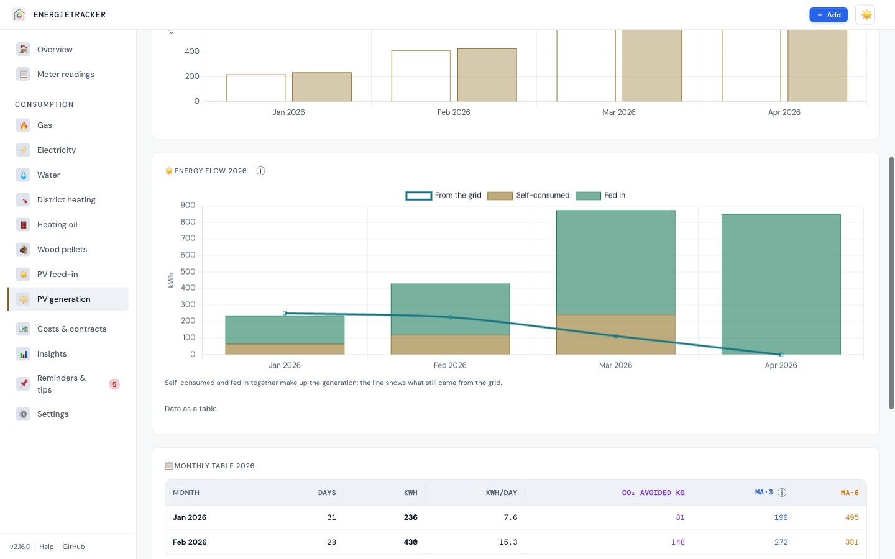

---

## 14. Sign-in (v2.6.0, opt-in)

Only with sign-in switched on: a plain sign-in screen with a password field and
the note how to get back in after forgetting the password. After signing in, the
browser stays signed in for 30 days; the top bar then carries a **Sign out**
button (it also discards this browser's offline data). When a session expires,
the screen appears instead of a series of error messages. Setup and background:
[Security & network operation](../betrieb/sicherheit.md).

**Offline notice:** when data comes from the offline storage of the installed
app, the top bar shows "Offline – data as of …". Changes without a connection
are reported as "No connection to Energietracker – nothing was saved."

---

## 15. Help (v2.13.0)

Reached from the footer of the sidebar, on the iPhone under "More"
(`#/help`). Four cards and the glossary:

- **First steps:** the same list as in the welcome, with ticks from the data;
  once everything is done, it says so.
- **Documentation:** getting started, frequently asked questions, compendium,
  glossary, Home Assistant guide and troubleshooting on GitHub (FAQ and
  troubleshooting since v2.14.0) — in German for a German interface, otherwise in
  English (with a note when your own language is missing).
- **Questions and bugs:** GitHub issues and the pointer to the diagnostics
  under Settings → System, whose details a bug report needs.
- **Your data:** everything stays on your own server — no accounts, no
  advertising, no telemetry. The only outside contact is Open-Meteo: the daily
  weather sync (location rounded to about 1 km) and the place search.
- **Terms:** 33 entries in all seven languages with a search. The ⓘ in the app
  opens the same texts; `#/help?term=hdd` jumps to a term.

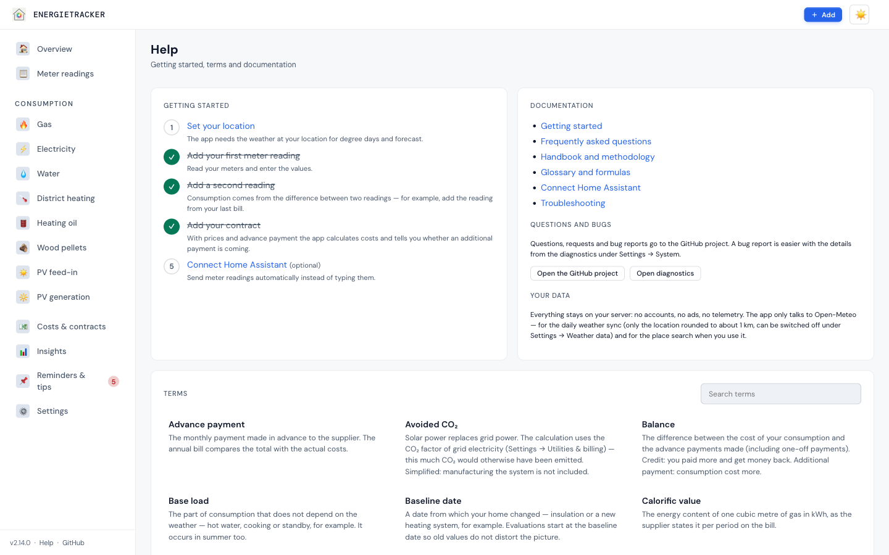

---

[← Compendium index](../README.md)
