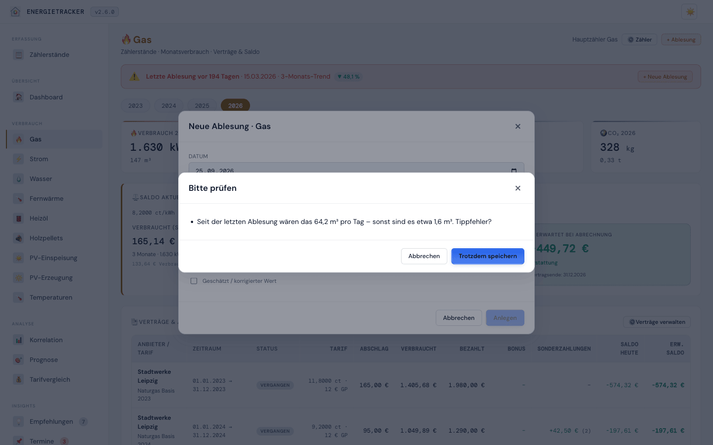
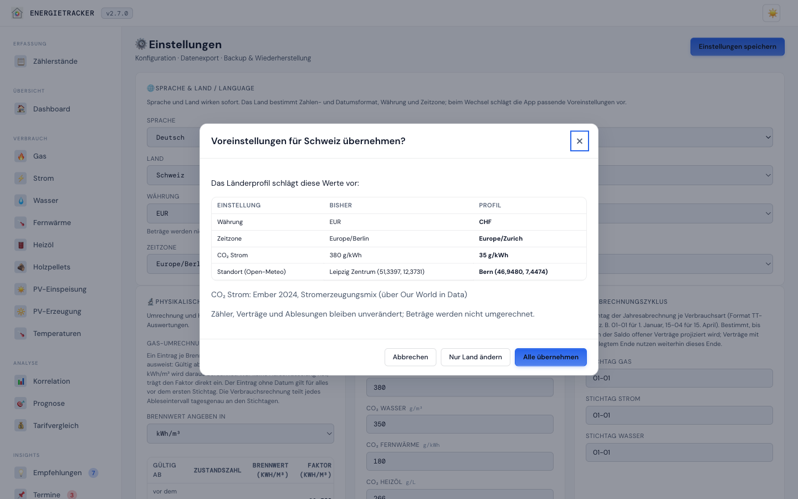
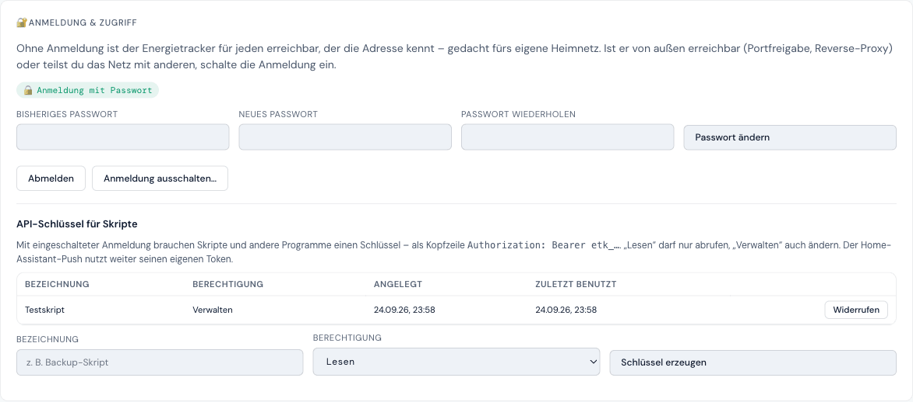
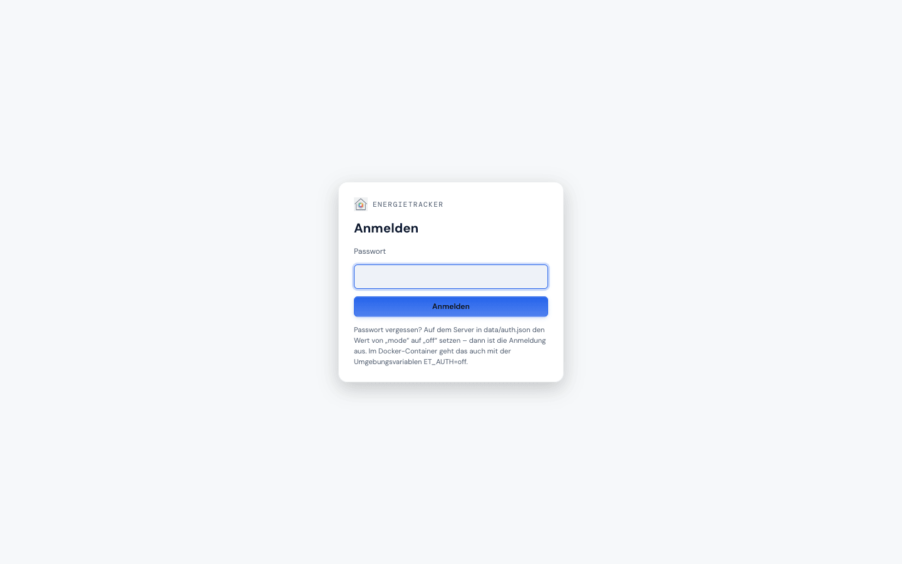

# UI reference — all views

**English** · [Deutsch](../../ui/01-views.md)

[← Compendium index](../README.md)

> **Real screenshots.** The following images are **actual screen captures** of the
> running app with the bundled [demo dataset](../../../demo-data/) (light theme; base
> set v1.9.2, sign-in, security card and the capture question v2.6.0). The app's
> interface is in German; the captures are shared with the
> German compendium. To regenerate them yourself: load the demo data and capture
> the views one by one — the app needs no build step for this.

The app is a single-page application with a fixed **topbar** (logo, theme toggle)
and a **sidebar** that is built dynamically from the *active* utilities
(Settings → Active utilities).

---

## 1. Overview (dashboard)

The entry point. 12-month figures per utility, efficiency class **per heat
source**, tank levels (oil/pellets), **electricity balance & self-sufficiency** for
PV, the combined consumption history and due appointments. Since v2.7.0 the
efficiency class appears only in countries with a scale (Germany); elsewhere the
card shows kWh/m²·yr and gives the reason ([country profiles](../functional/14-laenderprofile.md)).

---

## 2. Meter-reading capture (F1004)

The central, mobile-friendly input mask: all active cumulative meters
(gas/electricity/water/district heating/PV) each with the last reading for
orientation — ideal for the monthly reading on the phone.

**Since v2.6.0 with plausibility checks:** while typing, a note appears when the
new reading would mean an unusual daily consumption (more than three times the
usual one), is lower than the last one, lies in the future or when there is
already a reading for that day. On save the app asks per conspicuous card (title:
utility · meter); "Replace" updates the existing reading instead of creating a
second one. Whoever declines keeps the input; the card shows "Not saved – please
check". Details: [Meter readings → plausibility](../functional/11-zaehlerstaende.md).

---

## 3. Consumption view — cumulative utilities (gas/electricity/water/district heating)

Identical structure per utility: year selection, meter selection, KPI bar
(consumption, costs, balance today, expected balance), contract/balance card, a
consumption chart with a temperature overlay, and a monthly table with moving
averages (MA-3/MA-6) and weather adjustment. The **Contracts & advances**
table lists per contract tariff, advance, consumed, paid, bonus, **special
payments** (since v2.5.1: net from the customer's perspective, items in the
tooltip; gas/electricity/district heating only), balance today and expected
balance.

**Implausible readings (v2.6.0):** if there are outliers, a falling reading
without a meter swap or an unconfirmed suspect value from Home Assistant, a
notice above the year selection lists the affected readings with a link to the
meter swap. In the readings table they carry "CHECK" or "IMPLAUSIBLE" (tooltip
with the reason); ✅ confirms a suspect reading — only then does it count. The
reading dialog asks the same questions as the meter-reading capture.

---

## 4. Consumption view — delivery-based utilities (heating oil/pellets)

Instead of meter readings: the tank stock curve (modelled, calibrated) and a
delivery table (date, quantity, price, total, supplier). No contract area — the tank
invoice is the cost basis.

---

## 5. Analysis (heating signature)

An HDD correlation scatter plot with a regression line, an R² comparison of **all
five** models (linear, polynomial, robust, segmented, sigmoid), anomalies.

---

## 6. Forecast

Model selection (all five), a 12-month forecast as an R²-weighted blend of
regression and seasonal profile, a cost forecast with the balance of open contracts.

---

## 7. Tariff comparison

Answers the question the Energietracker exists for: **should I switch?** The
view is split into two blocks, and the order is deliberate.

### Switching decision

At the top sits the **expected annual consumption** from the forecast — exactly
the figure comparison sites ask for as input. One click copies it. The workflow
is therefore: take the number, search elsewhere, enter the offer you found as a
shadow contract.

There is deliberately no integration with comparison sites. The application
fetches no tariffs from outside; the user enters what they found.

Next to it sits the **switch date**, derived from the contract end and the
notice period. The deadline is shown with the days remaining and highlighted
once it gets tight — it is the thing people miss in everyday life. To model a
different scenario, set the date by hand.

What counts here is not the currently running contract alone but the **binding
chain**: if the follow-on contract has already been signed, the switch for the
next period is done, and the date follows that contract's end. The view states
such a follow-on explicitly. The baseline follows the chain too — each month is
billed with the tariff that applies then, not with the expiring one. A gap of
more than a day ends the chain; after that you are free.

Notice period, minimum term and price guarantee are maintained **on the
contract** (contract management of the respective utility). Without them the
comparison cannot derive a date or warn before a deadline passes.

The ranking shows, per offer:

| Column | Meaning |
|---|---|
| **Year 1** | cost of the first twelve months, sign-up bonus already deducted |
| **Year 2 on** | the ongoing cost, without one-off bonuses |
| **Difference** | against the current contract carried forward |
| **Pays off from** | the annual consumption above which the offer beats the current contract |

**Ranking follows "Year 2 on".** An offer that is only cheap in the first year
does not win the ranking — the year-1 figure still sits beside it so it can be
checked against what the portal displayed.

The **Pays off from** column is the honest answer to an uncertain forecast.
Instead of claiming a saving to the euro, it names the volume at which the
ranking flips: if that is far from the expected consumption, the decision holds
even when the forecast is off. A ±10 % consumption range sits below the annual
figures.

The chart overlays the offers **on top of** the current contract as a cost
curve. Monthly rather than as an annual total, because only then can you see
where the difference comes from — with gas it arises almost entirely in winter.
Months beyond the **price guarantee** are drawn dashed: there the price is an
assumption, not a commitment.

The calculation covers twelve months from the switch date, seasonally weighted.
A switch on 1 July therefore still covers a full winter; a one-twelfth
calculation would get this wrong.

### Looking back at real months

Below, collapsed: the same tariffs applied to **actually measured** consumption
— "what would tariff X have cost?". This is the proof. Anyone who sees the
maths hold up on real data will also trust the forecast.

Every row refers to **exactly the months that contract covers**: consumption,
cost and difference all mean the same period. Contracts with a shorter term
carry their month count as a marker, plus an extrapolation to the full period.

The **ct/unit** column holds the total cost per kWh or m³ — unit price,
standing charge and bonuses combined. It is the only figure independent of the
term length, and therefore the basis for the ranking. Only pure tariff costs
are compared; advance payments and one-off settlements are cash flows against
the balance and stay out of it (they live in the consumption view).

### Maintaining offers

An offer is captured with the fields a portal result actually carries: unit
price, standing charge, **sign-up bonus as an amount** (not as a credit date —
nobody knows that when entering it), price guarantee and notice period. The
calculated switch date is pre-filled as the start.

Offers can be created, edited and deleted. In the contract list they carry
their own marker so they are not mistaken for a running contract. They affect
**neither the balance nor the forecast nor the contract status** — they exist
for this comparison only.

> **Water** stays out: the three-component model (drinking, waste and rainwater)
> needs a calculation of its own. Heating oil and pellets are delivery-based —
> there the delivery invoice is the cost basis.

---

## 8. Recommendations

Seven statistical rule families (over-consumption trend, summer base, anomaly, tank
level, contract end, efficiency, …), sorted by urgency, individually hideable.
Purely data-driven, no advertising.

---

## 9. Appointments & maintenance

Recurring appointments (heating service, chimney sweep, calibration deadlines).
Due/overdue ones appear on the dashboard; on completion the next appointment is
rolled forward according to the recurrence.

---

## 10. Temperatures

CSV import (drag & drop), Open-Meteo sync for the stored location, a monthly chart
min/avg/max. The basis of every HDD evaluation. If the location is still the
country default, a note says so (v2.7.0) — the degree days then use the weather
of another place.

---

## 11. Settings

At the top the card **Language & country** (v2.7.0): language, country, currency
and time zone, all taking effect immediately. When the country changes, a dialog
shows the values the country profile would change — current and new side by
side, with the source of the CO₂ factor — and offers "Apply all", "Change
country only" or "Cancel". Since v2.7.0 the gas conversion factors accept the
calorific value in kWh/m³, MJ/m³ or GJ/Smc, with a hint for British, Italian
and Dutch bills.

All settings grouped: conversion & HDD, **billing cycle (DD-MM)**, building &
efficiency, calorific values, forecast model, **embedding** (since v2.6.0:
addresses allowed to embed the app, such as a Home Assistant dashboard), active
utilities, CSV export of all utilities, backup & migration, demo-data import
(F1007), **🔐 Sign-in & access** (since v2.6.0) and the **🏠 Home Assistant
integration (F1009)** — manage the API token, maintain meter aliases and copy three
ready-made templates: the REST command, the `secrets.yaml` entry and (since v2.5.3)
an automation built from the aliases that checks `has_value` before every push.
Number fields and billing anchors are validated before saving; errors appear in
red at the field.

**Backup & restore (v2.6.0):** an import is first checked completely and shown as
a preview (what is restored, what stays unchanged for lack of content); a faulty
backup changes nothing and names the findings. Below, the **stored snapshots**
with time, occasion and size — download (⬇️), restore (↩️, the app saves the
current state first) or delete. If the safety snapshot fails, the app asks
whether to restore anyway.

**Sign-in & access (v2.6.0):** shows the mode (no sign-in, password, proxy),
switches password sign-in on, changes the password or switches it off again
(with the current password) and manages **API keys** for scripts (read or
manage, plaintext once, last used). Whatever is fixed by an environment variable
is only displayed here. Since v2.6.0 the Home Assistant card shows when a value
last arrived with the token and warns when sign-in is on but no token exists.

---

## 12. Meters & contracts — incl. topology (F1006)

Meter/device management incl. meter swap (the device chain) and contract maintenance
(working/base price history, advances, bonuses, special payments). Since v2.5.3 the
**meter swap** requires the final reading, shows the last known reading and
summarises the swap before performing it. A **contract** needs a provider or tariff
and at least one working price; the start is prefilled with the day after the
current commitment, and the app asks before a new contract supersedes a running one. Below the unit prices of a gas contract, **"Convert a price per m³"** (v2.7.0) turns a price per m³ or Smc into ct/kWh and enters it. For oil/pellets only the tank/store
management is relevant here. When creating or editing a tank, **tank capacity** and **initial stock** are captured (instead of a cumulative meter reading). For cumulative meters the **register digits** can be maintained since v2.6.0 — the evaluation then calculates a rollover (99,999 → 0) correctly; the device line shows them.

**Meter topology:** submeters are shown indented under their parent meter, groups as
an expandable collective entry; a **merge wizard** combines several existing meters
into a group. Per meter, the HA alias (`external_id`) can also be set here.

---

## 13. PV — feed-in & generation (F1005)

A dedicated view for photovoltaics: the feed-in meter (remuneration as revenue), the
generation meter, the **electricity balance** (grid import − feed-in) and the
**self-sufficiency rate/self-consumption**. PV utilities have no default meter —
anyone without a system sees no phantom meters.

---

## 14. Sign-in (v2.6.0, opt-in)

Only with sign-in switched on: a plain sign-in screen with a password field and
the note how to get back in after forgetting the password. After signing in, the
browser stays signed in for 30 days; the top bar then carries a **Sign out**
button (it also discards this browser's offline data). When a session expires,
the screen appears instead of a series of error messages. Setup and background:
[Security & network operation](../technical/08-security.md).

**Offline notice:** when data comes from the offline storage of the installed
app, the top bar shows "Offline – data as of …". Changes without a connection
are reported as "No connection to Energietracker – nothing was saved."

---

[← Compendium index](../README.md)
