# UI reference — all views

**English** · [Deutsch](../../ui/01-views.md)

[← Compendium index](../README.md)

> **Real screenshots.** The following images are **actual screen captures** of the
> running app with the bundled [demo dataset](../../../demo-data/) (light theme, as
> of v1.9.2). The app's interface is in German; the captures are shared with the
> German compendium. To regenerate them yourself: load the demo data and capture
> the views one by one — the app needs no build step for this.

The app is a single-page application with a fixed **topbar** (logo, theme toggle)
and a **sidebar** that is built dynamically from the *active* utilities
(Settings → Active utilities).

---

## 1. Overview (dashboard)

The entry point. 12-month figures per utility, efficiency class **per heat
source**, tank levels (oil/pellets), **electricity balance & self-sufficiency** for
PV, the combined consumption history and due appointments.

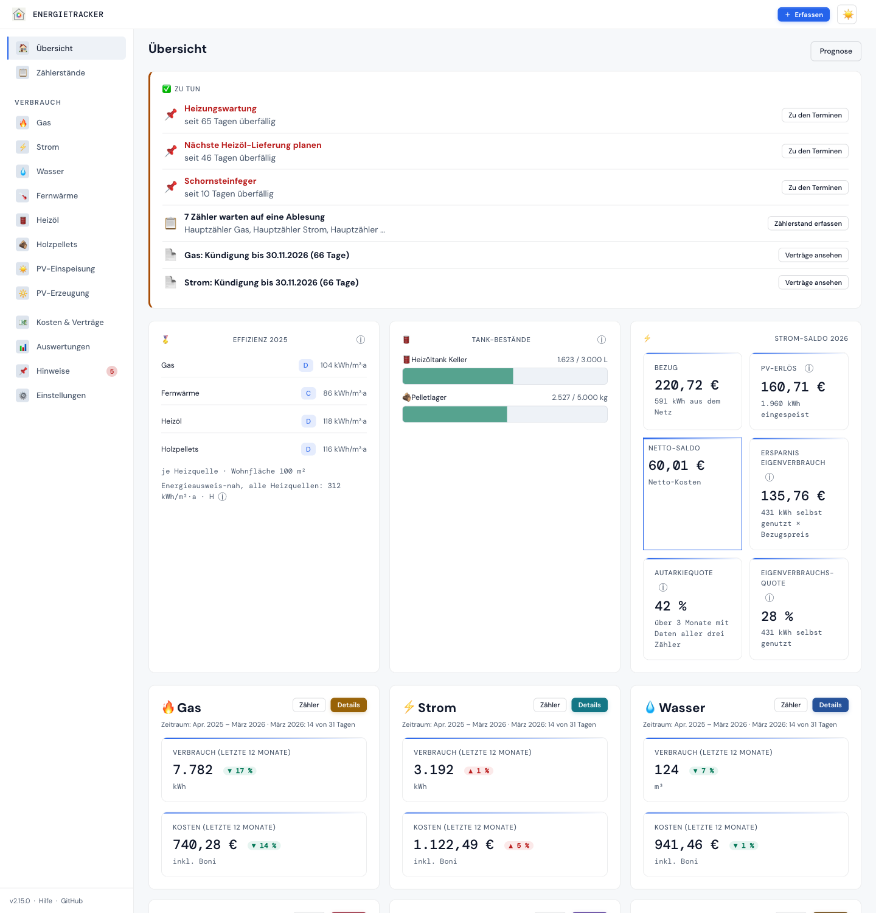

---

## 2. Meter-reading capture (F1004)

The central, mobile-friendly input mask: all active cumulative meters
(gas/electricity/water/district heating/PV) each with the last reading for
orientation — ideal for the monthly reading on the phone.

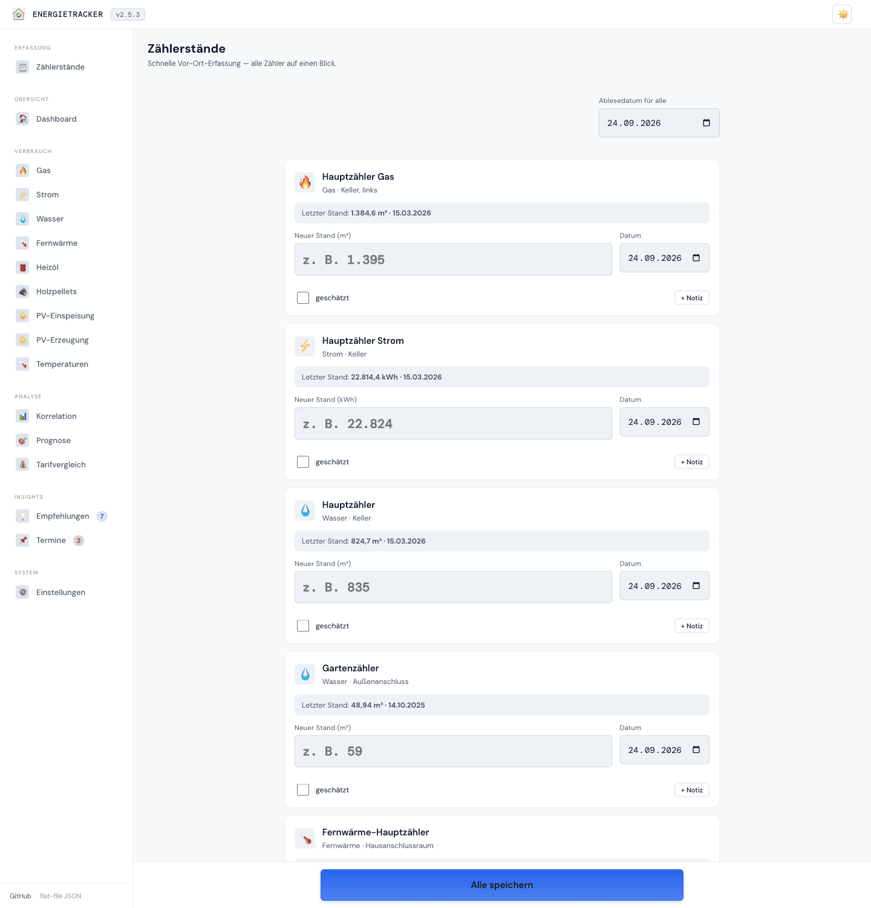

---

## 3. Consumption view — cumulative utilities (gas/electricity/water/district heating)

Identical structure per utility: year selection, meter selection, KPI bar
(consumption, costs, balance today, expected balance), contract/balance card, a
consumption chart with a temperature overlay, and a monthly table with moving
averages (MA-3/MA-6) and weather adjustment.

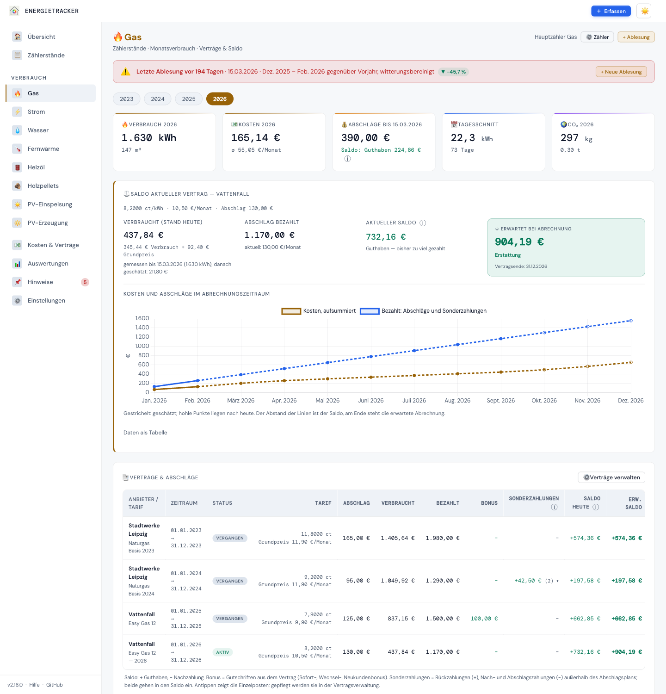

---

## 4. Consumption view — delivery-based utilities (heating oil/pellets)

Instead of meter readings: the tank stock curve (modelled, calibrated) and a
delivery table (date, quantity, price, total, supplier). No contract area — the tank
invoice is the cost basis.

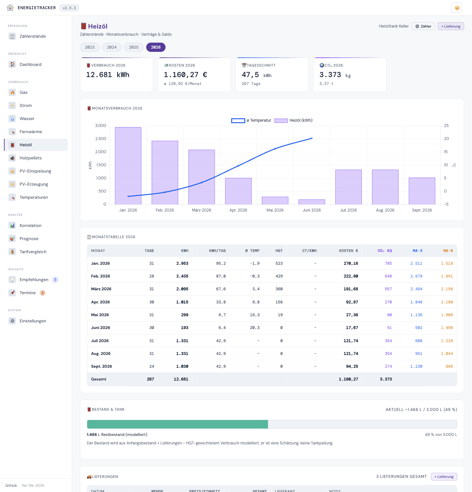

---

## 5. Analysis (heating signature)

An HDD correlation scatter plot with a regression line, an R² comparison of **all
five** models (linear, polynomial, robust, segmented, sigmoid), anomalies.

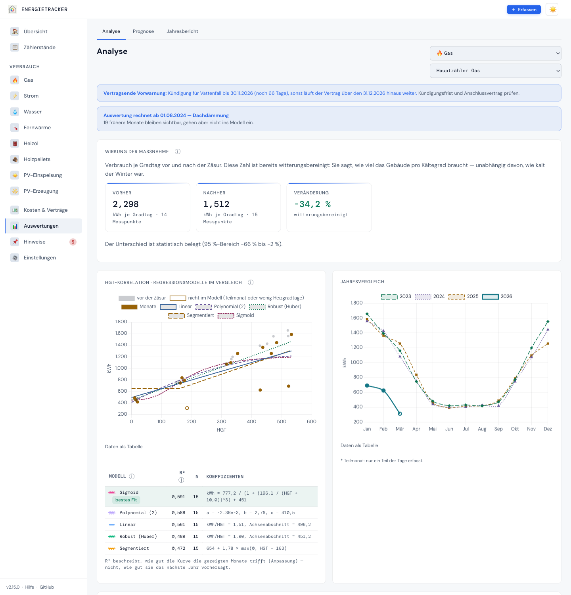

---

## 6. Forecast

Model selection (all five), a 12-month forecast as an R²-weighted blend of
regression and seasonal profile, a cost forecast with the balance of open contracts.

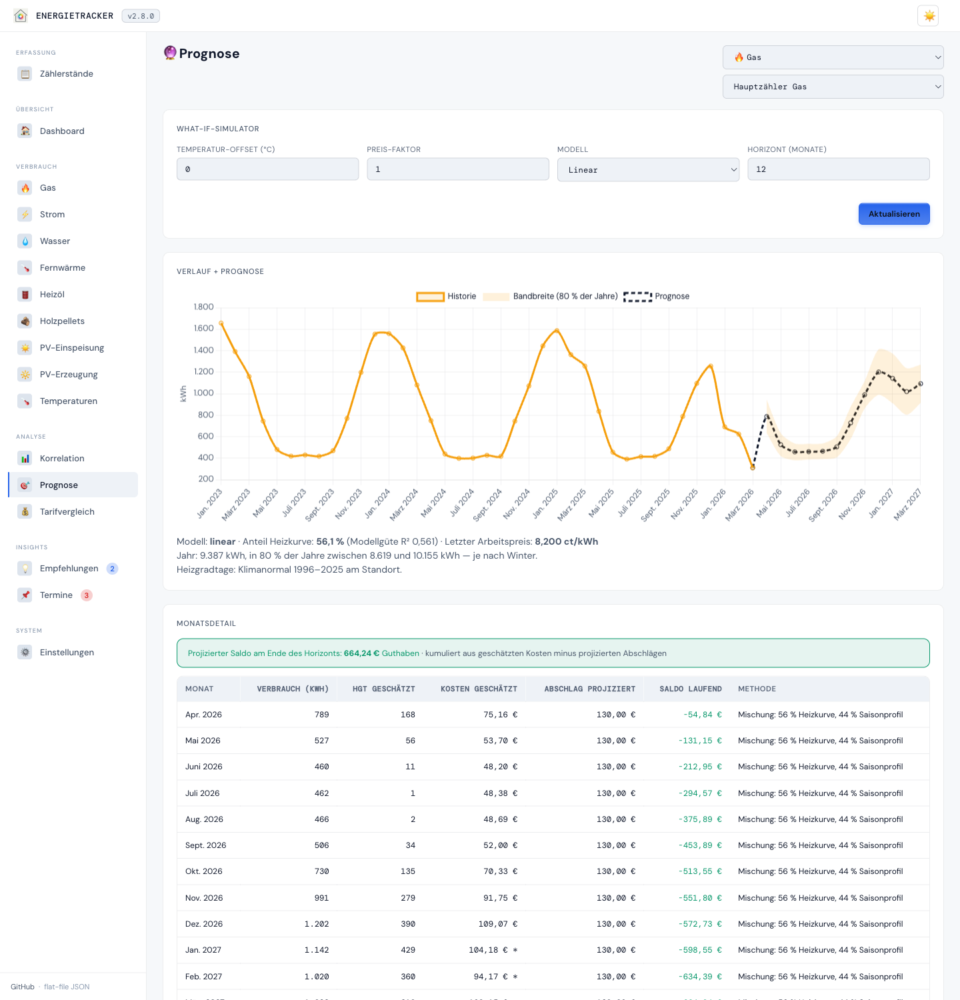

---

## 7. Tariff comparison

Answers the question the Energietracker exists for: **should I switch?** The
view is split into two blocks, and the order is deliberate.

### Switching decision

At the top sits the **expected annual consumption** from the forecast — exactly
the figure comparison sites ask for as input. One click copies it. The workflow
is therefore: take the number, search elsewhere, enter the offer you found as a
shadow contract.

There is deliberately no integration with comparison sites. The application
fetches no tariffs from outside; the user enters what they found.

Next to it sits the **switch date**, derived from the contract end and the
notice period. The deadline is shown with the days remaining and highlighted
once it gets tight — it is the thing people miss in everyday life. To model a
different scenario, set the date by hand.

What counts here is not the currently running contract alone but the **binding
chain**: if the follow-on contract has already been signed, the switch for the
next period is done, and the date follows that contract's end. The view states
such a follow-on explicitly. The baseline follows the chain too — each month is
billed with the tariff that applies then, not with the expiring one. A gap of
more than a day ends the chain; after that you are free.

Notice period, minimum term and price guarantee are maintained **on the
contract** (contract management of the respective utility). Without them the
comparison cannot derive a date or warn before a deadline passes.

The ranking shows, per offer:

| Column | Meaning |
|---|---|
| **Year 1** | cost of the first twelve months, sign-up bonus already deducted |
| **Year 2 on** | the ongoing cost, without one-off bonuses |
| **Difference** | against the current contract carried forward |
| **Pays off from** | the annual consumption above which the offer beats the current contract |

**Ranking follows "Year 2 on".** An offer that is only cheap in the first year
does not win the ranking — the year-1 figure still sits beside it so it can be
checked against what the portal displayed.

The **Pays off from** column is the honest answer to an uncertain forecast.
Instead of claiming a saving to the euro, it names the volume at which the
ranking flips: if that is far from the expected consumption, the decision holds
even when the forecast is off. A ±10 % consumption range sits below the annual
figures.

The chart overlays the offers **on top of** the current contract as a cost
curve. Monthly rather than as an annual total, because only then can you see
where the difference comes from — with gas it arises almost entirely in winter.
Months beyond the **price guarantee** are drawn dashed: there the price is an
assumption, not a commitment.

The calculation covers twelve months from the switch date, seasonally weighted.
A switch on 1 July therefore still covers a full winter; a one-twelfth
calculation would get this wrong.

### Looking back at real months

Below, collapsed: the same tariffs applied to **actually measured** consumption
— "what would tariff X have cost?". This is the proof. Anyone who sees the
maths hold up on real data will also trust the forecast.

Every row refers to **exactly the months that contract covers**: consumption,
cost and difference all mean the same period. Contracts with a shorter term
carry their month count as a marker, plus an extrapolation to the full period.

The **ct/unit** column holds the total cost per kWh or m³ — unit price,
standing charge and bonuses combined. It is the only figure independent of the
term length, and therefore the basis for the ranking. Only pure tariff costs
are compared; advance payments and one-off settlements are cash flows against
the balance and stay out of it (they live in the consumption view).

### Maintaining offers

An offer is captured with the fields a portal result actually carries: unit
price, standing charge, **sign-up bonus as an amount** (not as a credit date —
nobody knows that when entering it), price guarantee and notice period. The
calculated switch date is pre-filled as the start.

Offers can be created, edited and deleted. In the contract list they carry
their own marker so they are not mistaken for a running contract. They affect
**neither the balance nor the forecast nor the contract status** — they exist
for this comparison only.

> **Water** stays out: the three-component model (drinking, waste and rainwater)
> needs a calculation of its own. Heating oil and pellets are delivery-based —
> there the delivery invoice is the cost basis.

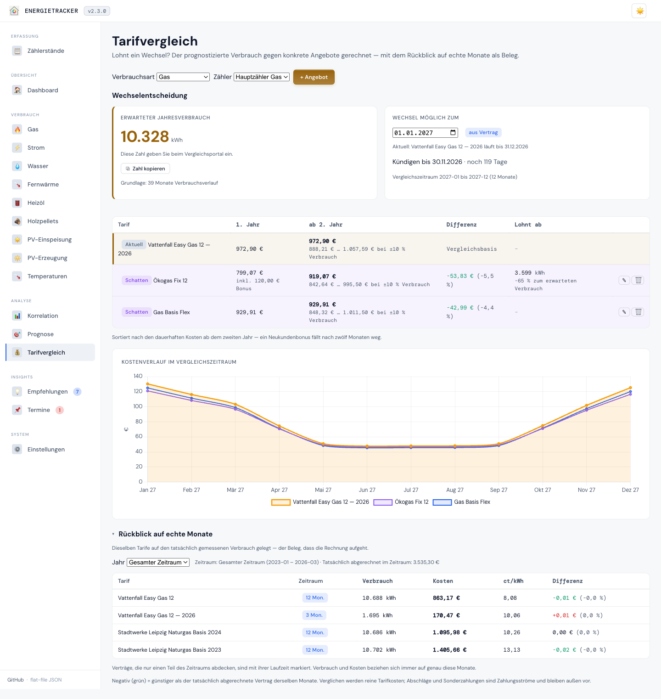

---

## 8. Recommendations

Seven statistical rule families (over-consumption trend, summer base, anomaly, tank
level, contract end, efficiency, …), sorted by urgency, individually hideable.
Purely data-driven, no advertising.

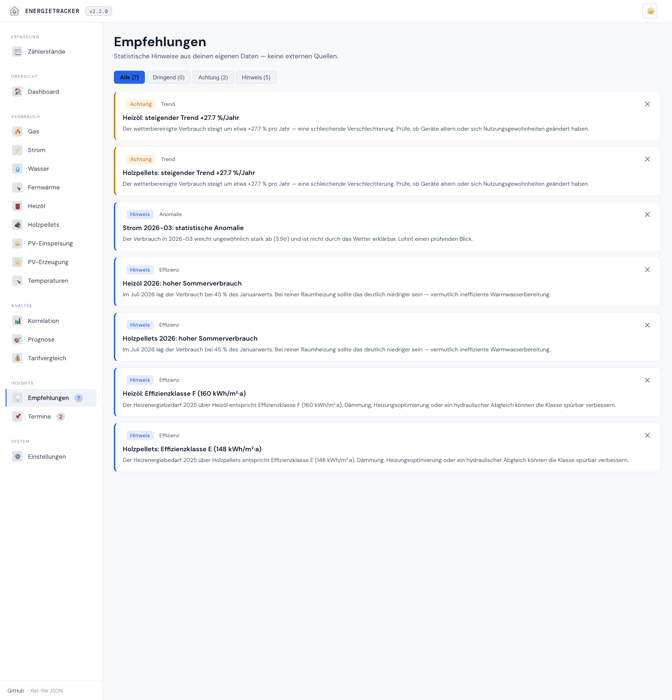

---

## 9. Appointments & maintenance

Recurring appointments (heating service, chimney sweep, calibration deadlines).
Due/overdue ones appear on the dashboard; on completion the next appointment is
rolled forward according to the recurrence.

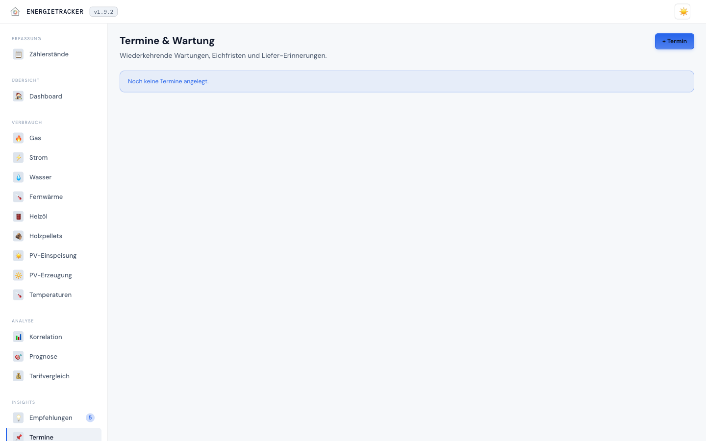

---

## 10. Temperatures

CSV import (drag & drop), Open-Meteo sync for the stored location, a monthly chart
min/avg/max. The basis of every HDD evaluation.

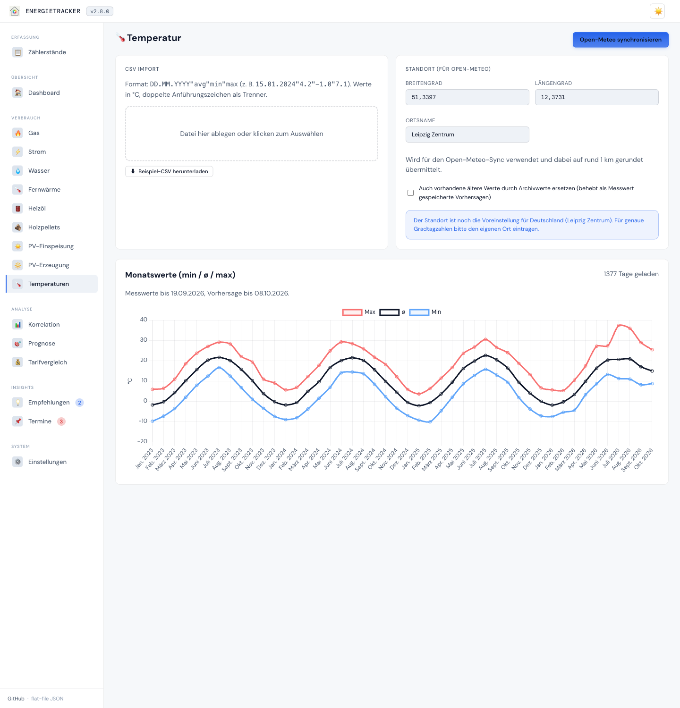

---

## 11. Settings

All 40 keys grouped: conversion & HDD, **billing cycle (DD-MM)**, building &
efficiency, calorific values, forecast model, active utilities, CSV export of all
utilities, backup & migration, demo-data import (F1007) and the **🏠 Home Assistant
integration (F1009)** — manage the API token, maintain meter aliases, copy the
ready-made HA YAML.

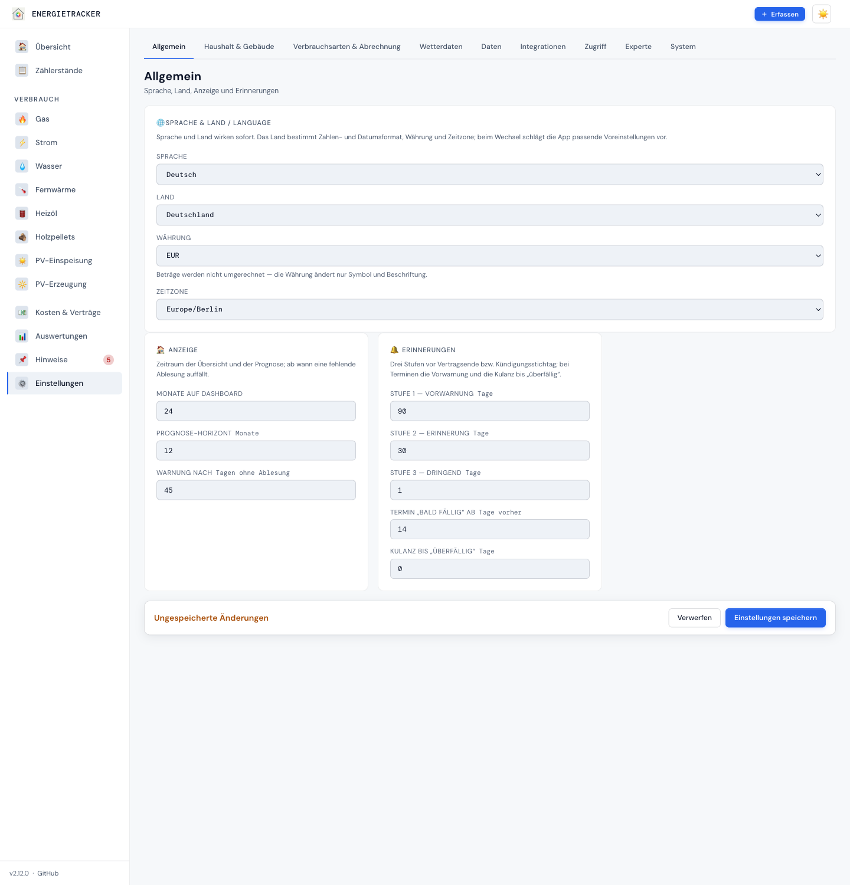

---

## 12. Meters & contracts — incl. topology (F1006)

Meter/device management incl. meter swap (the device chain) and contract maintenance
(working/base price history, advances, bonuses). For oil/pellets only the tank/store
management is relevant here. When creating or editing a tank, **tank capacity** and **initial stock** are captured (instead of a cumulative meter reading).

**Meter topology:** submeters are shown indented under their parent meter, groups as
an expandable collective entry; a **merge wizard** combines several existing meters
into a group. Per meter, the HA alias (`external_id`) can also be set here.

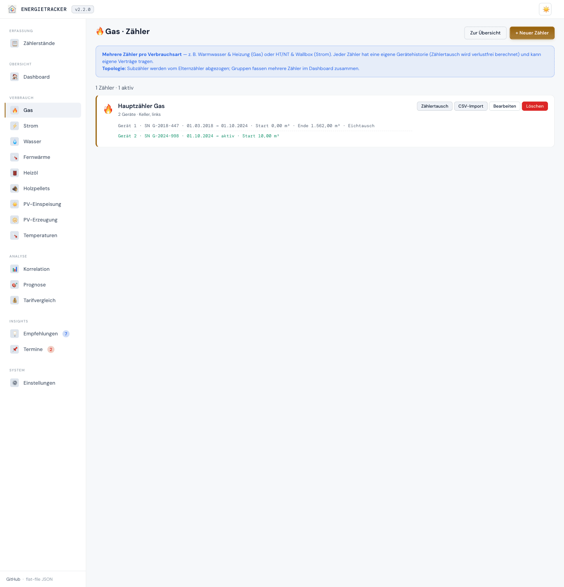

---

## 13. PV — feed-in & generation (F1005)

A dedicated view for photovoltaics: the feed-in meter (remuneration as revenue), the
generation meter, the **electricity balance** (grid import − feed-in) and the
**self-sufficiency rate/self-consumption**. PV utilities have no default meter —
anyone without a system sees no phantom meters.

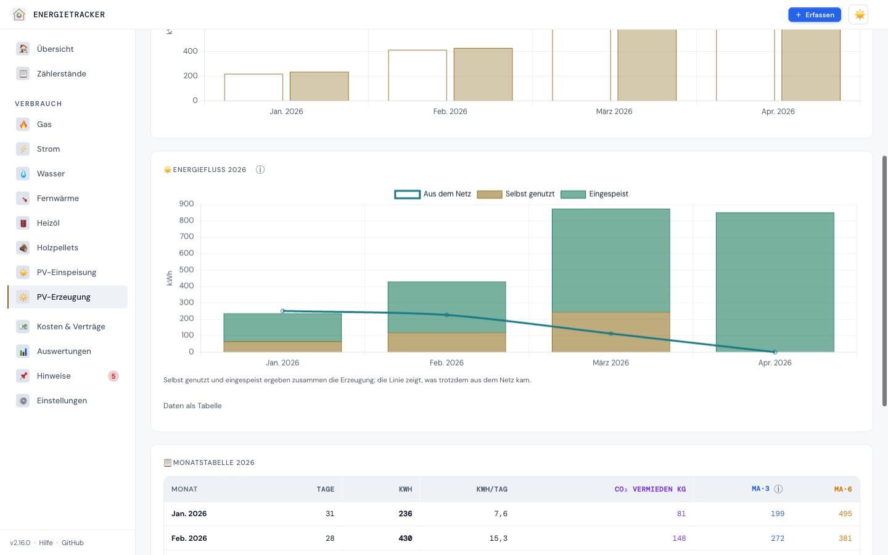

---

[← Compendium index](../README.md)
