# UI-Referenz — Alle Ansichten

**Deutsch** · [English](../en/referenz/ansichten.md)

[← Kompendium-Index](../README.md)

> **Echte Screenshots.** Die folgenden Bilder sind **tatsächliche
> Bildschirmaufnahmen** der laufenden App mit dem mitgelieferten
> [Demo-Datensatz](../../demo-data/) (Light-Theme; Grundstock v1.9.2, Anmeldung,
> Sicherheitskarte und Rückfrage bei der Erfassung v2.6.0, Navigation v2.11.0,
> Erfassung, Einstellungen und Import-Vorschau v2.12.0, Hilfe und Erklärungen
> v2.13.0, Analyse v2.15.0, Übersicht, Gas, PV und Temperaturen v2.16.0). Wer sie
> selbst neu erzeugen will: Demo-Daten laden und die Views nacheinander
> aufnehmen — die App braucht dafür keinen Build-Schritt. Die Bilder stammen
> aus der Zeit vor den Nutzungsstufen (v3.2.0): Sie zeigen, was heute die
> Stufe „Experte“ zeigt, und noch ohne den Umschalter der Stufe.

Die App ist eine Single-Page-Anwendung. Seit **v2.11.0** folgt die
Navigation den Fragen der Nutzer: sieben Bereiche statt 17 Einträgen.

| Bereich | Seiten |
|---|---|
| Übersicht | „Zu tun", Kennzahlen, Tanks und Empfehlungen im Überblick |
| Zählerstände | alle Zähler in einem Durchgang |
| Verbrauch | eine Seite je aktive Verbrauchsart |
| Kosten & Verträge | Verträge & Abschläge · Wechsel prüfen · Rechnung prüfen · Mietverhältnis (v3.1.0, nur „zur Miete“) |
| Auswertungen | Analyse · Prognose · Jahresbericht |
| Hinweise | Termine & Wartung · Empfehlungen (eine Zahl an der Seitenleiste) |
| Einstellungen | Allgemein · Haushalt & Gebäude · Verbrauchsarten & Abrechnung · Wetterdaten · Daten · Integrationen · Zugriff · Experte · System |

Die Seiten eines Bereichs stehen als **Tabs** über der Ansicht. Menüname und
Seitentitel sind gleich, und der Tab des Browsers nennt die Ansicht. Frühere
Adressen (`#/tariffs`, `#/temperatures` …) bleiben gültig. Die Seitenleiste
zeigt nur die *aktiven* Verbrauchsarten (Einstellungen → Verbrauchsarten &
Abrechnung → Aktive Verbrauchsarten) und folgt einer Änderung sofort. Seit
v3.2.0 fehlen in Navigation und Tabs die Seiten, die erst eine höhere
Nutzungsstufe zeigt (unten).

**Mac:** Seitenleiste links. In der Kopfleiste steht **＋ Erfassen**:
Zählerstände, Lieferung und Peilstand bei Heizöl und Pellets, Termin.
Daneben der Umschalter für die Darstellung (wie das System, hell, dunkel),
seit v3.2.0 davor die Auswahl der Nutzungsstufe.

**Nutzungsstufe (v3.2.0):** Vor dem Tag/Nacht-Knopf steht die Auswahl
**„Nutzungsstufe“** mit 🌱 **Einsteiger**, 🌿 **Erfahren** und 🌳
**Experte** — am Mac ein Menü, am iPhone das Rad des Systems; dort zeigt die
Kopfleiste nur das Symbol. Die Stufe gilt sofort: Seitenleiste, Tabs und die
offene Ansicht bauen sich neu auf. Sie bestimmt, was die Oberfläche zeigt,
nicht was die App rechnet — API, CSV-Export, Backup und Home Assistant
liefern in jeder Stufe dasselbe. Ausgeblendete Formularfelder bleiben im
Formular: Ein Vertrag, den ein Einsteiger speichert, behält seine
Kündigungsfrist. Ohne Anmeldung gilt die Stufe für die Installation
(`ui_level`), mit Anmeldung für die angemeldete Person
([Benutzer im Haushalt](../anleitungen/benutzer.md)); in der öffentlichen Demo
merkt sie sich der Browser. Eine bestehende Installation steht nach dem
Update auf „Experte“.

| ab Stufe | Seiten | Teile von Seiten |
|---|---|---|
| 🌱 Einsteiger | Übersicht (eigene Ansicht, §1), Zählerstände, Verbrauch je Art, Verträge & Abschläge, Jahresbericht, Termine & Wartung, Empfehlungen, Hilfe; Einstellungen → Allgemein, Haushalt & Gebäude, Verbrauchsarten & Abrechnung, Daten | — |
| 🌿 Erfahren | Wechsel prüfen, Rechnung prüfen, Mietverhältnis, Analyse, Prognose, Zählerverwaltung einer Art (`#/utility/…/meters`), Wetterdaten, Einstellungen → Integrationen | die Übersicht mit allen Kennzahlen; in der Verbrauchsansicht die CO₂-Kachel, „Gemessen“/„Witterungsbereinigt“, die Monatstabelle, der Energiefluss der PV, „Rechnung prüfen“ und „Ladevorgänge aus evcc“ (§3); im Vertragsdialog Kündigungsfrist, Preisgarantie, Kündigungsweise, Mindestlaufzeit, „Verlängert sich ohne Kündigung“, Boni und Sonderzahlungen; in den Einstellungen Anzeige, Erinnerungen, Eigene Vergleichswerte, Wasser-Referenzwerte, Physikalische Konstanten und Energieträger (Lieferung) |
| 🌳 Experte | Einstellungen → Zugriff, Experte, System | auf der Übersicht der Abschnitt „Schaubilder“; in der Verbrauchsansicht Warmwasser-Wärme, CO₂-Preis im Brennstoff, Ladestrom-Nachweis, Wärmepumpe sowie Speicher und Amortisation der PV; in der Analyse Zäsur und „Wirkung der Maßnahme“; in der Prognose Modell und CO₂-Preis-Szenario; unter Wechsel prüfen der dynamische Tarif und „Börsenstrompreise“; im Vertragsdialog Leistungs- und Messpreis und Kennwerte der Fernwärme, reduziertes Netzentgelt (§ 14a), Arbeitspreis je Zähler einer Gruppe, Gutschriften des Direktvermarkters und „Monatspreise importieren“; im Zählerdialog Gruppe, Analyse-Zäsuren, PV-Anlage, Stromzähler der Wärmepumpe und „Zeitreihe importieren“; im Mietverhältnis „CO₂-Kosten teilen“; in den Einstellungen CO₂-Emissionsfaktoren und Photovoltaik |

Ein Bereich zeigt als Tabs nur die Seiten seiner Stufe, bei einer einzigen
Seite gar keine; „Auswertungen“ in der Seitenleiste führt Einsteiger zum
Jahresbericht. Ein Link, ein Lesezeichen oder eine alte Adresse öffnet eine
ausgeblendete Seite trotzdem. Darüber steht dann der Hinweis „Diese Seite
gehört zur Stufe „Erfahren“. Sie ist trotzdem offen.“ mit **„Auf „Erfahren“
umstellen“** und ✕ — so etwa, wenn ein Einsteiger in der Verbrauchsansicht
auf „⚙️ Zähler“ tippt. Einzelheiten:
[Einrichten und Nutzungsstufen](../einstieg/einrichtung.md#3-nutzungsstufen).

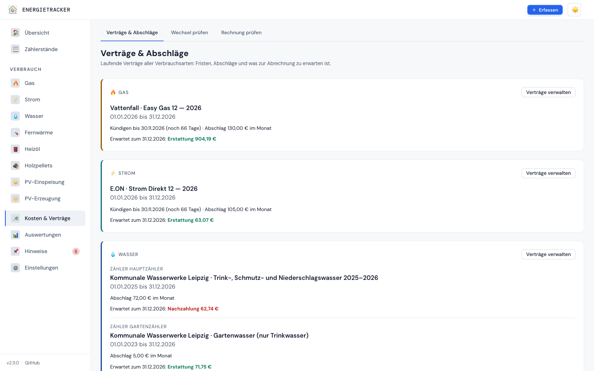

**iPhone:** Unten liegt eine Tab-Leiste in der Daumenzone: Übersicht,
Verbrauch, **＋ Erfassen**, Kosten, Mehr.

- „Mehr" öffnet die Seitenleiste als Menü.
- Die Verbrauchsarten stehen auf ihrer Seite als Tabs.
- Dialoge erscheinen als Blatt von unten, Kopf- und Fußleiste stehen fest.
- Die Zurück-Geste schließt einen Dialog, statt die Seite zu verlassen.
- Tippziele sind mindestens 44 px groß, Eingaben 16 px; Safari zoomt dann
  nicht mehr bei jedem Fokus.
- Als Home-Bildschirm-App reicht die Seite bis unter Uhr und Home-Balken.

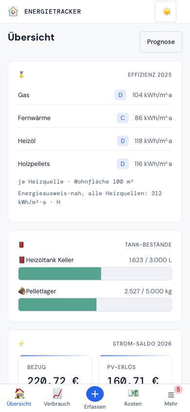 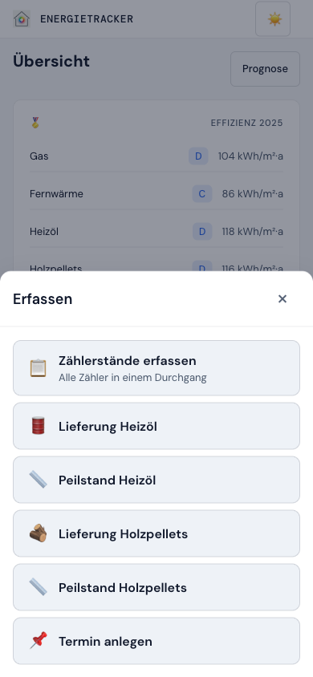

**Erklärungen zum Antippen (v2.13.0):** Neben Fachbegriffen steht ein **ⓘ** —
Heizgradtage, R², gleitendes Mittel, Saldo, Zäsur, Gewinnschwelle,
Kündigungsstichtag und weitere. Antippen oder Klicken öffnet die Erklärung:
am Mac als Blase unter dem Begriff, am iPhone als Blatt über der Tab-Leiste.
„Alle Begriffe“ führt in die Hilfe (§15); Escape oder ein Tipp daneben
schließt sie. Bis v2.12 standen diese Erklärungen in Tooltips, die es auf dem
iPhone nicht gibt. Gehört eine Erklärung zu einer einzelnen Zeile — warum ein
Stand „PRÜFEN“ trägt, was „VOLL“ bei einer Lieferung heißt —, öffnet das ⓘ
daneben genau diese. Seit v3.1.0 nennt die Erklärung eines Rechnungsbegriffs
auch seinen Wortlaut auf der Rechnung des eingestellten Landes, etwa „Auf
deiner Rechnung (Österreich): „Teilbetrag““ beim Abschlag
([Länderprofile §8](../verstehen/14-laenderprofile.md#8-so-heißt-das-auf-deiner-rechnung)).

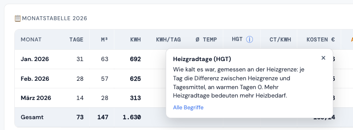 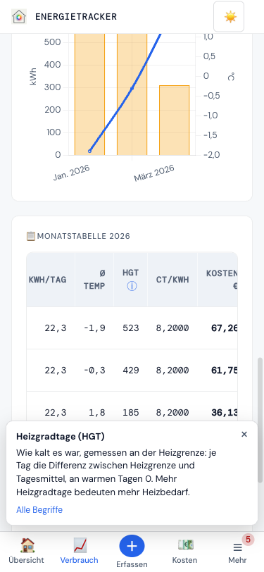

Die **Hilfe** steht in der Fußzeile der Seitenleiste, am iPhone unter „Mehr“.

**Diagramme (v2.15.0)** folgen überall denselben Regeln:

- **Teilmonate** — der erste Monat nach dem Einbau, der laufende, ein Monat
  bis zur letzten Ablesung — stehen blass (Balken) bzw. als hohler Punkt am
  Ende einer gestrichelten Linie da. Der Tooltip nennt die erfassten Tage
  („Teilmonat: 14 von 31 Tagen“), Tabellen zeigen „14 / 31“. Trends und das
  Saisonprofil lassen sie aus.
- **Trends** vergleichen dieselben vollen Monate ein Jahr zuvor. Das Banner
  einer Heizart rechnet dabei witterungsbereinigt nach dem Heizmodell, wenn für
  alle beteiligten Monate ein Wert vorliegt; die Karten der Übersicht
  vergleichen gemessene Werte. Bis v2.14 standen die letzten drei gegen die
  drei davor — Heizsaison gegen Sommer.
- **Farben** sind die der Verbrauchsart, im hellen Theme abgedunkelt (mindestens
  3:1 auf der Karte); beim Umschalten färben sich offene Diagramme sofort um.
- **Daten als Tabelle:** Unter jedem Diagramm ohne eigene Tabelle stehen die
  Zahlen zum Aufklappen. Screenreader hören eine Kurzbeschreibung mit
  Zeitraum, Summe sowie stärkstem und schwächstem Monat.
- **Jahr und Zähler in der Adresse:** `#/utility/gas?year=2025` (bei mehreren
  Zählern mit `&meter=…`) öffnet genau diese Auswahl — zum Teilen, als
  Lesezeichen, nach dem Neuladen. Jede Verbrauchsart merkt sich ihr Jahr.

---

## 1. Übersicht (Dashboard)

Einstieg. 12-Monats-Kennzahlen je Art, Effizienzklasse **pro
Heizquelle**, Tank-Bestände (Öl/Pellets), **Strom-Saldo & Autarkie** bei
PV, kombinierter Verbrauchsverlauf (so viele Monate wie in den Einstellungen
unter *Monate auf Dashboard*, seit v2.9.0) und fällige Termine. Seit v2.10.0
steht unter der Effizienz die **energieausweis-nahe Kennzahl** (bei mehreren
Heizquellen für alle zusammen, ⓘ mit Bezugsfläche und Monaten); ein
unvollständiges Jahr bekommt keine Klasse, sondern einen Hinweis. Die
PV-Karte zeigt zusätzlich die **Ersparnis durch Eigenverbrauch** und, solange
weniger als zwölf Monate Daten aller drei Zähler haben, über wie viele Monate
die Quoten rechnen. Seit v2.7.0 steht
die Effizienzklasse nur in Ländern mit Skala (Deutschland); sonst zeigt die
Karte kWh/m²·a und nennt den Grund ([Länderprofile](../verstehen/14-laenderprofile.md)).
Seit v2.11.0 heißt ein fälliger Termin „seit 65 Tagen überfällig" statt
„jetzt". Die Kopf-Aktion „Temperaturen" entfällt; „Erfassen" steht global in
der Kopfleiste bzw. der Tab-Leiste.

**„Zu tun" (v2.12.0)** steht oben: überfällige und fällige Termine, Zähler,
deren letzte Ablesung länger zurückliegt als unter Einstellungen → Allgemein →
*Warnung nach* eingestellt, Kündigungsfristen und Tanks — jeweils mit einem
Knopf dorthin. Bei bis zu zwei
fälligen Zählern springt der Eintrag direkt zur Karte des Zählers in der
Erfassung; mehr fasst eine Zeile zusammen („7 Zähler warten auf eine
Ablesung"). Jede Zeile ist als Ganzes antippbar, am iPhone mit „›" statt Knopf. Die Terminkarte
weiter unten und die Kachel „Aktive Zähler" je Verbrauchsart entfallen;
Kennzahl-Kacheln heben sich nicht mehr beim Überfahren, weil sie nicht
klickbar sind. Seit v3.1.0 kommen die Einträge aus der Agenda
(`GET /api/agenda`, alle Ereignisse mit `due_now`) — derselben Quelle wie das
Kalender-Abo (§9) und die Sensoren für Home Assistant. Die Regeln sind
dieselben wie bisher; bis v3.0 setzte der Browser die Liste selbst zusammen.

**Ohne Daten (v2.13.0)** steht statt leerer Kacheln ein Willkommen: was der
Energietracker tut, die ersten Schritte mit Häkchen aus den Daten (Standort,
erster und zweiter Stand, Vertrag, optional Home Assistant) und
**„Mit Beispieldaten ausprobieren“**. Vorher sichert die App den
jetzigen Stand; zurück geht es über Einstellungen → Daten → Snapshots.

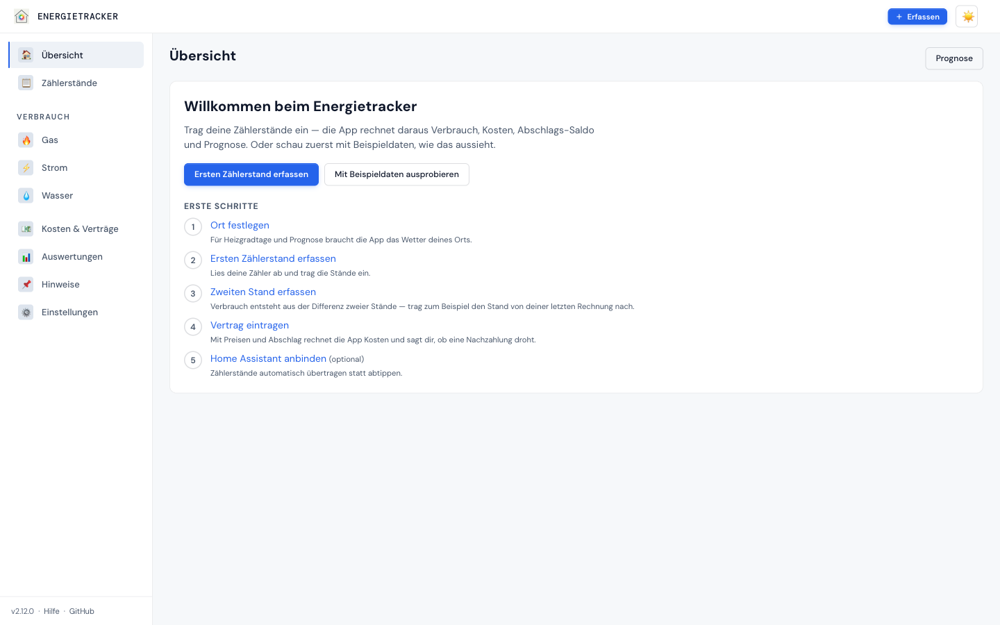

**Zeitraum je Karte (v2.15.0):** Jede Karte nennt ihr Fenster („Zeitraum:
Apr. 2025 – März 2026 · März 2026: 14 von 31 Tagen“) — die Verbrauchsarten
enden in verschiedenen Monaten. Der Pfeil vergleicht dieselben vollen Monate
ein Jahr zuvor; bis v2.14 die zwölf Monate davor, mit einem halben Monat gegen
einen ganzen.

**Kleine Vielfache (v2.16.0):** Jede Karte zeigt ihren eigenen Verlauf über
das Kartenfenster, dieselben Monate ein Jahr zuvor als gepunktete Linie. Der
gemeinsame Verlauf darunter heißt „Energie gesamt“ und stapelt nur, was sich
addieren lässt: den Verbrauch in kWh; Wasser und PV stehen in ihren Karten.
Bis v2.15 teilten sich Heizarten und Strom eine Linienachse, auf der Strom
plattgedrückt am Boden lag. Die Werte stehen darunter als Tabelle.

**PV auf der Übersicht (v2.13.0):** Die Einspeisung zeigt „Einspeisung“ und
„Vergütung“, die Erzeugung „Erzeugung“ ohne Kostenkachel. Bei beiden ist mehr
gut: Der Pfeil nach oben ist grün. Der gemeinsame Verlauf zeigt nur noch, was
bezogen wird — bis v2.12 standen dort auch die PV-Kilowattstunden, als wären
sie Verbrauch.

**Einordnung (v3.1.0):** Die Karte 📏 **„Einordnung {Jahr}“** (Vorjahr) stellt
den Jahresverbrauch eigenen Vergleichswerten gegenüber — „Haushaltsstrom: …
kWh gegenüber … kWh (dein Vergleichswert)“ und je Heizart „… kWh/m² gegenüber
… kWh/m²“, mit der Abweichung in % (grün darunter, rot darüber), nur für volle
Jahre. Darunter, wo es zutrifft: dass das Jahr noch nicht alle Monate hat, dass
mit PV, Wärmepumpe oder Wallbox der allgemeine Stromspiegel nicht passt
(Wärmepumpe und Wallbox sind schon herausgerechnet), und die Quelle der
Vergleichswerte. Ohne eigene Werte steht dort, wo man sie einträgt
(Einstellungen → Haushalt & Gebäude → Eigene Vergleichswerte). In Deutschland
verlinkt die Karte „Stromspiegel: eigene Klasse prüfen“ und „Heizspiegel:
Heizkosten prüfen“ ↗. Ohne Werte und ohne Links entfällt sie.

**Übersicht für Einsteiger (v3.2.0):** In der Stufe „Einsteiger“ zeigt die
Übersicht, sobald Verbrauchsdaten da sind, statt aller Kennzahlen drei
Antworten; oben steht der Knopf **„Zählerstand erfassen“**. Ohne Daten steht
in jeder Stufe das Willkommen.

- 💶 **„Bekomme ich Geld zurück?“** — je Zähler mit laufendem Vertrag (ohne
  Subzähler und PV) „rund … zurück“ in Grün, „rund … Nachzahlung“ in Rot oder
  „etwa ausgeglichen“ (unter 1 €), dazu „Abrechnung am …“. Ohne Vertrag:
  „Noch kein Vertrag mit Abschlag erfasst.“ mit dem Link „Vertrag eintragen“.
- 📈 **„Mehr oder weniger als im Vorjahr?“** — je Verbrauchsart die letzten
  zwölf Monate gegen dieselben Monate ein Jahr zuvor, ab sechs vergleichbaren
  Monaten: „… mehr als im Vorjahr“, „… weniger als im Vorjahr“ oder unter 2 %
  „etwa wie im Vorjahr“ — grün, wenn es gut ist (bei PV mehr), sonst rot.
  Ohne Vorjahr: „Noch kein Vorjahr zum Vergleichen.“
- 🏢 **„Reicht die Vorauszahlung?“** — nur „zur Miete“ mit laufendem
  Mietverhältnis: „Ja — voraussichtlich rund … zurück.“ oder „Knapp —
  voraussichtlich rund … Nachzahlung.“, dann mit „Passende Vorauszahlung: …
  im Monat.“
- ✅ **„Was ist zu tun?“** — die ersten vier Einträge aus „Zu tun“, je mit
  „›“; sonst „Gerade nichts — gut so.“

Darunter erklärt das Schaubild „Wohin geht mein Geld?“ den Vertrag mit dem
höchsten Abschlag. Die Zahlen sind dieselben wie in den anderen Stufen
(`GET /api/summary`, Vertragsstatus).

**Vorschlag zum Hochstufen (v3.2.0):** Zeigen die Daten mehr, als die Stufe
anzeigt, steht oben auf der Übersicht „Deine Daten können mehr, als diese
Stufe zeigt — „…“ blendet es ein.“ mit dem Anlass in kleiner Schrift. Für
Einsteiger sind das Subzähler, Werte von Home Assistant (ein Zähler mit
Alias) und mehrere Zähler einer Verbrauchsart — Vorschlag „Erfahren“; für
Erfahrene ein Zähler mit der Rolle Wärmepumpe, Speicher oder Wallbox —
Vorschlag „Experte“. **„Auf „…“ umstellen“** stuft mit einem Klick hoch,
**„Nicht mehr fragen“** merkt sich dieses Gerät je Stufe und Anlass. Der
Vorschlag blockiert nichts.

**Schaubilder (v3.2.0, Stufe Experte):** Zwischen „Zu tun“ mit den Karten
Effizienz, Tanks, Strom-Saldo und Empfehlungen und den Karten der
Verbrauchsarten steht der Abschnitt 🎞️
**„Schaubilder“**: „Wohin geht mein Geld?“ und „Vertrag auf einen Blick“ für
den Vertrag mit dem höchsten Abschlag, „Energiefluss im Haus“ für das Vorjahr
(sonst das letzte Jahr mit PV-Daten) und „Kälter oder mehr verbraucht?“ für
den ersten Heizzähler. Jedes Bild erscheint nur mit seinen Daten; fehlen sie
für alle, entfällt der Abschnitt.

Die vier Schaubilder sind Erklärgrafiken mit den eigenen Zahlen — sie
beantworten je eine Frage, statt eine Reihe zu zeigen:

| Schaubild | Was es zeigt | Leer, wenn … |
|---|---|---|
| **„Wohin geht mein Geld?“** | zwei Balken bis zum Ende des Abrechnungszeitraums: „Abschläge“ gegen „Kosten“, die Kosten geteilt in „Verbrauch“, „Grundpreis“ (abzüglich Boni) und „noch geschätzt“; der Abstand als Guthaben oder Nachzahlung. Text: „Bis zur Abrechnung am … zahlst du … Abschläge; Verbrauch und Grundpreis kosten voraussichtlich …. Das ergibt rund … Guthaben.“ | kein laufender Vertrag mit Saldo-Verlauf da ist |
| **„Energiefluss im Haus“** | ☀️ PV, 🏠 Haus, ⚡ Netz und, mit Speicherzählern, 🔋 Speicher; die Breite jedes Flusses folgt der Menge. Text: „{Jahr}: Die Anlage erzeugte … kWh. Das Haus nutzte … kWh davon selbst, … kWh gingen ins Netz, … kWh kamen aus dem Netz. Autarkie: ….“ | das Jahr keine Erzeugung hat |
| **„Kälter oder mehr verbraucht?“** | „Verbrauch“ und „Heizgradtage“, je „dieselben Monate im Vorjahr“ gegen „zuletzt“ mit der Abweichung in %, darunter die Plakette „witterungsbereinigt …“. Der Text sagt „Du hast wirklich weniger verbraucht“, „Du hast wirklich mehr verbraucht — nicht nur das Wetter“ oder „etwa gleich — der Unterschied kommt vom Wetter“ (Grenze ±2 %) | weniger als sechs ganze Monate mit witterungsbereinigtem Wert (`heat_adjusted`) aus den letzten zwölf ein Vorjahr haben |
| **„Vertrag auf einen Blick“** | ein Zeitstrahl mit „Beginn“, „Kündigen bis“, „Preiserhöhung“, „Ende“ und „heute“; die Strecke bis heute ist gefüllt. Bei einem weiterlaufenden Vertrag ist das Ende der Tag, an dem er nach einer Kündigung bis „Kündigen bis“ endet | der Vertrag keinen Beginn hat |

Balken wachsen und Flüsse laufen, sobald ein Bild ins Blickfeld kommt. Mit
„Bewegung reduzieren“ am Gerät steht gleich das fertige Bild da, ebenso beim
Drucken. Die Grafik ist für Screenreader ausgeblendet; ihre Aussage steht als
Text darunter. Die Bilder sind SVG mit CSS-Animation, ohne Bibliothek, und
folgen Tag/Nacht. Wo sie sonst stehen: in jeder Verbrauchsansicht (§3) und
auf der Übersicht für Einsteiger
([Schaubilder](../einstieg/einrichtung.md#4-schaubilder)).

---

## 2. Zählerstand-Erfassung (F1004)

Zentrale, mobil-freundliche Eingabemaske: alle aktiven kumulativen Zähler
(Gas/Strom/Wasser/Fernwärme/PV, seit v3.1.0 Heizwärme) mit jeweils dem letzten Stand als
Orientierung — ideal fürs monatliche Ablesen am Handy.

**Seit v2.6.0 mit Plausibilitätsprüfung:** Schon beim Tippen erscheint ein
Hinweis, wenn der neue Stand einen ungewöhnlichen Tagesverbrauch ergäbe
(mehr als das Dreifache des üblichen), kleiner als der letzte ist, in der
Zukunft liegt oder es für den Tag schon einen Stand gibt. Beim Speichern fragt
die App je auffälliger Karte nach (Titel: Verbrauchsart · Zähler); „Ersetzen"
aktualisiert den vorhandenen Stand statt einen zweiten anzulegen. Wer ablehnt,
behält die Eingabe, die Karte zeigt „Nicht gespeichert – bitte prüfen".
Details: [Zählerstände → Plausibilität](../verstehen/11-zaehlerstaende.md).

**Seit v2.12.0:**

- Das Datum gilt oben für alle Karten; je Karte ist es eingeklappt
  („Anderes Datum"). Eine Karte mit eigenem Datum behält es, wenn sich das
  Datum oben ändert.
- Kein Beispielwert mehr im Feld — „z. B. 1.395" sah aus wie ein vorbelegter
  Stand. Der letzte Stand steht darüber.
- Die Tastatur zeigt „Weiter": Enter springt ins nächste Zählerfeld, beim
  letzten auf „Alle speichern". Am iPhone lässt sich der Stand auch mit der
  Kamera übernehmen: Feld antippen → „Text scannen" (Live Text; das Feld ist
  dafür ein Textfeld mit Dezimaltastatur).
- Ein Fehler steht unter dem Feld statt nur im Titel des ✗.
- Nach dem Speichern nennt die Meldung, was sich geändert hat („Gas +5,4 m³"),
  und bietet zehn Sekunden **„Rückgängig"** — das löscht die eben angelegten
  Stände.
- **Direktsprung je Zähler:** `#/zaehlerstaende?meter=<id>` öffnet die
  Erfassung mit der Karte dieses Zählers im Fokus — für ein Lesezeichen auf dem
  Home-Bildschirm, einen Kurzbefehl oder „Zu tun".

**Seit v3.1.0:**

- **„📷 Foto“** je Karte nimmt ein Bild des Zählwerks als Beleg mit; am Handy
  öffnet sich die Kamera. Die Karte zeigt ein Vorschaubild mit „Foto
  entfernen“. Das Bild wird im Browser auf höchstens 1600 Pixel verkleinert und
  als JPEG neu kodiert (ohne EXIF- und GPS-Daten) und mit dem Stand
  gespeichert.
- **Texterkennung:** Ist unter Einstellungen → Experte ein Dienst eingetragen,
  lädt „📷 Foto“ das Bild sofort hoch und zeigt erst „Texterkennung läuft …“,
  dann „Erkannt: 12.345,6“ mit **„Übernehmen“** — das setzt den Wert ins Feld,
  gespeichert wird wie gewohnt mit „Alle speichern“. Erkennt der Dienst nichts,
  steht „Kein Zählerstand erkannt – bitte von Hand eintragen.“ da
  ([Texterkennung im Heimnetz](../anleitungen/texterkennung.md)).
- **Ohne Verbindung:** Eine Karte, deren Speichern an der Verbindung scheitert,
  zeigt ⏳ „Wartet auf Verbindung“; der Stand liegt in der Warteschlange des
  Browsers. Oben erscheint die Karte **„Noch nicht gespeichert“** mit jedem
  wartenden Stand (Zähler · Wert · Datum, 📷 mit Foto), „Verwerfen“ und
  **„Jetzt senden“**. Die Zahl der wartenden Stände steht auch am Menüpunkt
  „Zählerstände“ und am ＋ der Tab-Leiste.
- **Konflikt:** Gibt es beim Nachsenden am selben Tag schon einen anderen
  Stand, fragt der Eintrag „Am … gibt es schon einen Stand (…) – ersetzen oder
  den vorhandenen behalten?“ mit **„Ersetzen“** und **„Vorhandenen behalten“**.
  Lehnt der Server einen Stand ab, steht „Nicht gespeichert: Grund“ mit
  **„Bearbeiten“** (Werte und Foto zurück in die Karte) und **„Verwerfen“** da.
  Einzelheiten: [Auf dem Handy nutzen](../einstieg/handy.md#die-warteschlange-noch-nicht-gespeichert).
- **Zähler mit „Verbrauch je Zeitraum“:** Statt Datum und Stand zeigt die
  Karte „Monat“ und „Verbrauch (kWh)“ bzw. die Einheit der Art, darüber „Letzter
  Zeitraum:“ mit Zeitraum und Wert. Vorbelegt ist der Monat nach dem letzten
  Zeitraum, ohne Zeitraum der Vormonat. Aufklappbar **„Vergleichswerte laut
  Verbrauchsinfo“** mit Vormonat, Vorjahresmonat und Durchschnittsnutzer — so,
  wie die monatliche Verbrauchsinfo des Messdienstes sie nennt. „Geschätzt“ und
  Notiz wie bei Ständen; „Alle speichern“ legt einen Zeitraum über den ganzen
  Monat an, die Offline-Warteschlange gilt auch hier. Bei Gas trägt die Karte
  kWh ein; m³ gehen über die Verbrauchsansicht. Hintergrund:
  [Heizwärme](../verstehen/15-waerme.md).

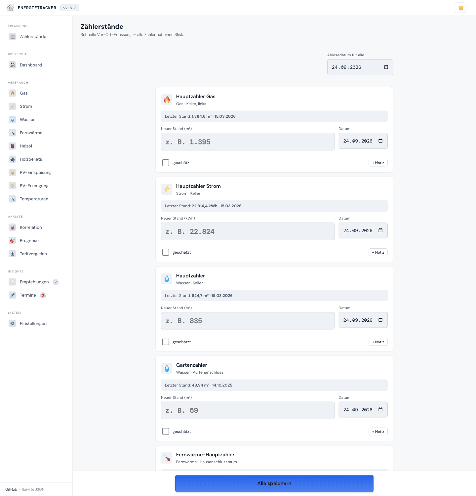

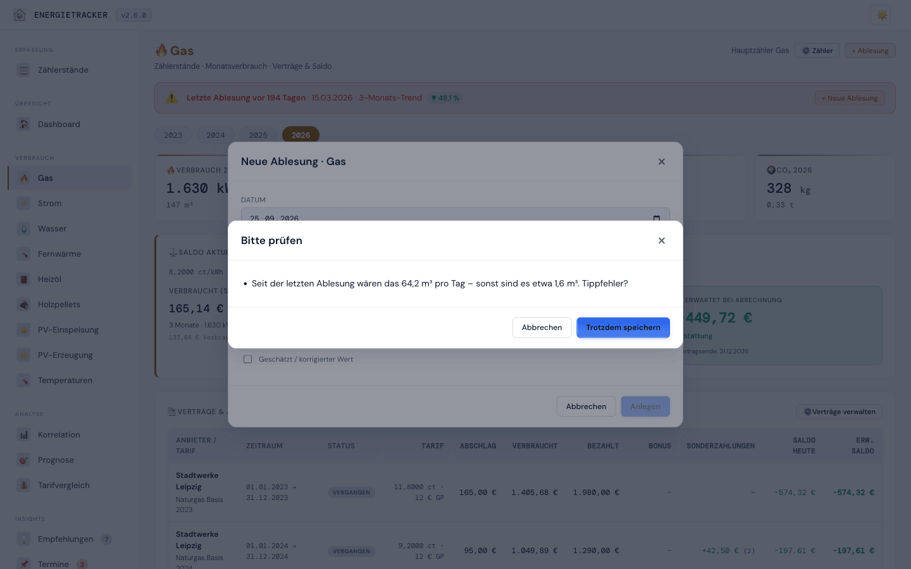

---

## 3. Verbrauchsansicht — kumulative Arten (Gas/Strom/Wasser/Fernwärme)

Pro Art identischer Aufbau: Jahr-Auswahl, Zähler-Auswahl, KPI-Leiste
(Verbrauch, Kosten, Abschläge mit Saldo der abgelesenen Monate, Tagesschnitt,
CO₂), Vertrags-/Saldo-Karte, Verbrauchschart mit Temperaturüberlagerung sowie
Monatstabelle mit gleitenden Mitteln (MA-3/MA-6) und Wetterbereinigung.

**Saldo-Verlauf (v2.16.0):** Unter den Zahlen der Saldo-Karte stehen die
aufsummierten Kosten und das Bezahlte (Abschläge, Sonderzahlungen) über den
Abrechnungszeitraum — gestrichelt, wo geschätzt ist, hohle Punkte nach heute.
Der Abstand der Linien ist der Saldo, der letzte Punkt die erwartete
Abrechnung; die Zahlen stehen als Tabelle darunter. Gerechnet wird im Backend
mit derselben Funktion wie der erwartete Saldo (`balance_path`).

**Monatschart (v2.16.0):** Neben jedem Monat steht derselbe Monat des Vorjahres
als Umriss. Heizarten schalten zwischen *Gemessen* und *Witterungsbereinigt*
um: bereinigt nach dem Heizmodell auf ein Normaljahr am Standort, damit der
Vergleich zeigt, ob gespart wurde — nicht, ob der Winter mild war. Die
Monatstabelle führt dafür die Spalte „bereinigt“, der Tooltip nennt einen
Zählertausch im Monat.

**Saldo-Karte (v2.8.0):** rechnet nach Kalender bis heute — „Verbraucht
(Stand heute)" zerlegt sich in Arbeitspreis und Grundpreis (abzüglich Boni),
darunter steht, bis wann gemessen und ab wann geschätzt ist. „Abschlag
bezahlt" zählt die Abschläge, wie sie abgebucht wurden. Weicht der erwartete
Saldo spürbar ab, schlägt die Karte einen Abschlag vor. Die KPI-Kacheln
summieren dagegen die abgelesenen Monate; liegt die letzte Ablesung im
laufenden Jahr zurück, heißt die Kachel „Abschläge bis ‹Datum›". Die Tabelle
**Verträge & Abschläge** führt je Vertrag Tarif, Abschlag, Verbraucht,
Bezahlt, Bonus, **Sonderzahlungen** (seit v2.5.1: Netto aus Kundensicht;
seit v2.13.0 die Einzelposten zum Aufklappen statt im Tooltip; nur bei
Gas/Strom/Fernwärme) sowie Saldo heute und erwarteten Saldo. Der Grundpreis
steht ausgeschrieben da („Grundpreis 12,95 €/Monat“ statt „13 € GP“).

**Saldo aus Kundensicht (v2.13.0):** Karte und Kachel nennen den Saldo mit
Wort und ohne Vorzeichen — „Guthaben 120,00 €“ in Grün, „Nachzahlung
60,00 €“ in Rot, dazu der Bezugszeitraum. In Tabellen steht **+ für
Guthaben** und **− für Nachzahlung**, erklärt in einer Zeile darunter. Bis
v2.12 zeigte die App die Buchhaltungssicht (Kosten − Abschläge, Minus =
Guthaben) — das Gegenteil dessen, was die Abrechnung sagt. API und CSV-Export
behalten ihr Vorzeichen.

**Noch keine Monatswerte (v2.13.0):** Hat ein Zähler keinen oder erst einen
Stand, erklärt die Seite, dass Monatswerte aus der Differenz zweier Stände
entstehen, und führt zur Erfassung genau dieses Zählers.

**Seit v2.9.0** rechnet die Karte tagesgenau: Ein Wechsel oder eine
Preisänderung zur Monatsmitte gilt ab ihrem Tag. Unter den Zahlen stehen
Hinweise, wenn sie zutreffen — der Vertrag ist abgelaufen und läuft ohne
Kündigung weiter (Status **VERLÄNGERT**, Enddatum = nächste Abrechnung), der
Kündigungsstichtag ist verpasst, oder eine eingetragene Preiserhöhung steht
bevor (in Deutschland mit dem Sonderkündigungsrecht nach § 41 Abs. 5 EnWG).
Das Banner „Ablesung überfällig" richtet sich nach der Einstellung
*Warnung nach* (Tage ohne Ablesung; Warnung ab ⅔, Alarm ab dem Wert). Seit
v2.15.0 nennt es den Trend der letzten drei vollen Monate gegen dieselben
Monate des Vorjahres („Dez. 2025 – Feb. 2026 gegenüber Vorjahr,
witterungsbereinigt“), auch bei PV, wo mehr gut ist.

**Unplausible Stände (v2.6.0):** Gibt es Ausreißer, einen fallenden Stand
ohne Zählertausch oder einen unbestätigten Verdacht aus Home Assistant, steht
oberhalb der Jahresauswahl ein Hinweis mit den betroffenen Ständen und einem
Link zum Zählertausch. In der Ablesetabelle tragen sie „PRÜFEN“ bzw.
„UNPLAUSIBEL“ (seit v2.13.0 mit ⓘ und der Begründung, vorher im Tooltip);
einen Verdacht bestätigt ✅ —
erst dann zählt er. Der Ablese-Dialog stellt dieselben Rückfragen wie die
Zählerstand-Erfassung.

**Foto zum Stand (v3.1.0):** Trägt ein Stand ein Foto, zeigt die
Ablesetabelle ein kleines Vorschaubild. Ein Klick öffnet die Großansicht mit
„In neuem Tab öffnen“ und „Foto entfernen“ — Entfernen löst das Foto vom Stand;
die Datei wird nach 24 Stunden aufgeräumt.

**Zeiträume statt Ablesungen (v3.1.0):** Bei einem Zähler mit „Verbrauch je
Zeitraum“ steht statt der Ablesetabelle die Karte **„Zeiträume {Jahr}“** mit
Zeitraum, Verbrauch und den Vergleichswerten (Vormonat · Vorjahresmonat ·
Durchschnittsnutzer), ✏️ und 🗑️ je Zeile. **„+ Zeitraum“** öffnet den Dialog
mit „Von“, „Bis (einschließlich)“ — vorbelegt mit dem Monat nach dem letzten
Zeitraum, sonst dem Vormonat —, „Verbrauch“, „Einheit“, den
Vergleichswerten, „Geschätzt“ und Notiz. Die Einheit lässt sich nur bei Gas
wählen: kWh (Verbrauch) oder m³ (Zählereinheit, umgerechnet mit den
Gasfaktoren). Ein überlappender Zeitraum wird abgelehnt. Leer steht da: „Noch
kein Zeitraum in diesem Jahr“ mit dem Hinweis, Monat für Monat aus der
Verbrauchsinfo einzutragen oder unter Zähler eine CSV-Datei einzulesen. Das
Banner „Ablesung überfällig“ zählt hier ab dem Ende des letzten Zeitraums
(„Letzter Zeitraum endete vor … Tagen“). Chart, Monatstabelle, Verträge und
Wetterbereinigung laufen wie bei Ständen.

**Warmwasser-Wärme (v3.1.0):** Bei einem Wasserzähler mit der Rolle
„Warmwasser“ steht unter den Tabellen „Wärme für dieses Warmwasser {Jahr}: rund
… kWh bei … °C – Rechenwert nach HeizkostenV § 9, kein Messwert.“ mit ⓘ. Die
Temperatur kommt aus Einstellungen → Haushalt & Gebäude → Wohnen und
Warmwasser.

**Rechnung prüfen (v3.1.0):** Gas, Strom, Wasser und Fernwärme tragen unter
den Tabellen die Karte **„Rechnung prüfen“** mit dem Knopf „Rechnung {Jahr}
prüfen“. Er öffnet die Seite mit Verbrauchsart, Zähler und dem angezeigten
Jahr (`#/bill-check?utility=…&meter=…&from=…&to=…`) und rechnet gleich nach.
Bis v3.0 gab es den Verweis nur bei Gas.

**CO₂-Preis im Brennstoff (v3.1.0):** Bei Gas, Heizöl, Fernwärme und
Heizwärme folgt — in Deutschland — die Karte **„CO₂-Preis im Brennstoff
{Jahr}“** mit ⓘ: „Darin enthalten“ (der Betrag mit Umsatzsteuer), „Je kWh“,
„Emissionen (BEHG)“ und „CO₂-Preis“ in €/t. Darunter „Steckt schon im
Arbeitspreis – kein Aufschlag. Netto …, oben mit Umsatzsteuer.“, die Quelle
(Standardfaktor, Versorgerrechnung oder Emissionsfaktor des Wärmenetzes) und,
wo es zutrifft, die Hinweise auf die Näherung bei Heizwärme und auf einen
angenommenen Preis. Ohne Verbrauch im Jahr oder ohne Faktor — Fernwärme ohne
Netzfaktor im Vertrag — entfällt die Karte
([CO₂-Preis im Brennstoff](../verstehen/16-co2-preis.md)).

**Gruppenvertrag (v3.1.0):** Ist der Zähler Mitglied einer Gruppe mit
Gruppenvertrag, zeigt die Saldo-Karte den Gruppenvertrag mit dem Hinweis
„Dieser Zähler rechnet über den Gruppenvertrag „…“. Saldo und Abschläge gelten
für die ganze Gruppe.“ ([Meter-Topologie](../verstehen/13-meter-topologie.md#gruppenvertrag-v310)).

**Ladestrom-Nachweis (v3.1.0):** Bei einem Stromzähler mit der Rolle „Wallbox“
folgt die Karte **„Ladestrom-Nachweis (Dienstwagen)“** mit „Jahr“ (laufendes
und drei Vorjahre, vorgewählt das Vorjahr), „Preis“ („Vertragspreis mit
anteiligem Grundpreis“ oder „Strompreispauschale“), bei der Pauschale „Pauschale
je kWh (Cent)“, der Zeile „Geladen: … kWh · zu erstatten: …“, den Knöpfen
„CSV herunterladen“ und „PDF herunterladen“ und dem Hinweis „keine
Steuerberatung“. Ohne zahlenden Vertrag oder ohne Pauschale steht dort die
Meldung ([Ladestrom-Nachweis](../anleitungen/ladestrom-nachweis.md)).

**Wärmepumpe (v3.1.0):** Beim Stromzähler mit der Rolle „Wärmepumpe
(Heizstrom)“ und beim Heizwärme-Zähler mit der Rolle „Wärmemenge der
Wärmepumpe“ folgt die Karte **„Wärmepumpe {Jahr}“** mit ⓘ: „Jahresarbeitszahl“
(„aus … Monaten mit beiden Zählern“), „Heizperiode (Okt.–Apr.)“, „Wärme /
Strom“ in kWh und eine Tabelle je Monat mit Wärme, Strom und Arbeitszahl; darunter
die Werte des Feldtests zur Einordnung. Fehlt der Wärmezähler, die Verknüpfung
oder ein gemeinsamer Monat, sagt die Karte das
([Heizwärme §7](../verstehen/15-waerme.md#7-jahresarbeitszahl-der-wärmepumpe-v310)).

**Schaubilder (v3.2.0):** Unter der Saldo-Karte steht in jeder Stufe die
Karte **„Schaubilder“** mit denen, die zur Art passen (§1): bei einem
laufenden Vertrag „Wohin geht mein Geld?“ und „Vertrag auf einen Blick“
(nicht bei der Einspeisung), bei Heizarten — auch Heizöl und Pellets (§4) —
„Kälter oder mehr verbraucht?“ über die letzten zwölf Monate, bei beiden
PV-Arten „Energiefluss im Haus“ für das gewählte Jahr. Passt keines, fehlt
die Karte.

**Ladevorgänge aus evcc (v3.2.0):** Bei einem Stromzähler mit der Rolle
„Wallbox“ folgt ab der Stufe „Erfahren“ die Karte **„Ladevorgänge aus evcc
{Jahr}“** für das gewählte Jahr. Ein Satz erklärt, dass evcc die Wallbox
steuert und die App nachrechnet. Mit Ladevorgängen steht dort „… Ladevorgänge,
… kWh, davon … aus der Sonne“, wenn evcc Preise liefert mit „· laut evcc …“,
und eine Tabelle mit Monat, Vorgänge, kWh, Sonne und „Preis (evcc)“; ohne
„Für {Jahr} sind noch keine Ladevorgänge aus evcc da.“ Darunter die Auswahl
**„Zählerstände“** — „vom Zähler der Wallbox (sonst aufsummiert)“, „aus der
geladenen Energie aufsummieren“ oder „keine – nur die Ladevorgänge“ — und die
Knöpfe **„CSV aus evcc wählen …“** und, wenn unter Einstellungen → Experte
eine Adresse steht, **„Von evcc abrufen“**. Beides zeigt erst die Vorschau
„Ladevorgänge übernehmen?“: Zahl und Zeitraum der Vorgänge mit kWh, wie viele
Zählerstände dazukommen und wie viele vorhandene am selben Tag ersetzt
werden, ein noch laufender Vorgang, mehrere Ladepunkte in der Datei.
„Übernehmen“ schreibt, die Meldung nennt die Zahl der Vorgänge. Ohne Adresse
sagt die Karte, wo es in evcc die CSV-Datei gibt; „Anleitung“ führt zu
[Ladevorgänge aus evcc](../anleitungen/evcc.md).

**Was die Stufen zeigen (v3.2.0):** Einsteiger sehen Jahr und Zähler, die
Kacheln Verbrauch, Kosten, Abschläge und Tagesschnitt, Saldo-Karte,
Schaubilder, Verträge, den Monatschart und die Ablesungen, Zeiträume oder
Lieferungen. Ab „Erfahren“ kommen die CO₂-Kachel, der Umschalter
„Gemessen“/„Witterungsbereinigt“, die Monatstabelle, bei PV der Energiefluss
sowie die Karten „Rechnung prüfen“ und „Ladevorgänge aus evcc“ dazu. Erst
„Experte“ zeigt Warmwasser-Wärme, CO₂-Preis im Brennstoff,
Ladestrom-Nachweis, Wärmepumpe und bei der PV-Erzeugung Speicher,
Amortisation und Hinweise. „⚙️ Zähler“ im Kopf der Ansicht führt in die
Zählerverwaltung; sie gehört zur Stufe „Erfahren“, Einsteiger sehen sie mit
dem Hinweis von oben.

---

## 4. Verbrauchsansicht — lieferbasierte Arten (Heizöl/Pellets)

Statt Zählerständen: Tank-Karte und Lieferungstabelle (Datum, Menge, Preis,
Gesamt, Lieferant). Kein Vertrags-Bereich — die Tankrechnung ist die
Kostenbasis.

**Tankbuch (v2.10.0):** Die Tank-Karte zeigt Füllstand und den
**Bestandsverlauf** des gewählten Jahres — gerechnet durchgezogen, geschätzt
gestrichelt, bekannte Bestände als Punkte — und sagt darunter, bis wann aus
bekannten Beständen gerechnet ist. Hinweise erscheinen, wenn Stände nicht
zusammenpassen, der Tank rechnerisch leer ist oder noch keine Rechnung
möglich ist. Darunter die **Peilstände** mit „Peilstand erfassen" (Datum,
Stand, Notiz) und Löschen. Im Lieferdialog markiert **„Bis voll getankt"**
eine Lieferung als Stützstelle; die Tabelle zeigt sie mit „VOLL". Monate mit
geschätzten Tagen tragen in der Monatstabelle „≈"; die Spalte ct/kWh zeigt
den effektiven Preis. Bei Heizöl steht seit v3.1.0 darunter die Karte
„CO₂-Preis im Brennstoff“ wie in §3.

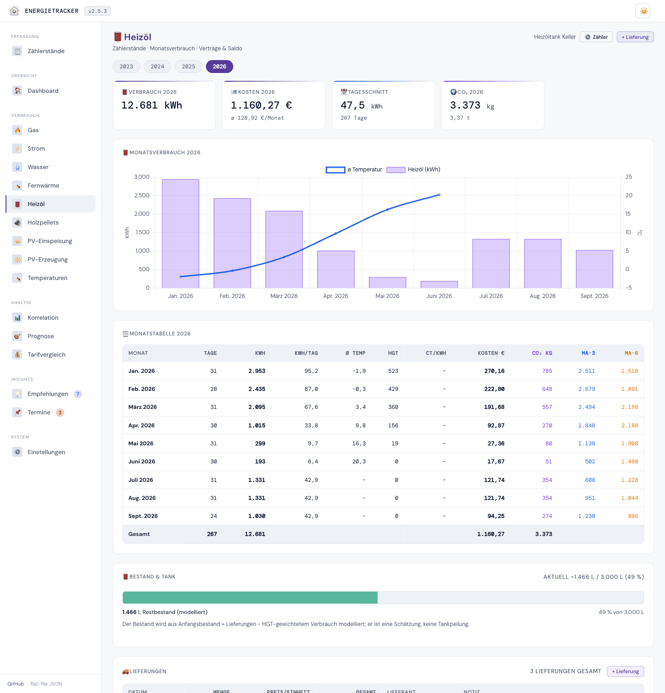

---

## 5. Analyse (Heizsignatur)

HGT-Korrelations-Streudiagramm mit den Kurven **aller fünf** Modelle
(linear, polynomial, robust, segmentiert, sigmoid) und ihrem R²-Vergleich,
Jahresvergleich und Anomalien. Darüber stehen die Vertragserinnerungen in
drei Stufen; seit v2.9.0 nennen sie bei gepflegter Kündigungsfrist den
**Kündigungsstichtag** („Kündigung für … bis …, sonst läuft der Vertrag über
den … hinaus weiter"), sonst das Vertragsende.

Seit v2.8.0: Volle Punkte gehen in die Kurven ein, **hohle** sind eigene
Monate außerhalb des Fits (Teilmonat, zu wenig Heizgradtage oder Temperaturen),
**graue** liegen vor der Zäsur. Unter der Tabelle steht, dass R² die Anpassung
an die gezeigten Monate misst, keine Vorhersagegüte. Die Karte „Wirkung der
Maßnahme" sagt, ob der Unterschied vor/nach der Zäsur statistisch belegt ist,
mit 95-%-Bereich. Anomalien messen jeden Monat an seiner eigenen Erwartung
(Heizmodell bzw. derselbe Monat anderer Jahre). Bei Heizöl und Pellets steht
statt der Kurven ein Hinweis: Ihre Monatswerte sind nach Gradtagen verteilt.

Seit v3.1.0 gibt es „Wirkung der Maßnahme“ auch für **Strom, Wasser und PV**:
„vorher“, „nachher“ (je hochgerechnet „… pro Jahr“) und die „Veränderung“ in %
und je Jahr, mit dem Satz „Ohne Heizkurve: verglichen werden dieselben
Kalendermonate vor und nach der Zäsur (… Monate), hochgerechnet auf ein Jahr.
Das Wetter ist nicht bereinigt.“

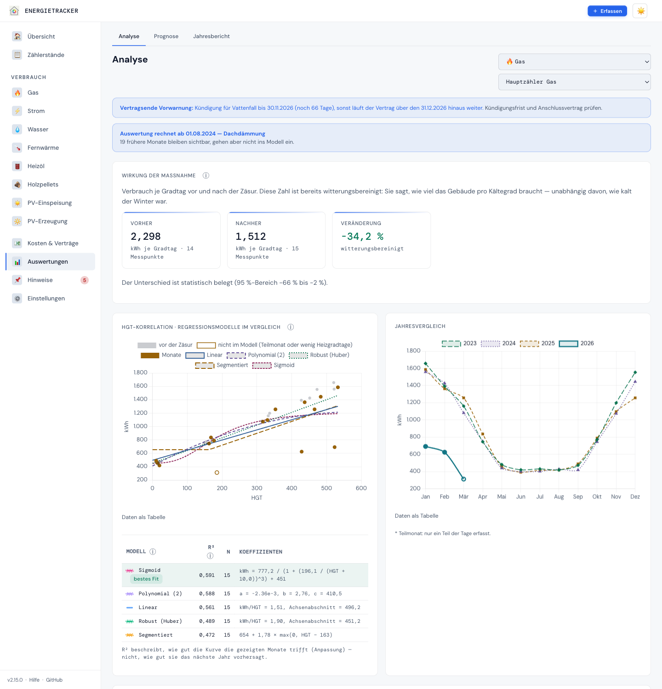

---

## 6. Prognose

Modellauswahl (alle fünf), 12-Monats-Prognose als R²-gewichteter Blend
aus Regression und Saisonprofil, Kostenprognose mit Saldo offener
Verträge.

Seit v2.8.0 mit **Unsicherheitsband** (Bereich, in dem der Verbrauch in 80 %
der Jahre liegt) und einer Zeile zum Jahr („in 80 % der Jahre zwischen … und
…"). Darunter die Quelle der Heizgradtage (Klimanormal am Standort oder eigene
Historie) und Hinweise bei kurzer Historie. Die Spalte „Methode" sagt je
Monat, wie gerechnet wurde; Monate nach Vertragsende, in denen der letzte
Vertrag als Annahme weiterläuft, tragen ein Sternchen.

Seit v2.13.0 steht der Modellname in der Sprache der Oberfläche, die
Saldo-Spalte aus Kundensicht (+ Guthaben, − Nachzahlung) mit ⓘ. Modell und
Horizont sind aus den Einstellungen vorbelegt.

**CO₂-Preis-Szenario (v3.1.0):** Neben den Was-wäre-wenn-Feldern steht
**„CO₂-Preis ab 2028 (€/t)“** mit ⓘ — leer = aus, vorbelegt aus Einstellungen
→ Experte → „CO₂-Preis“. Mit einem Wert schreibt die Seite unter die Prognose
etwa „Mit 150 €/t CO₂ ab 2028: +1,94 ct/kWh, in den nächsten 12 Monaten …
mehr (mit Umsatzsteuer).“ Die Prognose selbst ändert sich nicht. Das Startjahr
kommt aus „Szenario ab Jahr“ derselben Einstellungen; erreicht die Prognose es
nicht, fehlt die Zeile. Für Gas, Heizöl und Heizwärme mit Gas oder Heizöl als
Energieträger ([CO₂-Preis im Brennstoff](../verstehen/16-co2-preis.md#6-wo-du-ihn-siehst)).

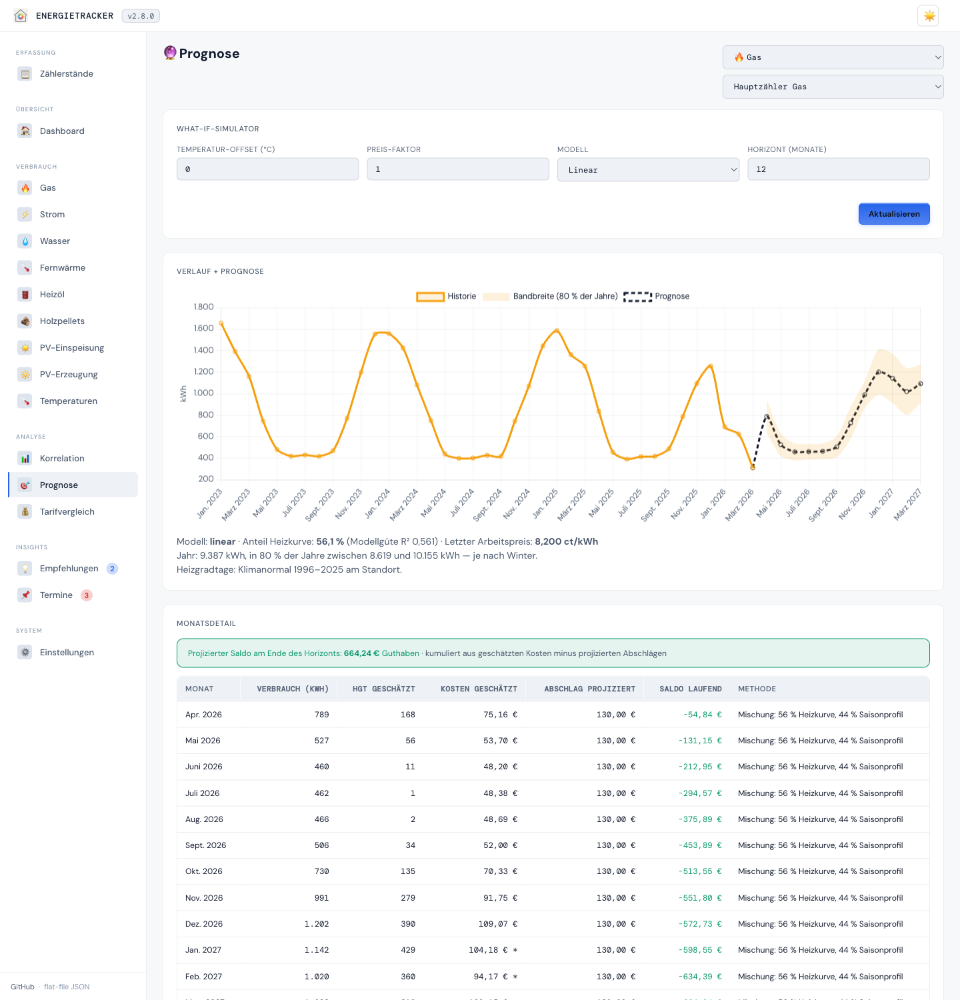

### Jahresbericht (seit v2.11.0 unter Auswertungen)

Ein Jahr auf einen Blick: Übersicht je Verbrauchsart, Effizienz,
Monatstabellen und offene Empfehlungen. Bis v2.10 stand der Bericht in den
Einstellungen.

**Druckansicht (v3.1.0)** ist der Hauptknopf: **Druckansicht öffnen** zeigt
den Bericht des gewählten Jahres als Seite in der App (`#/report/print?year=…`)
— in der Sprache dieses Geräts, Zahlen, Daten und Beträge so geschrieben wie
in der übrigen Oberfläche, die Diagramme als Vektorgrafik. **Drucken / als PDF
sichern** öffnet den Druckdialog des Browsers; beim Drucken blendet die Seite
Seitenleiste, Kopfleiste, Tabs und Knöpfe aus und setzt A4. Am iPhone geht
das über Teilen → Drucken; dort lässt sich der Bericht auch als PDF sichern.
Daten liefert `GET /api/reports/yearly`.

Darunter steht die **PDF-Datei** wie bisher: **Im Browser öffnen** zeigt das
PDF in einem neuen Tab (`yearly.pdf?inline=1`) — in der Home-Bildschirm-App
auf dem iPhone kam ein Download oft nicht an —, **Jahresbericht
herunterladen** speichert es. Ein Hinweis sagt: „Das PDF entsteht in der Standardsprache der
Installation (…); die Druckansicht folgt der Sprache dieses Geräts.“ Die
eingebauten PDF-Schriften kennen nur westeuropäische Zeichen (CP1252); seit
v3.1.0 wird „CO₂“ dort zu „CO2“ statt zu „CO“. Für eine Sprache, die das PDF
nicht setzen kann, entfällt der Block, und die Druckansicht bleibt.

---

## 7. Kosten & Verträge

### Verträge & Abschläge (v2.11.0)

Je Verbrauchsart und Zähler der laufende Vertrag:

- Anbieter, Tarif und Laufzeit bzw. „verlängert sich"
- **Kündigen bis** mit den verbleibenden Tagen, ab sechs Wochen vorher
  hervorgehoben; eine verpasste Frist in Rot
- der Abschlag je Monat
- was zur Abrechnung zu erwarten ist: Guthaben (grün) oder Nachzahlung
  (rot)

„Verträge verwalten“ führt zur Vertragsliste der Verbrauchsart. Die Zahlen
kommen aus derselben Rechnung wie die Saldo-Karte der Verbrauchsart. Heizöl
und Pellets fehlen seit v2.13.0 in der Liste — ihre Kosten stehen an den
Lieferungen, der Link „Vertrag anlegen“ führte auf eine Seite ohne Verträge.

### Rechnung prüfen

Bis v2.10 stand die Rechnungsprüfung am Ende der Gas-Seite, seit v2.11.0 ist
sie eine Seite (`#/bill-check`), seit **v3.1.0** für **Gas, Strom, Wasser und
Fernwärme**. Oben die Auswahl **„Verbrauchsart“** (bei mehreren) und
**„Zähler“** (bei mehreren), darunter „Von“, „Bis (ausschließlich)“ und
**„Nachrechnen“**. Die Seite der Verbrauchsart verweist mit Art, Zähler und
Jahr hierher (`?utility=…&meter=…&from=…&to=…`).

Die Tabelle schneidet den Zeitraum wie die Versorgerrechnung: bei Gas an jeder
Ablesung und jedem Brennwertwechsel (m³ × Zustandszahl × Brennwert = kWh), bei
den anderen Arten an jeder Ablesung und jedem Preis- oder Vertragsstichtag
(Grenze „Preiswechsel“). Je Abschnitt Zeitraum, Stand alt und neu mit
Ableseart, Tage, Grenze, Menge und seit v3.1.0 **Preis**, **Verbrauchskosten**
und **Feste Kosten**; darunter „Nachgerechnet: …“ (abzüglich eines Bonus) und
die Legende der Ablesearten.

**Laut Rechnung (v3.1.0):** Die zweite Karte nimmt die Werte der
Versorgerrechnung auf — Von, „Bis einschließlich“, Rechnungsdatum, Verbrauch
laut Rechnung (kWh bzw. m³), Rechnungsbetrag (brutto), gezahlte Abschläge,
Nachzahlung/Guthaben (positiv = Nachzahlung; leer = Betrag − Abschläge),
**„Weitere Posten“** (Umlagen, Gebühren, Gutschriften mit „Posten
hinzufügen“), bei Gas „Emissionen (kg CO₂)“ und „CO₂-Kosten laut Rechnung“
und „Rechnung anhängen (PDF oder Foto)“. **„Rechnung speichern“** legt sie an
und vergleicht sofort. Die Liste darunter zeigt je Rechnung Zeitraum, Menge,
Betrag und Nachzahlung/Guthaben mit 📄, **„Vergleichen“**, **„Als
Sonderzahlung buchen“** (danach die Marke „gebucht“) und 🗑️. Der Vergleich
stellt Nachgerechnet, Laut Rechnung und Abweichung für Menge, Betrag und
Abschläge nebeneinander, mit dem Urteil **„passt“** oder **„prüfen“** und den
möglichen Gründen ([Jahresabrechnung](../anleitungen/jahresabrechnung.md#7-laut-rechnung-erfassen-vergleichen-buchen)).

**Rechnung bearbeiten (v3.2.0):** Jede Zeile der Liste trägt vor 🗑️ ein
✏️ („Bearbeiten“). Es füllt die Karte „Laut Rechnung“ mit den Werten dieser
Rechnung — Zeitraum, Rechnungsdatum, Menge, Betrag, Abschläge,
Nachzahlung/Guthaben, weitere Posten, bei Gas die CO₂-Angaben und die
angehängten Belege — und sagt über den Knöpfen „Du bearbeitest die Rechnung
vom … bis ….“ Ist sie schon gebucht, folgt „Sie ist schon als Sonderzahlung gebucht –
die Buchung im Vertrag ändert sich nicht mit.“ Der Knopf heißt dann
**„Änderungen speichern“** (Meldung „Rechnung geändert“, danach der
Vergleich), daneben steht **„Abbrechen“**. Bis v3.1 ließ sich eine Rechnung
nur löschen und neu anlegen; die Schnittstelle (`PATCH
/api/utility/{utility}/bills/{id}`) gab es schon. Die Seite gehört zur Stufe
„Erfahren“.

### Wechsel prüfen (Tarifvergleich)

Beantwortet die Frage, um die es im Energietracker geht: **Soll ich wechseln?**
Die Ansicht ist in zwei Blöcke geteilt, und die Reihenfolge ist Absicht.

#### Wechselentscheidung

Oben steht der **erwartete Jahresverbrauch** aus der Prognose — genau die Zahl,
die CHECK24, Verivox und andere Vergleichsportale als Eingabe verlangen. Sie
lässt sich mit einem Klick kopieren. Der Ablauf ist damit: Zahl mitnehmen,
draußen suchen, das gefundene Angebot mit **„+ Angebot erfassen"** eintragen
(technisch ein Schattenvertrag).

Eine Anbindung an Vergleichsportale gibt es bewusst nicht. Die Anwendung holt
keine Tarife von außen; der Nutzer trägt ein, was er gefunden hat. Wo das
eingestellte Land einen amtlichen Tarifvergleich hat (Österreich, Frankreich,
Italien, Spanien, Portugal), verlinkt die Ansicht ihn seit v3.1.0 unter dem
Jahresverbrauch: „Amtlicher Tarifvergleich (Österreich) ↗“ — ein Link, kein
Abruf ([Länderprofile §8](../verstehen/14-laenderprofile.md#8-so-heißt-das-auf-deiner-rechnung)).

Daneben steht der **Wechseltermin**. Er ergibt sich aus Vertragsende und
Kündigungsfrist; die Frist wird mit Restlaufzeit angezeigt und farblich
hervorgehoben, sobald es eng wird — sie ist das, was im Alltag verpasst wird.
Wer ein anderes Szenario durchrechnen will, setzt das Datum von Hand.

**Gruppen (v3.1.0):** Die Auswahl der Zähler führt zusätzlich „Gruppe: …“ für
jede Zählergruppe mit Gruppenvertrag. Prognose und Rangliste rechnen dann mit
dem Verbrauch der ganzen Gruppe, bei Arbeitspreisen je Zählwerk mit einem
Mischpreis; ein Angebot, das hier entsteht, gilt für die Gruppe. Die Karte
„Für den Wechsel bereithalten“ entfällt für Gruppen — sie gilt je Zähler.

Maßgeblich ist dabei nicht der heute laufende Vertrag allein, sondern die
**Bindungskette**: Ist der Anschlussvertrag bereits abgeschlossen, ist der
Wechsel für die nächste Periode vollzogen, und der Termin richtet sich nach
dessen Ende. Die Ansicht weist einen solchen Anschluss ausdrücklich aus. Auch
die Vergleichsbasis folgt der Kette — jeder Monat rechnet mit dem Tarif, der
dann gilt, nicht mit dem des auslaufenden Vertrags. Eine Lücke von mehr als
einem Tag beendet die Kette; danach ist man frei.

Kündigungsfrist, Mindestlaufzeit und Preisgarantie werden **am Vertrag**
gepflegt (Vertragsverwaltung der jeweiligen Verbrauchsart). Ohne sie kann der
Vergleich keinen Termin errechnen und nicht vor einer ablaufenden Frist warnen.

**Für den Wechsel bereithalten (v3.1.0):** Eine Karte mit den Angaben, die der
neue Anbieter abfragt — **Marktlokations-ID**, **Zählernummer** (Seriennummer
des eingebauten Geräts) und **„Letzter Zählerstand ({Datum})“** — und dem Knopf
**„Angaben kopieren“**. Was fehlt, entfällt; ohne jede Angabe entfällt die
Karte. Die MaLo-ID trägst du im Zählerdialog ein (§12).

**Preiserhöhung (v3.1.0):** Steht im laufenden oder folgenden Vertrag eine
künftige Preiserhöhung, meldet die App in Deutschland die Empfehlung
„{Art}: Preiserhöhung zum {Datum}“ mit dem Hinweis auf das
Sonderkündigungsrecht zu diesem Tag (§ 41 Abs. 5 EnWG). Solange die
Empfehlung steht, erscheint die Preiserhöhung auch unter „Zu tun“;
ausgeblendet steht sie nur noch im Kalender.

Die Rangliste zeigt je Angebot:

| Spalte | Bedeutung |
|---|---|
| **1. Jahr** | Kosten der ersten zwölf Monate, Neukundenbonus bereits abgezogen |
| **ab 2. Jahr** | die dauerhaften Kosten, ohne einmalige Boni |
| **Differenz** | gegen den fortgeschriebenen Bestandsvertrag |
| **Lohnt ab** | der Jahresverbrauch, ab dem das Angebot den Bestandsvertrag schlägt |

Seit v2.13.0 steht diese Erklärung unter der Rangliste statt nur im Tooltip
der Spaltenköpfe; „Lohnt ab“ trägt ein ⓘ.

**Sortiert wird nach „ab 2. Jahr“.** Ein Lockangebot, das nur im ersten Jahr
billig ist, gewinnt die Rangfolge damit nicht — die Jahr-1-Zahl steht trotzdem
daneben, um sie mit der Portalanzeige abzugleichen.

Die Spalte **Lohnt ab** ist die ehrlichste Antwort auf eine unsichere Prognose.
Statt eine Ersparnis auf den Euro genau zu behaupten, nennt sie die Menge, ab
der die Rangfolge kippt: Liegt sie weit vom erwarteten Verbrauch weg, trägt die
Entscheidung auch dann, wenn die Prognose danebenliegt. Ergänzend steht unter
den Jahreskosten eine Spanne für ±10 % Verbrauch.

Das Diagramm legt die Angebote als Kostenverlauf **über** den Bestandsvertrag.
Monatlich statt als Jahressumme, weil man erst daran sieht, wo die Differenz
herkommt — bei Gas entsteht sie fast vollständig im Winter. Monate jenseits der
**Preisgarantie** werden gestrichelt gezeichnet: Dort ist der Preis eine
Annahme, keine Zusage.

Gerechnet wird über zwölf Monate ab Wechseltermin, saisonal gewichtet. Ein
Wechsel zum 1. Juli deckt damit trotzdem einen vollen Winter ab; eine
Zwölftelrechnung würde hier danebenliegen.

#### Rückblick auf echte Monate

Darunter, eingeklappt: dieselben Tarife auf den **tatsächlich gemessenen**
Verbrauch gelegt — „Was hätte Tarif X gekostet?". Das ist der Beleg. Wer sieht,
dass die Rechnung auf echten Daten aufgeht, glaubt auch der Prognose.

Echte Verträge beziehen sich auf **genau die Tage, die sie abdecken** —
das, was die Rechnung gebucht hat; Verträge mit kürzerer Laufzeit tragen ihre
Monatszahl als Marke und zusätzlich eine Hochrechnung auf die volle Periode.
**Schattenverträge gelten als Preisblatt für den ganzen Zeitraum** (seit
v2.9.0): Ein Angebot, das nur von April bis September eingetragen ist, sah
bisher billiger aus als dasselbe Angebot fürs ganze Jahr, weil ihm der Winter
fehlte.

Die Spalte **ct/Einheit** trägt die Vollkosten je kWh bzw. m³ — Arbeitspreis,
Grundpreis und Boni zusammen. Sie ist die einzige Größe, die von der Laufzeit
unabhängig ist, und damit der Maßstab für die Rangfolge. Verglichen werden
reine Tarifkosten; Abschläge und Sonderzahlungen sind Zahlungsströme gegen den
Saldo und bleiben außen vor (sie stehen in der Verbrauchsansicht). Beides
steht seit v2.13.0 unter der Tabelle.

Die Jahresauswahl bietet seit v2.12.0 nur Jahre mit Verbrauchsdaten an (bis
v2.11 fest die letzten sieben Jahre); Monate stehen in der Schreibweise der
Sprache („Jan. 2027"). Ein Jahr ohne Tarifzeilen zeigt einen Hinweis, statt
den Rückblick samt Auswahl auszublenden.

#### Angebote pflegen

Ein Angebot wird mit den Feldern erfasst, die auf einem Portalergebnis
tatsächlich stehen: Arbeitspreis, Grundpreis, **Neukundenbonus als Betrag**
(nicht als Gutschriftsdatum — das kennt beim Anlegen niemand), Preisgarantie
und Kündigungsfrist. Als Startdatum ist der errechnete Wechseltermin
vorbelegt.

**Dynamischer Tarif (v3.1.0, Strom):** Das Angebotsformular hat das Häkchen
**„Dynamischer Tarif (Börsenpreis je Monat)“**. Mit ihm entfällt der
Arbeitspreis; stattdessen stehen dort „Aufschlag je kWh“ (mit dem Hinweis,
was dazugehört) und „Umsatzsteuer auf den Börsenpreis (%)“, vorbelegt mit 19.
In Rangliste und Rückblick steht unter einem solchen Angebot „Börsenpreis als
Monatsmittel — als verteile sich dein Verbrauch gleichmäßig über den Tag;
Abendverbrauch ist meist teurer.“ und, wenn nötig, für wie viele Monate der
Vorjahresmonat angenommen wurde. Fehlen die Börsenpreise, erscheint statt des
Angebots der Hinweis, sie unter „Börsenstrompreise“ zu laden.

**Börsenstrompreise (v3.1.0, Strom):** Die Karte **„Börsenstrompreise“** mit ⓘ
nennt den Bereich der vorhandenen Monatsmittel („Monatsmittel vorhanden: … bis
…“ bzw. „Noch keine Börsenpreise geladen.“), erklärt den Dynamik-Check und hat
die Knöpfe **„Von SMARD laden“** (holt die Monatswerte, nur auf Knopfdruck) und
**„Datei importieren“** (SMARD-Download oder `JJJJ-MM;€/MWh`). Darunter die
Quelle „Großhandelspreise Deutschland/Luxemburg: Bundesnetzagentur | SMARD.de
(CC BY 4.0)“ ([Strom → Dynamische Tarife](../verstehen/02-strom.md#dynamische-tarife-v310)).

Angebote lassen sich anlegen, bearbeiten und löschen; die Löschen-Rückfrage
nennt das Angebot (v2.12.0). In der Vertragsliste
tragen sie ein eigenes Kennzeichen, damit sie nicht mit einem laufenden
Vertrag verwechselt werden. Sie beeinflussen **weder Saldo noch Prognose noch
Vertragsstatus** — sie existieren nur für diesen Vergleich.

> **Wasser** bleibt ausgenommen: Das Drei-Komponenten-Modell (Trink-, Schmutz-
> und Niederschlagswasser) braucht eine eigene Rechnung. Heizöl und Pellets
> sind lieferbasiert — dort ist die Lieferrechnung die Kostenbasis.

### Mietverhältnis *(v3.1.0)*

Für Mieter, die Heizung und Wasser über die Nebenkosten zahlen. Die Seite
(`#/tenancy`) erscheint unter **Kosten & Verträge**, sobald unter Einstellungen
→ Haushalt & Gebäude → Wohnen und Warmwasser „Ich wohne: zur Miete“ gewählt
ist; im Eigentum gibt es sie nicht. Oben „+ Mietverhältnis“, bei mehreren eine
Auswahl. Ohne Mietverhältnis steht „Noch kein Mietverhältnis“ da, mit der Bitte,
Vorauszahlung, Abrechnungsstichtag und die Zähler aus der Verbrauchsinfo
anzulegen. Schritt für Schritt: [Als Mieter](../anleitungen/mieter.md).

Drei Karten, in Deutschland seit v3.1.0 eine vierte („CO₂-Kosten teilen“):

**Vorauszahlung und Kosten** ⓘ — die Hilfsrechnung für den laufenden
Abrechnungszeitraum („Abrechnungszeitraum … – …“):

- Kennzahlen **Erwartete Kosten**, **Vorausgezahlt**, **Voraussichtlich**
  („… Nachzahlung“, „… Guthaben“ oder „etwa ausgeglichen“) mit einem Hinweis
  zum Risiko — „Kaum Nachzahlung zu erwarten“, „Kleine Nachzahlung möglich“
  (bis 10 % der Vorauszahlung) oder „Nachzahlung wahrscheinlich“ — und
  **Passende Vorauszahlung je Monat**.
- Darunter fest: „Eine Hilfsrechnung aus deinen Zählern und den Preisen der
  letzten Abrechnung – keine Nebenkostenabrechnung. Was der Vermieter
  abrechnet, kann abweichen.“
- Die **Annahmen**, wenn sie zutreffen: fehlender Preis für Wärme, Warmwasser
  oder Kaltwasser, fehlende Vorauszahlung, keine Zähler zugeordnet, wie viele
  Monate geschätzt sind.
- Aufklappbar **„Monat für Monat“**: Monat, Heizung (kWh), Wasser (m³, warm und
  kalt zusammen), Erwartete Kosten, Vorausgezahlt und Stand (aufsummiert).
  Geschätzte Monate stehen blass mit „geschätzt“.

**CO₂-Kosten teilen {Jahr}** ⓘ *(v3.1.0)* — für das Vorjahr der Anteil des
Vermieters an den CO₂-Kosten nach dem CO2KostAufG. Ein Satz nennt den Fall
(eigene Heizung mit eigenem Vertrag oder Zentralheizung), darunter **CO₂ je
m² und Jahr**, **Stufe** (… / 10), **Anteil Vermieter** und **Erstattung**,
Abweichungen der Heizkostenabrechnung als Warnung, die Kürzungen und
„Hilfsrechnung nach dem CO2KostAufG, keine Rechtsberatung.“ **„Anschreiben
(PDF)“** öffnet das Schreiben an den Vermieter bzw. das Prüfergebnis in einem
neuen Tab. Ohne Fläche oder Daten sagt die Karte, was fehlt; im Eigentum oder
außerhalb Deutschlands fehlt sie
([CO₂-Kosten mit dem Vermieter teilen](../anleitungen/co2-aufteilung.md)).

**Stammdaten** — Titel ist die Bezeichnung des Mietverhältnisses, daneben
**„Bearbeiten“**. Beginn (und Ende), Vermieter oder Verwaltung, Beginn des
Abrechnungszeitraums (TT.MM.), die heute gültige Vorauszahlung („Heizung … +
Betriebskosten … je Monat“), die Preise für Wärme (ct/kWh), Warmwasser und
„Kaltwasser und Abwasser“ (je m³) und die Zahl der zugeordneten Zähler. Ein
Satz mit ⓘ verweist auf die Verbrauchsart: „Die monatliche Verbrauchsinfo
trägst du bei der Verbrauchsart ein: Heizwärme“ — nur, wenn Heizwärme aktiv
ist.

Der Dialog **„Mietverhältnis anlegen“/„bearbeiten“** hat Bezeichnung,
Vermieter oder Verwaltung, seit v3.1.0 **„Wohnfläche laut Mietvertrag (m²)“**
(leer = aus den Einstellungen), Beginn, „Ende (leer = läuft)“,
„Abrechnungszeitraum beginnt am (TT.MM.)“ und drei Listen mit „+ Zeile“ und ✕,
je Zeile ein „Ab“-Datum:

- **Vorauszahlungen** — Heizung und Betriebskosten je Monat,
- **Preise** — Wärme je kWh, Warmwasser je m³, Kaltwasser je m³; Hinweis:
  aus der letzten Abrechnung, Kosten der Kategorie geteilt durch den Verbrauch,
  Grundkosten eingeschlossen,
- **Pauschale Umlagen** — Bezeichnung und Betrag je Jahr (Müll, Hausreinigung,
  Versicherung, Kabel …).

Unter **Zugeordnete Zähler** stehen Häkchen für „Heizung:“ (Zähler der
Heizwärme), „Warmwasser:“ und „Kaltwasser:“ (Wasserzähler). Seit v3.1.0 folgt
die Feldgruppe **„CO₂-Kosten (CO2KostAufG)“**: das Häkchen „Gas auch für eigene
Geräte (z. B. Gasherd) – Erstattung −5 %“ und die Auswahl „Öffentlich-rechtliche
Vorgaben (§ 9)“ — keine, „gegen Sanierung oder Heizungstausch (Anteil
halbiert)“ oder „gegen beides (keine Aufteilung)“; dazu eine Notiz.
„Mietverhältnis löschen“ fragt nach — es nimmt seine Abrechnungen mit.

**Nebenkostenabrechnungen** ⓘ — Liste mit Zeitraum, Erhalten, Kosten,
Vorausgezahlt und Ergebnis („… Nachzahlung“ bzw. „… Guthaben“), je Beleg ein
📄 („Abrechnung öffnen“), ✏️ und 🗑️. **„+ Abrechnung“** öffnet „Abrechnung
erfassen“:

- Zeitraum von, bis, „Erhalten am“ (damit beginnt die Einwandfrist),
- Kosten insgesamt und Vorausgezahlt,
- Wärmeverbrauch laut Abrechnung (kWh) und Heizkosten,
- **Posten** mit Bezeichnung, Art (Heizung, Warmwasser, Kaltwasser, Abwasser,
  Betriebskosten, Sonstiges), Betrag und Verbrauch — „Für die Preise reichen
  Warmwasser und Kaltwasser mit Kosten und Verbrauch (m³); Abwasser zählt zum
  Kaltwasser.“,
- *(v3.1.0)* **CO₂-Angaben der Heizkostenabrechnung**: Emissionen (kg CO₂),
  CO₂-Kosten, Stufe laut Abrechnung, Anteil Vermieter laut Abrechnung (%),
  Betrag Vermieter laut Abrechnung — Grundlage der Prüfung bei Zentralheizung,
- **Neue Vorauszahlung laut Abrechnung** (Ab, Heizung, Betriebskosten),
- „📄 PDF oder Foto anhängen“ (mehrere möglich),
- zwei Häkchen, vorbelegt an: **„Preise daraus übernehmen (ab dem Tag nach dem
  Zeitraum)“** und **„Neue Vorauszahlung übernehmen“**, dazu eine Notiz.

Agenda und Kalender kennen bei „zur Miete“ zwei Fristen: wann die Abrechnung
spätestens kommen muss und bis wann Einwände möglich sind
([Kalender](../anleitungen/kalender.md)). Bei eigener Gastherme kommt seit
v3.1.0 die Frist für die Erstattung der CO₂-Kosten dazu.

---

## 8. Empfehlungen

Sieben statistische Regelfamilien (Mehrverbrauch-Trend, Sommer-Sockel,
Anomalie, Tank-Niveau, Vertragsende, Effizienz, …), nach Dringlichkeit
sortiert, einzeln ausblendbar. Rein datengetrieben, keine Werbung. Seit
v2.11.0 unter **Hinweise**; der Knopf heißt „30 Tage ausblenden" statt „✕".
Seit v2.12.0 nennt die Meldung die Empfehlung und bietet zehn Sekunden
**„Rückgängig“**. Seit v2.13.0 sagt die Seite bei zu wenig Daten (kein Zähler
mit drei Ständen), dass es für Empfehlungen noch zu früh ist — vorher stand
dort „alles im grünen Bereich“.

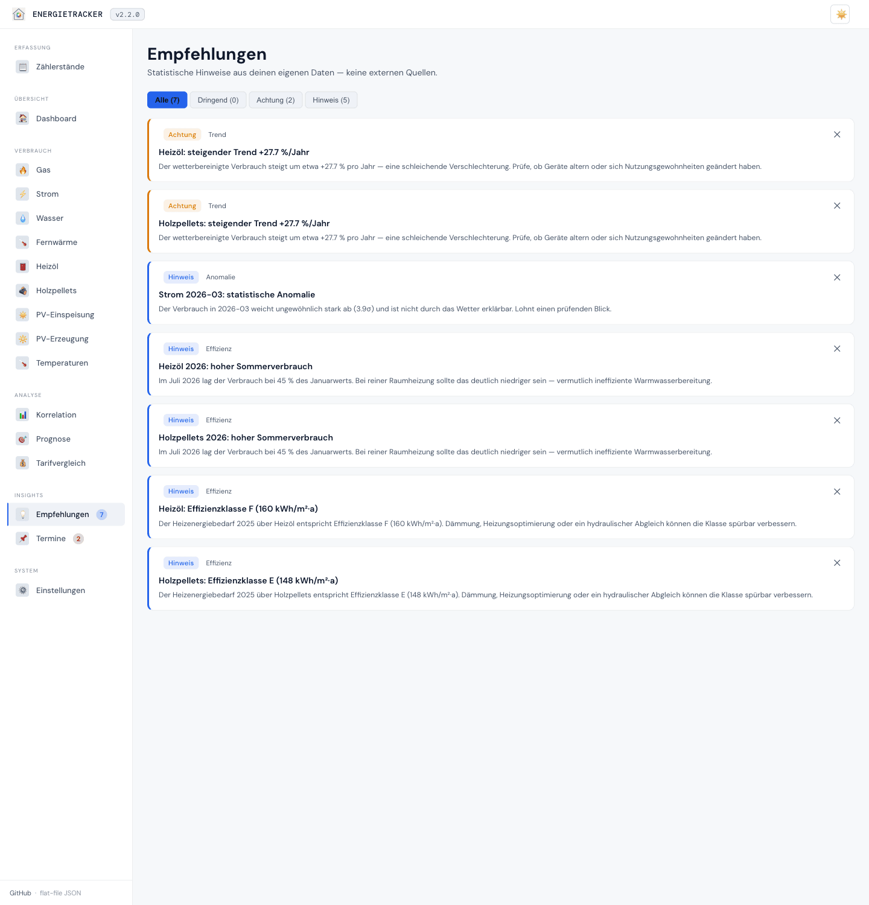

---

## 9. Termine & Wartung

Wiederkehrende Termine (Heizungswartung, Schornsteinfeger,
Eichfristen — seit v2.9.0 mit eigener Kategorie für die Wärmezähler-Eichung). Fällige/überfällige erscheinen auf dem Dashboard; beim
Erledigen wird der nächste Termin gemäß Recurrence fortgeschrieben. Seit
v2.11.0 der erste Tab unter **Hinweise**; die Zahl an der Seitenleiste zählt
fällige Termine und offene Empfehlungen zusammen.

Seit v2.12.0 meldet **„Erledigt"** den Termin mit dem nächsten Fälligkeitsdatum
und bietet zehn Sekunden **„Rückgängig"** (Datum und Status wie vorher). Ein
fehlender Titel oder ein fehlendes Datum steht am Feld statt in einer Meldung
unten rechts; die Löschen-Rückfrage nennt den Termin. Ein Intervall in Monaten
steht als „Alle 48 Monate" statt „Alle N Monate (48)".

**Im Kalender abonnieren (v3.1.0):** Der Knopf über der Liste öffnet einen
Dialog mit zwei Adressen zum Kopieren — `webcal://…` (öffnet die
Kalender-App direkt) und `https://…`. Das Abo enthält Termine,
Kündigungsstichtage, Vertragsenden, Ende der Preisgarantie, Preiserhöhungen
und fällige Ablesungen; der Kalender holt es alle 12 Stunden neu. Ist die
Anmeldung eingeschaltet, legt die App dafür einen eigenen
**Kalender-Schlüssel** an und hängt ihn an den Link; er gilt nur für dieses
Abo und lässt sich unter Einstellungen → Zugriff widerrufen. Hinweise zu
Apple Kalender und Google Kalender stehen im Dialog. Einrichtung je
Kalender-App: [Fristen im Kalender](../anleitungen/kalender.md).

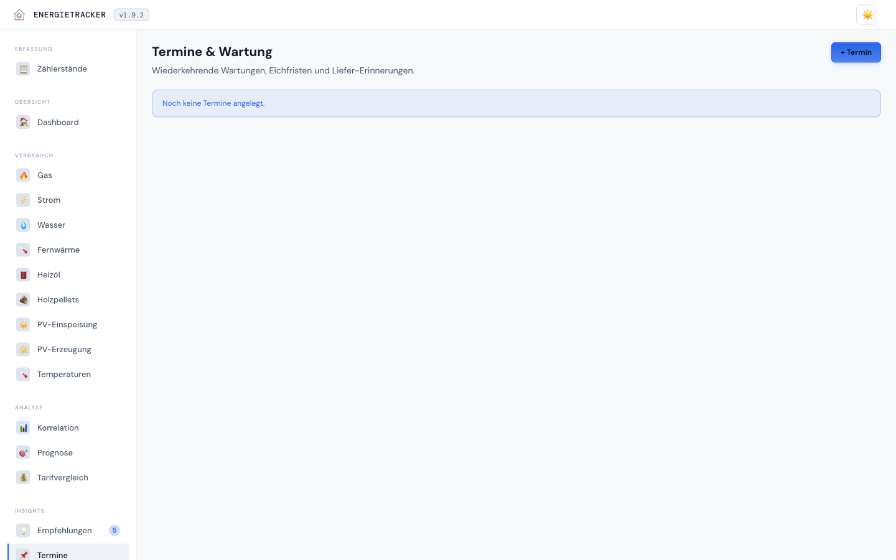

---

## 10. Wetterdaten (Einstellungen)

Seit v2.11.0 unter Einstellungen → Wetterdaten; die Adresse `#/temperatures`
bleibt. CSV-Import (Drag & Drop), Open-Meteo-Sync für den hinterlegten
Standort, Monatschart Min/Ø/Max. Grundlage jeder HGT-Auswertung.

**Seit v2.12.0** ist hier der einzige Ort für Standort und Wetter:

- **Ortssuche:** Name oder Postleitzahl eingeben, einen Treffer wählen —
  Koordinaten und Ortsname werden übernommen und gespeichert. An Open-Meteo
  geht dabei nur der Suchtext.
- Breite, Länge und Ortsname speichern beim Ändern; *Wetter automatisch
  füllen* ist ein Schalter auf dieser Seite.
- Der Abgleich speichert einen geänderten Standort vorher.
- CSV im üblichen Format `TT.MM.JJJJ;Mittel;Min;Max` mit Dezimalkomma;
  Tabulator und das alte Format mit Anführungszeichen werden ebenfalls
  gelesen. Bis v2.11 trennte der Import auch am Dezimalkomma. Seit v3.1.0
  versteht er auch Tabellen aus anderen Sprachen — Datum als `T/M/JJJJ` oder
  `T-M-JJJJ`, Kopfzeile wie „Date;Moyenne;Min;Max“ — und jede eigene
  Export-Datei; die Beispiel-CSV kommt in der Sprache der Oberfläche.

Seit v2.8.0
steht über dem Chart, bis wann Messwerte und ab wann Vorhersagen vorliegen;
die Option „Auch vorhandene ältere Werte durch Archivwerte ersetzen" räumt
Vorhersagen auf, die frühere Versionen wie Messwerte gespeichert haben. Mit
*Wetter automatisch füllen* (Standard an) gleicht die App beim
Öffnen einmal am Tag selbst ab und lädt beim ersten Mal das Klimanormal. Steht der
Standort noch auf der Voreinstellung des Landes, sagt ein Hinweis das
(v2.7.0) — die Heizgradtage rechnen dann mit dem Wetter eines anderen Orts.

Unter dem Chart steht seit v2.13.0 die Quelle mit Lizenz: „Wetterdaten von
Open-Meteo.com (CC BY 4.0)“; der PDF-Jahresbericht nennt sie ebenfalls,
sobald er Temperaturen zeigt. Seit v2.16.0 ist die Spanne vom Minimum bis zum
Maximum eine gefüllte Fläche, das Mittel die Linie darin.

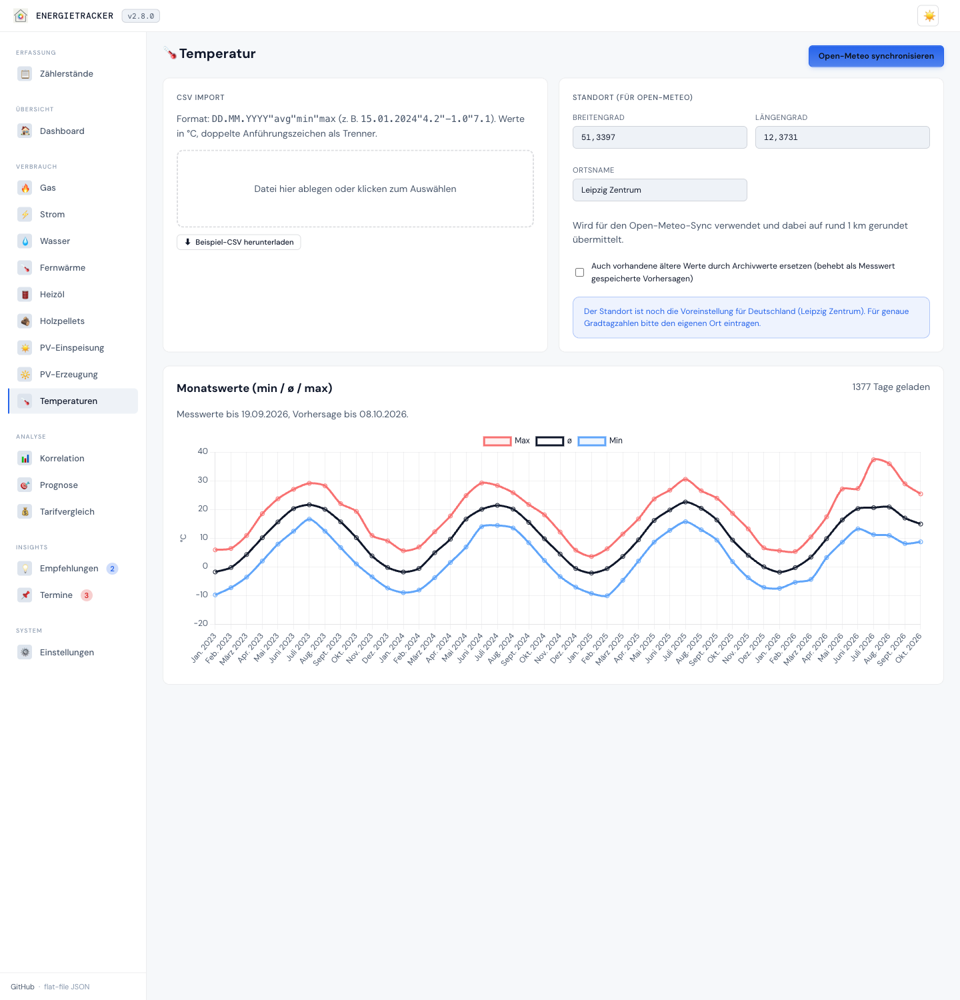

---

## 11. Einstellungen

Seit v2.12.0 **neun Unterseiten** statt einer langen Seite:

| Seite | Inhalt | ab Stufe (v3.2.0) |
|---|---|---|
| Allgemein | seit v3.2.0 oben „Nutzungsstufe und Einrichtung“ und, mit Anmeldung, „Mein Konto“; Sprache & Land, Übersicht (Monate, Prognosehorizont, Warnung nach Tagen ohne Ablesung), Vertragserinnerungen | Einsteiger; die Gruppen „Anzeige“ und „Erinnerungen“ ab Erfahren |
| Haushalt & Gebäude | Wohnfläche, Gebäudetyp, beheizter Keller, Warmwasser; seit v3.1.0 „Wohnen und Warmwasser“ und „Eigene Vergleichswerte“ (für die Einordnung); Wasser-Referenzwerte mit der Zahl der Personen im Haushalt | Einsteiger; „Eigene Vergleichswerte“ und „Wasser-Referenzwerte“ ab Erfahren |
| Verbrauchsarten & Abrechnung | aktive Verbrauchsarten (seit v3.1.0 auch Heizwärme), alle Abrechnungsstichtage in einer Karte, Physikalische Konstanten (Gasfaktoren, Heizgrenze), Heizwerte und Tankwarnung, CO₂-Faktoren (seit v3.1.0 mit „CO₂ vermieden durch PV“), seit v3.1.0 „Photovoltaik“ (angenommener Eigenverbrauch eines Balkonkraftwerks) | Einsteiger; Physikalische Konstanten und Heizwerte ab Erfahren, CO₂-Faktoren und Photovoltaik ab Experte |
| Wetterdaten | §10 | Erfahren |
| Daten | CSV-Export (Tabelle in der Standardsprache oder Format 1), Backup & Wiederherstellung mit Snapshots, Demo-Daten, Migration aus v0.9.0; Verweis zum Jahresbericht | Einsteiger |
| Integrationen | Home-Assistant-Anbindung | Erfahren |
| Zugriff | Anmeldung & Zugriff, seit v3.2.0 „Benutzer und Rechte“, Einbetten | Experte |
| Experte | seit v3.1.0 oben Belege (Speichergrenze) und Texterkennung im Heimnetz, seit v3.2.0 „evcc im Heimnetz“; darunter eingeklappt („Rechenparameter anzeigen“) und mit Warnung: Regression, Prognosemodell, Anomalie- und Empfehlungsschwellen, seit v3.1.0 CO₂-Preis | Experte |
| System | Version, Lizenz, System-Diagnose | Experte |

Gespeichert wird je Seite über eine Leiste unten („Verwerfen" · „Speichern"),
die erst bei einer Änderung erscheint. Wer die Seite mit ungespeicherten
Änderungen verlässt, wird gefragt.

**Seit v2.13.0:** 18 Felder mehr tragen einen Hinweis, was sie bewirken. Die
Karte der Abrechnungsstichtage führt die **PV-Einspeisung** (ihre Vergütung
rechnet bis zum Stichtag); Heizöl und Pellets entfallen dort — sie haben keine
Abschläge und damit keinen Stichtag, die Felder wirkten nicht. Unter Experte
stehen die Prognosemodelle mit Namen statt Schlüssel, und die **Breite des
Prognosebands** ist pflegbar (seit v2.8.0 wirksam, bisher nur per API). Die
Home-Assistant-Karte verlinkt die Anleitung in der passenden Sprache.

Der PDF-Jahresbericht steht seit v2.11.0
unter Auswertungen. Nach Demo-Daten, Backup-Import oder Wiederherstellung
startet die App neu, damit Seitenleiste, Sprache und Zwischenspeicher zum
neuen Stand passen.

**Nutzungsstufe und Einrichtung (v3.2.0, Seite Allgemein):** Die Karte 🌱
steht ganz oben. Der Hinweis sagt „Bestimmt, was die Oberfläche zeigt —
gerechnet wird in jeder Stufe alles.“ und für wen die Stufe gilt: „Gilt für
alle Geräte dieser Installation.“ bzw. mit Anmeldung „Gilt für dich (…) auf
allen Geräten.“ Darunter die Auswahl „Nutzungsstufe“ — dieselbe wie in der
Kopfleiste, sie speichert sofort („Stufe gespeichert.“) — und je Stufe eine
Zeile, was sie zeigt: Einsteiger „Übersicht mit drei Antworten,
Zählerstände, einfache Verträge, Jahresbericht.“, Erfahren „Dazu
Auswertungen, Prognose, Wechsel, Rechnungsprüfung und Zähler-Aufbau.“,
Experte „Alles, mit Schaubildern, Gruppen, Rechenparametern und Zugriff.“ Die
Knöpfe **„Einrichtungsassistent starten“** (§16) und **„Anleitung“**
([Einrichten und Nutzungsstufen](../einstieg/einrichtung.md)) schließen die
Karte ab.

**Mein Konto (v3.2.0, Seite Allgemein):** Nur mit Anmeldung und einer
angemeldeten Person — 👤 **„Mein Konto: {Name}“** mit der Rolle
(„Verwaltung“ oder „Mitglied“). Wer sich mit Passwort anmeldet, ändert es
hier mit „Bisheriges Passwort“, „Neues Passwort“ (mindestens 8 Zeichen) und
**„Passwort ändern“**; im Proxy-Modus steht stattdessen „Angemeldet über den
vorgeschalteten Dienst; das Passwort wird dort geändert.“
([Benutzer im Haushalt](../anleitungen/benutzer.md)).

Darunter die Karte **Sprache & Land** (v2.7.0): Sprache, Land, Währung und
Zeitzone, alle mit sofortiger Wirkung. Seit v3.1.0 gibt es zwei
Sprachfelder:

- **Sprache auf diesem Gerät** — gilt nur für diesen Browser und wird dort
  gespeichert, nicht auf dem Server. Die erste Wahl, „Wie die Installation
  (…)“, folgt der Standardsprache. So kann im selben Haushalt ein Handy
  Englisch zeigen und das andere Deutsch.
- **Standardsprache der Installation** — die Einstellung `language`. Sie
  gilt für Geräte ohne eigene Wahl und für alles, was ohne Gerät entsteht:
  PDF-Jahresbericht, CSV-Dateien, Meldungen an Home Assistant und Skripte.

Mit Anmeldung und einer angemeldeten Person (v3.2.0) speichert die Wahl unter
„Sprache auf diesem Gerät“ zugleich die Sprache dieser Person; sie gilt dann
auf allen ihren Geräten und geht der Wahl im Browser vor.

Bis v3.0 stellte eine Person die Sprache für alle Geräte um. Beim Wechsel des
Landes zeigt ein
Dialog die Werte, die das Länderprofil ändern würde — bisher und neu
nebeneinander, mit der Quelle des CO₂-Faktors —, und bietet „Alle
übernehmen“, „Nur Land ändern“ oder „Abbrechen“. Bei den
Gas-Umrechnungsfaktoren lässt sich der Brennwert seit v2.7.0 in kWh/m³,
MJ/m³ oder GJ/Smc eingeben; für britische, italienische und niederländische
Rechnungen steht ein Hinweis dabei.

Seit v2.10.0: **CO₂-Faktoren** der Energieträger mit Quelle, alle je kWh
(Heizöl und Pellets waren mit g/L bzw. g/kg beschriftet, gerechnet wurde je
kWh; Wasser bleibt je m³ und ohne Quellenangabe), Strom
**je Jahr** als Tabelle; **Gebäude & Effizienz** mit *Beheizter Keller* und
*Warmwasser dezentral*. Trägt eine Installation noch die alten
Standardwerte, steht oben **„Neuere Standardwerte verfügbar"** mit bisher und
neu und dem Knopf „Neue Werte übernehmen". Ist nur der Standard-Gasfaktor
11,5 aktiv, weist die Gasfaktor-Tabelle darauf hin.

**Einbetten** (seit v2.6.0, Seite Zugriff): Adressen, die die App einbetten
dürfen, etwa ein Home-Assistant-Dashboard. Die **🏠 Home-Assistant-Anbindung
(F1009)** auf der Seite Integrationen
— API-Token verwalten, Zähler-Aliase pflegen und drei fertige Vorlagen
kopieren: REST-Command, Eintrag für die `secrets.yaml` und (seit v2.5.3) eine
Automatisierung aus den Aliasen, die vor jedem Push `has_value` prüft. Seit
v3.1.0 folgt **„Schritt 5 · Werte zurück nach Home Assistant“**: REST-Sensoren
für die `configuration.yaml`, die `GET /api/summary` einmal je Stunde abfragen —
je Zähler Saldo (bei Arten mit Vertrag), Prognose der nächsten 12 Monate und
Tage seit der letzten Ablesung. Ist die Anmeldung eingeschaltet, steht darunter
der `secrets.yaml`-Eintrag `energietracker_read` für einen API-Schlüssel mit
Bereich „Lesen“. Läuft die App unter Home-Assistant-Ingress, nennen die
Vorlagen `http://<Hostname des Containers>` als Adresse statt der
Ingress-Adresse aus der Adresszeile
([Home Assistant, Schritt 5](../anleitungen/home-assistant.md)).
Zahlenfelder und Abrechnungsstichtage werden vor dem Speichern geprüft;
Fehler stehen rot am Feld.

**Datenexport (CSV, v3.1.0):** Über den Knöpfen steht die Wahl des Formats:
„Tabelle in der Standardsprache (…) — empfohlen“ öffnet sich mit Spaltennamen,
Dezimalzeichen und Datum der Standardsprache direkt in Excel oder
LibreOffice; „CSV-Format 1 — stabil, für Skripte“ bleibt, wie es seit
Version 1.1 ist. Der Browser merkt sich die Wahl; beide lassen sich wieder
importieren. Exportiert werden Monatsübersicht, Zählerstände bzw. Lieferungen
je Verbrauchsart und die Temperaturreihe
([CSV-Formate](api.md#csv-formate-v310)).

**Backup & Restore (v2.6.0):** Ein Import wird erst vollständig geprüft und als
Vorschau gezeigt (was eingespielt wird, was mangels Inhalt unverändert bleibt);
ein fehlerhaftes Backup ändert nichts und nennt die Fundstellen. Darunter die
**gespeicherten Snapshots** mit Zeitpunkt, Anlass und Größe — herunterladen
(⬇️), einspielen (↩️, vorher sichert die App den jetzigen Stand) oder löschen.
Scheitert der Sicherungs-Snapshot, fragt die App, ob trotzdem eingespielt
werden soll. Seit v3.1.0 steht über den Knöpfen, sobald es Belege gibt, die
Zeile „Belege: 12 Dateien, 3,4 MB von 500 MB – im Backup enthalten.“; ab
80 % der Grenze in Warnfarbe mit „Der Speicher für Belege ist fast voll.“

**Wohnen und Warmwasser (v3.1.0, Seite Haushalt & Gebäude):** Die Karte 🔑
zwischen „Gebäude & Effizienz“ und den Wasser-Referenzwerten. „Ich wohne“ — „im
Eigentum“ oder „zur Miete“; zur Miete erscheint unter Kosten & Verträge die
Seite [Mietverhältnis](#mietverhältnis-v310). „Heizwärme kommt aus“ und
„Warmwasser wird erwärmt mit“ — Auswahl der Energieträger, erste Wahl „keine
Angabe“; „Warmwassertemperatur“ in °C
([Einstellungen](einstellungen.md#wohnen-und-warmwasser-v310)).

**Belege und Texterkennung (v3.1.0, Seite Experte):** Zwei Gruppen oben auf der
Seite, vor dem eingeklappten Teil „Rechenparameter anzeigen“ — sie sind keine
Rechenparameter. **📎 Belege** mit „Speicher für Belege, höchstens“
(`attachments_max_mb`). **🔎 Texterkennung im Heimnetz** mit „Adresse des
Dienstes“, „Schnittstelle“ (Ollama oder „OpenAI-kompatibel (LM Studio,
LocalAI)“), „Modell“ und „Zeitlimit“. Leer gelassen bleibt die Texterkennung
aus ([Einstellungen](einstellungen.md#texterkennung-im-heimnetz-v310),
[Anleitung](../anleitungen/texterkennung.md)).

**evcc im Heimnetz (v3.2.0, Seite Experte):** Die Gruppe 🚗 steht neben Belegen
und Texterkennung vor dem eingeklappten Teil. Ihr Feld **„Adresse von evcc“**
(`evcc_endpoint`) nimmt die Adresse, unter der evcc im Browser läuft, etwa
`http://192.168.178.30:7070` oder `http://evcc.local:7070`; nur Adressen im
eigenen Netz. Leer bleibt der Abruf aus — die CSV-Datei aus evcc geht immer.
Mit Adresse zeigt die Karte „Ladevorgänge aus evcc“ den Knopf „Von evcc
abrufen“ (§3, [Ladevorgänge aus evcc](../anleitungen/evcc.md)).

**CO₂-Preis (v3.1.0, Seite Experte, unter „Rechenparameter anzeigen“):** Die
Gruppe 🏷️ mit „CO₂-Preis je Jahr“ — einer Tabelle Jahr → €/t mit Löschen je
Zeile und den Feldern Jahr und €/t zum Hinzufügen; eigene Werte gehen dem
Länderprofil vor —, „Szenario: CO₂-Preis“ (Vorbelegung der Prognose, leer =
aus) und „Szenario ab Jahr“
([Einstellungen](einstellungen.md#co₂-preis-v310)).

**Anmeldung & Zugriff (v2.6.0):** zeigt den Modus (ohne Anmeldung, Passwort,
Proxy), schaltet die Passwort-Anmeldung ein, ändert das Passwort oder schaltet
sie wieder aus (mit dem bisherigen Passwort) und verwaltet **API-Schlüssel**
für Skripte (Lesen oder Verwalten, Klartext einmalig, zuletzt benutzt). Seit
v3.1.0 stehen dort auch die Kalender-Schlüssel, die „Im Kalender abonnieren“
nach einer Rückfrage („Link erzeugen“) anlegt (Bereich „nur Kalender-Abo“);
Widerrufen beendet das Abo. Was per
Umgebungsvariable festgelegt ist, ist hier nur zu sehen. Die
Home-Assistant-Karte zeigt seit v2.6.0, wann zuletzt ein Wert mit dem Token
ankam, und warnt, wenn die Anmeldung an ist, aber kein Token existiert. Sind
Personen angelegt (v3.2.0), fehlen hier die Felder zum Ändern des Passworts;
an ihrer Stelle steht „Jede Person ändert ihr Passwort unter Einstellungen →
Allgemein → Mein Konto.“

**Benutzer und Rechte (v3.2.0, Seite Zugriff):** Mit eingeschalteter
Anmeldung folgt unter „Anmeldung & Zugriff“ die Karte 👥 **„Personen im
Haushalt“** mit dem Hinweis „Jede Person meldet sich mit Name und Passwort an
und hat ihre eigene Stufe und Sprache. Die Daten des Haushalts teilen sich
alle.“ — im Proxy-Modus „… die App kennt jede Person an ihrem Namen. Wer
zuerst kommt, verwaltet.“ — und dem Link „Anleitung“. Die Tabelle nennt je
Person Name (die eigene Zeile mit „(du)“) und Rolle als Auswahl „Verwaltung“
oder „Mitglied“, die sofort speichert; dazu **„Passwort neu setzen“** (bei
Personen mit Passwort, im Dialog „Neues Passwort“; die Person wird auf allen
Geräten abgemeldet) und **„Person löschen“** (nicht bei der eigenen Zeile;
Rückfrage „Die Person kann sich danach nicht mehr anmelden. Die Daten des
Haushalts bleiben.“). Im Modus „Passwort“ legt **„Person hinzufügen“** mit
Name, „Neues Passwort“ (mindestens 8 Zeichen) und Rolle (vorgewählt
„Mitglied“) eine Person an — „{Name} kann sich jetzt anmelden.“ Vor der
ersten neuen Person steht dort nur der Verwalter „admin“; ihm gehört das
bisherige Passwort der Installation. Die letzte Person, die verwaltet, lässt
sich weder löschen noch zum Mitglied machen („Mindestens eine Person muss die
Installation verwalten.“).

Die Seite Zugriff zeigt einem **Mitglied** nur „Den Zugriff verwaltet, wer
die Installation verwaltet. Dein eigenes Passwort änderst du unter
Einstellungen → Allgemein.“ Was nur Verwalter dürfen — Personen,
API-Schlüssel und Anmeldung, Backup oder Snapshot einspielen, Beispieldaten
laden, die Adressen für Einbetten, Texterkennung und evcc —, lehnt der Server
für Mitglieder mit „Das darf nur, wer die Installation verwaltet.“ ab
([Benutzer im Haushalt](../anleitungen/benutzer.md)).

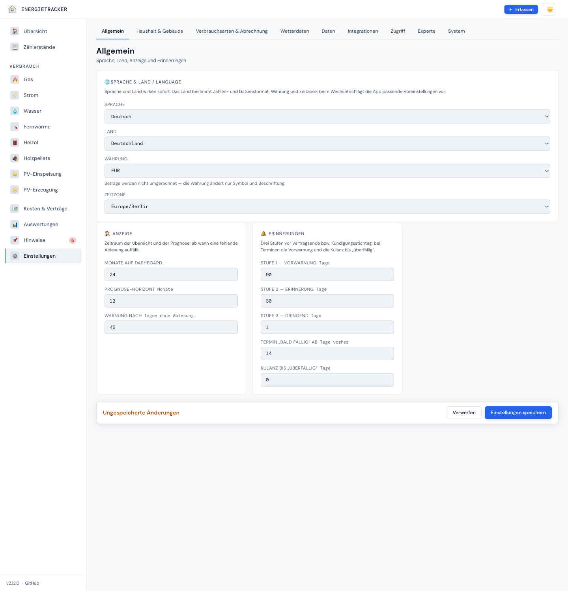

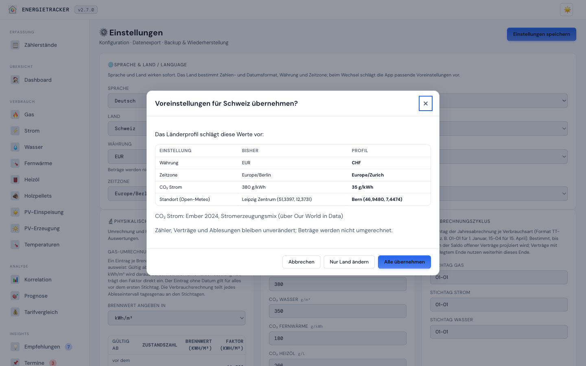

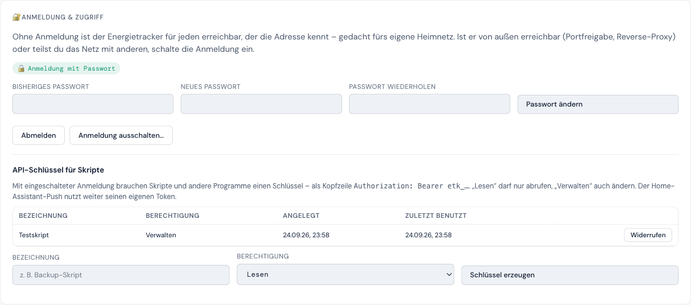

---

## 12. Zähler & Verträge — inkl. Topologie (F1006)

Zähler-/Geräteverwaltung inkl. Zählertausch (Device-Kette) und
Vertragspflege (Arbeits-/Grundpreis-Historie, Abschläge, Boni,
Sonderzahlungen). Seit v2.5.3 verlangt der **Zählertausch** den Endstand,
zeigt den letzten bekannten Stand und fasst den Tausch vor dem Ausführen
zusammen. Ein **Vertrag** braucht Anbieter oder Tarif und mindestens einen
Arbeitspreis; der Beginn ist mit dem Tag nach der laufenden Bindung vorbelegt,
und bevor ein neuer Vertrag einen laufenden ablöst, fragt die App nach. Seit
v2.12.0 gelten die ersten Preiszeilen ab Vertragsbeginn und folgen ihm, bis
jemand ihr Datum ändert; eine vorbelegte Zeile ohne Betrag bleibt leer.
„Ab Beginn" (bis v2.11 „⇧ Start") setzt eine Zeile auf den Vertragsbeginn. Die
Vertragskarte zählt in der richtigen Pluralform („1 Arbeitspreis"), Löschen
steht als umrandeter Knopf da, und die Rückfrage nennt den Vertrag. Seit
v2.9.0 nimmt die **Kündigungsfrist** Monate, Wochen oder Tage, dazu die
**Kündigungsweise** (automatisch, zum Vertragsende, jederzeit zum Monatsende,
jederzeit zu jedem Tag) und den Haken **„Verlängert sich ohne Kündigung"** —
herausnehmen, wenn gekündigt ist. Ein Zähler, bei dem *aktiv* abgewählt ist,
zählt weiter in allen Summen, verschwindet aber aus der Erfassung und aus den
Warnungen. Unter
den Arbeitspreisen eines Gasvertrags rechnet **„Preis je m³ umrechnen“**
(v2.7.0) einen Preis je m³ oder Smc in ct/kWh um und trägt ihn ein. Bei
Öl/Pellets ist hier nur die Tank-/Lagerverwaltung relevant — beim Anlegen
und Bearbeiten eines Tanks werden **Tank-Kapazität** und **Anfangsbestand**
erfasst (statt eines kumulativen Zählerstands), seit v2.10.0 optional der
**Preis des Anfangsbestands** (leer = Preis der ersten Lieferung). Bei
kumulativen Zählern
lassen sich seit v2.6.0 die **Stellen des Zählwerks** pflegen — dann rechnet
die Auswertung einen Überlauf (99.999 → 0) richtig; die Gerätezeile zeigt
sie an.

**Rolle und Erfassung (v3.1.0):** Der Zählerdialog hat bei Strom, Wasser,
PV-Erzeugung und Heizwärme die Auswahl **„Rolle“** mit einem Hinweis darunter
— sie ersetzt die frühere Checkbox „Heizstrom (Wärmepumpe)“:

| Art | Rollen |
|---|---|
| Strom | Haushalt · Wärmepumpe (Heizstrom) — zählt in der Effizienzkennzahl · Wallbox |
| Wasser | Kaltwasser · Warmwasser — die App weist zusätzlich die Wärme dafür aus · Garten |
| PV-Erzeugung | Erzeugung · Speicher – Ladung · Speicher – Entladung |
| Heizwärme | Verbrauch der Wohnung · Wärmemenge der Wärmepumpe — zählt nicht als Heizenergie, sonst stünde sie neben dem Heizstrom doppelt |

Bei allen Arten mit Zählerständen kommt **„Erfassung“** dazu: „Zählerstände“
oder „Verbrauch je Zeitraum“ — „für Werte, die schon als Verbrauch vorliegen –
etwa die monatliche Verbrauchsinfo des Messdienstes. Wechseln geht, solange
der Zähler keine Daten hat.“ Die Zählerkarte trägt dann die Marke „je
Zeitraum“, ebenso jede Rolle außer der Standardrolle. Ein Zähler mit
Verbrauch je Zeitraum hat keinen Zählertausch; „CSV-Import“ öffnet bei ihm den
Import von Zeiträumen: je Zeile ein Monat und der Verbrauch oder `von; bis;
Verbrauch; Notiz`, Kopfzeile optional, mit Vorschau („N Zeiträume lassen sich
einlesen“); überlappende Zeiträume werden übersprungen und gemeldet
([Heizwärme](../verstehen/15-waerme.md)).

**Markt- und Messlokation (v3.1.0):** Außer bei Heizöl und Pellets hat der
Zählerdialog die Felder **„Marktlokations-ID (MaLo)“** und
**„Messlokations-ID (MeLo)“** mit dem Hinweis „Für den Lieferantenwechsel,
steht auf der Rechnung. MaLo: 11 Ziffern; MeLo: 33 Zeichen ab „DE“.“ Eine
falsche ID — etwa eine MaLo-ID mit falscher Prüfziffer — lehnt die App mit
einer Meldung ab. Die MaLo-ID erscheint in der Wechselentscheidung unter „Für
den Wechsel bereithalten“ (§7).

**Fernwärme (v3.1.0):** Der Vertragsdialog der Fernwärme hat zwei weitere
Preislisten mit Stichtag — **„Leistungspreis“** (€ je kW und Jahr) und
**„Messpreis“** (€ je Jahr) — und die Feldgruppe **„Fernwärme: Anschluss und
Kennwerte“** mit „Anschlussleistung (kW)“, „CO₂-Faktor des Netzes (g/kWh)“ und
„Primärenergiefaktor“ samt Hinweis, wo die Werte stehen
([Fernwärme](../verstehen/04-fernwaerme.md#feste-kosten-leistungs--und-messpreis-v310)).

**Gruppenvertrag (v3.1.0):** Bei Gas, Strom und Fernwärme führt die Auswahl
„Zähler“ im Vertragsdialog zusätzlich **„Zählergruppen (ein Vertrag für
alle)“** — jede Gruppe mit Mitgliedern. Mit einer Gruppe erscheint
**„Arbeitspreis je Zähler (z. B. HT/NT)“**: je Mitglied eine Preisliste mit
Stichtag, leer gilt der Arbeitspreis oben. Die Vertragskarte nennt dann
„Zählergruppe: …“ statt des Zählers
([Gruppenvertrag](../verstehen/13-meter-topologie.md#gruppenvertrag-v310)).

**Reduziertes Netzentgelt (v3.1.0):** Der Stromvertrag hat die Preisliste
**„Reduziertes Netzentgelt (§ 14a EnWG, Modul 1)“** in € je Jahr, mit
Stichtag ([Strom](../verstehen/02-strom.md#steuerbare-verbraucher-v310)).

**Gutschriften des Direktvermarkters (v3.1.0):** Der Vertragsdialog der
Einspeisung hat den Abschnitt **„Gutschriften des Direktvermarkters“** mit
„Von“, „Bis einschließlich“ und „Betrag“ je Zeile und „Gutschrift hinzufügen“
([PV §11](../verstehen/12-pv.md#11-gutschriften-des-direktvermarkters-v310)).

**Monatspreise importieren (v3.1.0):** Auf der Karte eines echten Vertrags
(nicht bei Wasser und Einspeisung) liest **„Monatspreise importieren“** eine
Datei `Monat;ct/kWh[;Grundpreis]`. Die Vorschau „Monatspreise übernehmen“ nennt
die Monate („Die Datei enthält Preise für … Monate …“) und übersprungene
Zeilen; „Übernehmen“ trägt je Monat einen Arbeitspreis (und Grundpreis) ab dem
Ersten ein ([Strom](../verstehen/02-strom.md#dynamische-tarife-v310)).

**PV-Anlage und Wärmepumpe im Zählerdialog (v3.1.0):** Bei PV-Erzeugung die
Feldgruppe **„PV-Anlage“** mit „Balkonkraftwerk (Steckersolargerät, ohne
Einspeisezähler)“, „Investition (brutto)“, „In Betrieb seit“ und
„Speicherkapazität (kWh)“ samt Hinweisen. Bei Heizwärme mit der Rolle
„Wärmemenge der Wärmepumpe“ die Auswahl **„Stromzähler der Wärmepumpe“** —
Stromzähler mit der Rolle Wärmepumpe zum Ankreuzen.

**Zeitreihe importieren (v3.1.0):** Jede Zählerkarte einer Art mit
Zählerständen trägt den Knopf **„Zeitreihe importieren“**. Der Dialog
„Zeitreihe aus einem Portal — …“ zeigt nach „Datei wählen“ die ersten Zeilen
und fragt „Kopfzeilen“, „Spalte Datum (und Uhrzeit)“, „Spalte Uhrzeit (falls
getrennt)“, „Spalte Wert“, „Die Werte sind“ (Verbrauch je Intervall oder
Zählerstände), „Einheit der Werte“, „Zeitstempel bezeichnet“ (Beginn oder Ende
des Intervalls) und „Startwert (Zählerstand)“. „Vorschau“ nennt Tage,
Zeitraum und Summe; „Übernehmen“ schreibt und merkt sich die Zuordnung je
Zähler im Browser ([Zeitreihen aus Portalen](../anleitungen/daten-aus-portalen.md)).

**Mindestlaufzeit über 24 Monate (v3.1.0):** Endet die Mindestlaufzeit eines
Vertrags mehr als 24 Monate nach seinem Beginn, zeigt die App nach dem
Speichern den Hinweis „Die Mindestlaufzeit ist länger als 24 Monate. In
Deutschland ist eine so lange Erstlaufzeit für Verbraucher unwirksam (§ 309
Nr. 9 BGB).“ Gespeichert wird der Vertrag trotzdem.

**Meter-Topologie:** Subzähler werden unter ihrem Elternzähler eingerückt
dargestellt, Gruppen als aufklappbarer Sammeleintrag; **„Zu Gruppe
zusammenfassen"** (bis v2.11 „Zähler zusammenführen") fasst mehrere bestehende
Zähler zu einer Gruppe zusammen — die Zähler bleiben getrennt, die Gruppe
zeigt die Summe. Fehlt die Auswahl oder der Name, steht das am Feld. Pro Zähler
lässt sich hier auch der HA-Alias (`external_id`) setzen.

**CSV-Import mit Vorschau (v2.12.0):** Die Dateiauswahl liest nur. Die
Vorschau zeigt jede Zeile mit ihrer Wirkung — neu, ersetzt den vorhandenen
Stand (mit altem Wert) oder unverändert — und den Rückfragen der Erfassung:
Rückgang, Sprung, Größenordnung, Zukunft, doppeltes Datum. Auffällige Zeilen
stehen immer in der Liste, unauffällige bis 50. Erst „N Zeilen importieren"
schreibt; „Andere Datei wählen" beginnt von vorn.

Seit v3.1.0 liest der Import Tabellen in jeder Sprache der App: Spaltennamen
wie „Date“, „Index“ oder „Lectura“, das Datum als `TT.MM.JJJJ`, `TT/MM/JJJJ`,
`TT-MM-JJJJ` oder `JJJJ-MM-TT`, „geschätzt“ als Ja der Sprache. Ein Datum mit
dem Monat vor dem Tag (`01/15/2026`) deutet er nicht um, sondern meldet die
Zeile. Das Beispiel unter dem Dateifeld und die Beispiel-CSV stehen in der
Sprache der Oberfläche.

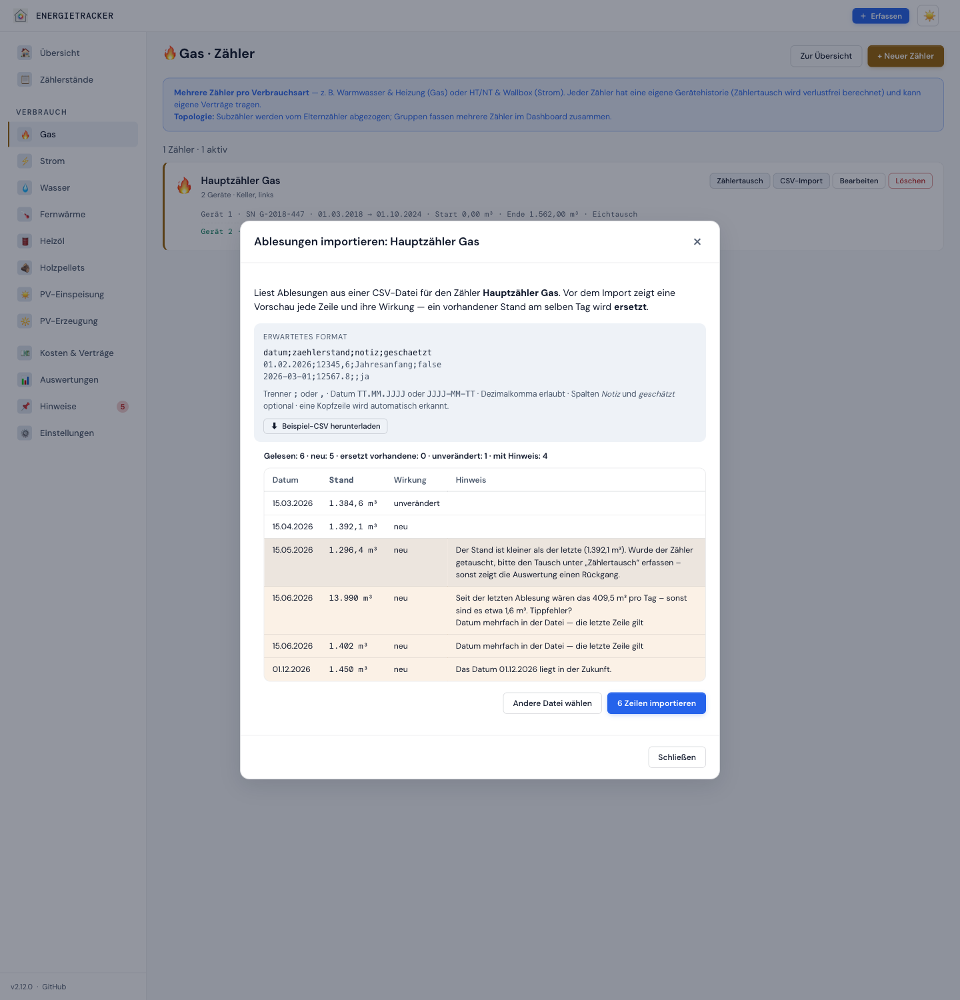

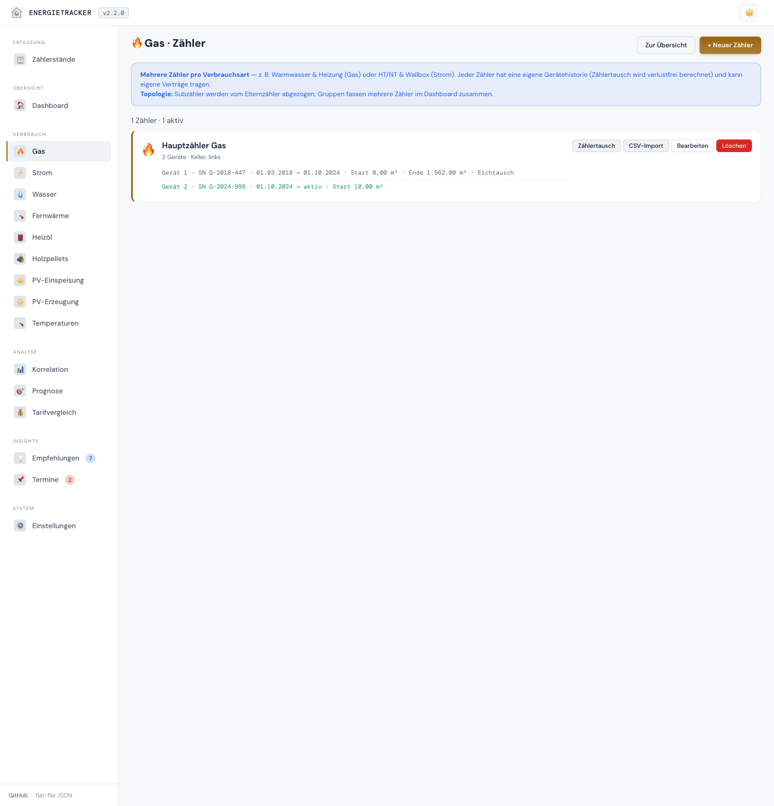

---

## 13. PV — Einspeisung & Erzeugung (F1005)

Eigene Ansicht für Photovoltaik: Einspeisezähler (Vergütung als Erlös),
Erzeugungszähler, **Strom-Saldo** (Netzbezug − Einspeisung) und
**Autarkiequote/Eigenverbrauch**. Seit v2.10.0 zeigt die Erzeugung
„Erzeugung" und vermiedenes CO₂ statt „Verbrauch" und Emission, ohne
Kostenkachel; im Tarifwechsel der Einspeisung steht die höhere Vergütung
vorn. PV-Verbrauchsarten haben keinen
Default-Zähler — wer keine Anlage hat, sieht keine Phantom-Zähler.

**Seit v2.13.0** spricht die Einspeisung durchgehend von Vergütung: Die
Monatstabelle führt „Erlös“ statt „Kosten“ und keine Abschlagsspalten, die
Vertragstabelle „Vergütung“ und „Erhalten“ statt „Verbraucht“ und „Bezahlt“,
und ein offener Anspruch ist grün statt rot (Legende „+ Guthaben,
− Rückforderung“). Vermiedenes CO₂ steht ohne Minus da — das Wort
„vermieden“ trägt die Richtung, wie im Jahresbericht. Bei beiden PV-Arten entfallen
Temperatur und Heizgradtage; Anomalien und Vorjahresvergleich werten weniger
Einspeisung als Rückgang, nicht als Ersparnis.

**Energiefluss (v2.16.0):** Beide PV-Seiten zeigen je Monat, wohin der
Sonnenstrom ging — selbst genutzt und eingespeist, gestapelt zur Erzeugung —
und als Linie, was trotzdem aus dem Netz kam. Die Kurzbeschreibung summiert nur
Monate mit Daten aller drei Zähler.

**Speicher, Amortisation, Hinweise (v3.1.0):** Die Ansicht der PV-Erzeugung
zeigt, wo die Daten es hergeben:

- **„Speicher {Jahr}“** — „Geladen“, „Entladen“, „Wirkungsgrad“ mit „Verluste
  … kWh“ und „Vollzyklen“ (nur mit Speicherkapazität);
- **„Amortisation“** — „Investition“, „Nutzen bisher“ mit „zuletzt … im Jahr“
  und „Zurück seit“ bzw. „Zurück voraussichtlich“ mit „rund … Jahre“, darunter,
  was der Nutzen enthält und was nicht;
- bei einem Balkonkraftwerk ohne Einspeisezähler „Balkonkraftwerk:
  Eigenverbrauch angenommen mit … % der Erzeugung (Einstellungen).“;
- in Deutschland bei Inbetriebnahme ab dem 25.02.2025 der Hinweis zu § 51 EEG
  (keine Vergütung bei negativem Börsenpreis, unter 100 kW ab dem Jahr nach
  dem Einbau eines intelligenten Messsystems).

Mehr in [PV §7–10](../verstehen/12-pv.md#7-speicher-v310).

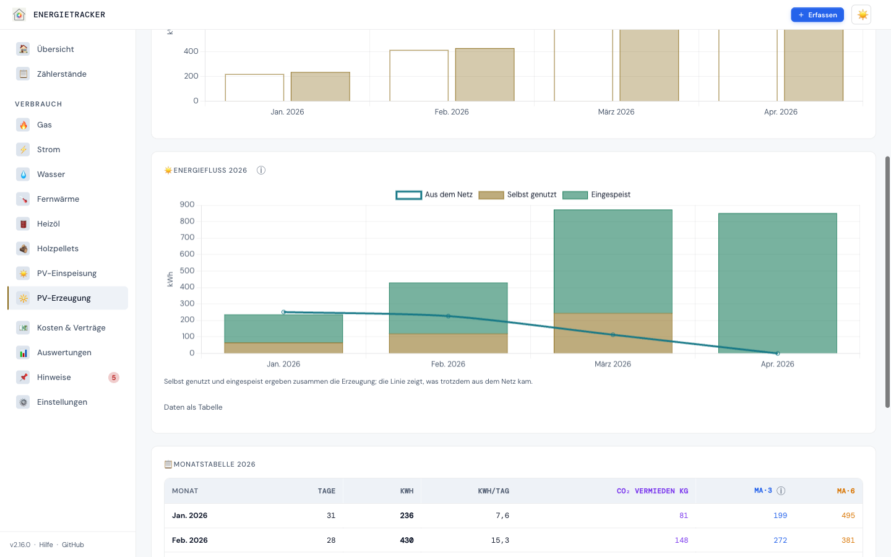

---

## 14. Anmeldung (v2.6.0, opt-in)

Nur bei eingeschalteter Anmeldung: ein schlichter Anmeldebildschirm mit
Passwortfeld und dem Hinweis, wie man bei vergessenem Passwort wieder
hereinkommt. Nach der Anmeldung bleibt der Browser 30 Tage angemeldet; die
Kopfleiste trägt dann einen Knopf **Abmelden** (er verwirft auch die
Offline-Daten dieses Browsers). Läuft eine Sitzung ab, erscheint der
Bildschirm statt einer Reihe von Fehlermeldungen. Einrichtung und Hintergründe:
[Sicherheit & Netzbetrieb](../betrieb/sicherheit.md).

**Name (v3.2.0):** Sind unter Einstellungen → Zugriff Personen angelegt
(`named_login` in `GET /api/session`), steht über dem Passwort das Feld
**„Name“**, und der Cursor beginnt dort. Groß- und Kleinschreibung zählen
beim Namen nicht. Ein leeres Namensfeld meldet mit dem bisherigen Passwort
der Installation an, solange es den ersten Verwalter „admin“ noch gibt. Der
Hinweis darunter heißt dann „Passwort vergessen? Eine Person, die die
Installation verwaltet, setzt es unter Einstellungen → Zugriff neu.“ Im
Proxy-Modus meldet der vorgeschaltete Dienst an; die App erkennt die Person
an dem Namen, den er meldet
([Benutzer im Haushalt](../anleitungen/benutzer.md)).

**Offline-Hinweis:** Kommen Daten aus dem Offline-Speicher der installierten
App, zeigt die Kopfleiste „Offline – Stand vom …". Änderungen ohne Verbindung
meldet die App als „Keine Verbindung zum Energietracker – nichts gespeichert."

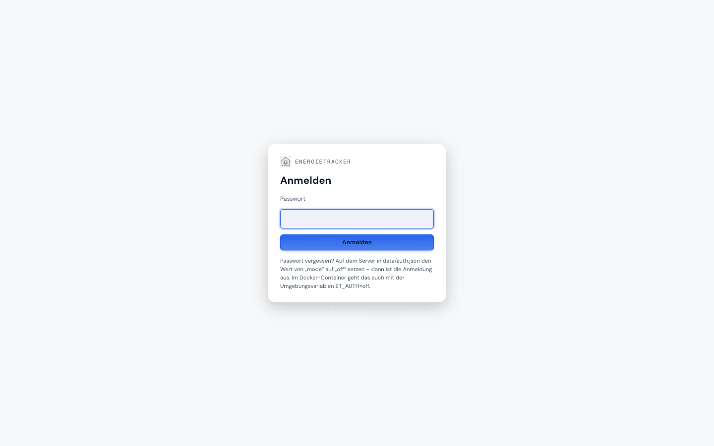

---

## 15. Hilfe (v2.13.0)

Erreichbar über die Fußzeile der Seitenleiste, am iPhone unter „Mehr“
(`#/help`). Vier Karten, seit v3.2.0 die Anwendungsfälle und das Glossar:

- **Erste Schritte:** dieselbe Liste wie im Willkommen, mit Häkchen aus den
  Daten; sind alle Schritte erledigt, steht das da.
- **Dokumentation:** Einstieg, häufige Fragen, Kompendium, Glossar,
  Home-Assistant-Anleitung und Fehlersuche auf GitHub (FAQ und Fehlersuche seit
  v2.14.0), seit v3.2.0 dazu „Einrichten, Beispielhaushalte und Stufen“
  ([Einrichten und Nutzungsstufen](../einstieg/einrichtung.md)) und
  „Anwendungsfälle“ ([Anwendungsfälle](../anleitungen/anwendungsfaelle.md)) —
  auf Deutsch in deutscher Oberfläche, sonst auf Englisch (mit Hinweis, wenn
  die eigene Sprache fehlt).
- **Fragen und Fehler:** GitHub-Issues und der Verweis auf die Diagnose unter
  Einstellungen → System, deren Angaben eine Meldung braucht.
- **Deine Daten:** Alles bleibt auf dem eigenen Server — keine Konten, keine
  Werbung, keine Telemetrie. Nach außen spricht die App nur mit Open-Meteo:
  beim täglichen Wetterabgleich (Standort auf rund 1 km gerundet) und bei der
  Ortssuche — und, nur wenn eingetragen, mit dem eigenen Texterkennungsdienst
  im Heimnetz (v3.1.0) und mit evcc im Heimnetz (v3.2.0) — und, nur auf
  Knopfdruck („Von SMARD laden“ unter Wechsel prüfen), mit SMARD für die
  Börsenstrompreise (v3.1.0).
- **Anwendungsfälle (v3.2.0):** eine eigene Karte zwischen den Karten oben
  und dem Glossar, in allen Sprachen der App — die Dokumentation gibt es nur
  auf Deutsch und Englisch. Drei Fälle mit Titel und Erklärung: **„Fernwärme
  oder Heizwärme?“** (eigener Liefervertrag gegen gemessene Wärme ohne
  Vertrag), **„Steuern mit evcc oder Home Assistant“** („Der Energietracker
  schaltet nichts.“ — er rechnet nach, was die Steuerung gebracht hat) und
  **„Erst einfach, später alles“** (die Nutzungsstufen). Darunter
  **„Beispielhaushalt ausprobieren“** — führt zu Einstellungen → Allgemein
  mit „Einrichtungsassistent starten“ — und „Anwendungsfälle“ zur
  [Anleitung](../anleitungen/anwendungsfaelle.md).
- **Begriffe:** seit v3.1.0 43 Einträge (in v2.13.0 33) in allen sieben Sprachen mit Suche. Dieselben
  Texte öffnet das ⓘ in der App; `#/help?term=hdd` springt zu einem Begriff.
  Seit v3.1.0 steht unter Rechnungsbegriffen, wie die Rechnung des
  eingestellten Landes sie nennt („Auf deiner Rechnung (Frankreich):
  „Mensualité““).

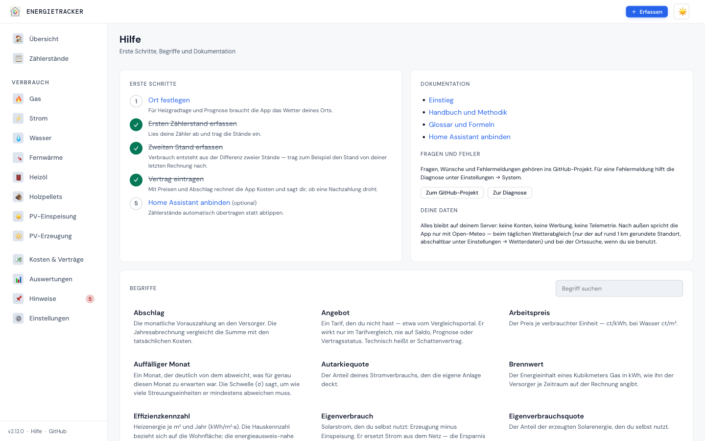

---

## 16. Einrichtungsassistent (v3.2.0)

Der Dialog **„Einrichten“** stellt drei Fragen und richtet danach
Verbrauchsarten, Wohnverhältnis und Nutzungsstufe ein; zum Schluss zeigt er
einen passenden Beispielhaushalt oder führt zu den eigenen Daten. Erklärt in
[Einrichten und Nutzungsstufen](../einstieg/einrichtung.md).

**Wann er erscheint:**

- beim **allerersten Start** einer neuen Installation — die Einstellung
  `setup_pending` setzt nur der Erststart, nie ein Update. Er kommt bei jedem
  Öffnen der App wieder, bis er abgeschlossen oder übersprungen ist;
- auf Wunsch über Einstellungen → Allgemein → **„Einrichtungsassistent
  starten“** (§11) — dann sind die aktiven Verbrauchsarten und die Stufe
  vorgewählt;
- in der **öffentlichen Demo**, solange dieser Browser keinen
  Beispielhaushalt gewählt hat.

**Die Schritte** — die Fußzeile zeigt „Schritt 1 von 4“, „Zurück“, „Weiter“
und „Überspringen“:

1. **„Wer bist du?“** — fünf Antworten mit Symbol und einem Satz. Die Antwort
   hakt in Schritt 2 ihre Verbrauchsarten an; beim ersten Start schlägt sie
   auch die Stufe vor.
2. **„Welche Energieträger nutzt du?“** — alle Verbrauchsarten zum Ankreuzen,
   „Vorgeschlagen nach deiner Antwort — frei kombinierbar.“; ohne Haken geht
   es nicht weiter. Darunter der Hinweis „Fernwärme oder Heizwärme? …“.
3. **„Wie viel Erfahrung hast du?“** — die drei Stufen mit denselben Zeilen
   wie in den Einstellungen und „Die Stufe lässt sich jederzeit oben neben
   Tag/Nacht umstellen.“
4. **„So geht es weiter“** — „{Antwort} · Stufe „…““ und die Wahl
   **„Mit Beispieldaten ansehen“** („Lädt den passenden Beispielhaushalt.
   Vorher sichert die App den jetzigen Stand.“) oder **„Mit eigenen Daten
   starten“** („Als Nächstes: Zähler prüfen und den ersten Stand
   erfassen.“). Der Knopf heißt hier **„Los geht’s“**.

| Antwort in Schritt 1 | Beispielhaushalt | vorgeschlagene Verbrauchsarten | Stufe |
|---|---|---|---|
| 🏢 „Ich wohne zur Miete“ | `mieterin` | Strom, Heizwärme, Wasser | Einsteiger |
| 🏙️ „Eigentumswohnung mit Fernwärme“ | `etw-fernwaerme` | Strom, Fernwärme | Einsteiger |
| 🏡 „Eigenheim mit Gas, Öl oder Pellets“ | `eigenheim-klassisch` | Gas, Strom, Wasser | Erfahren |
| ☀️ „Eigenheim mit Wärmepumpe und PV“ | `eigenheim-modern` | Strom, Heizwärme, Wasser, PV-Erzeugung, PV-Einspeisung | Erfahren |
| 🔍 „Erst einmal alles ansehen“ | `showcase` (Schaufenster) | alle | Experte |

Erst „Los geht’s“ speichert: die aktiven Verbrauchsarten, „Ich wohne“ („zur
Miete“ bei „Ich wohne zur Miete“, sonst „im Eigentum“), die Antwort
(`setup_persona`) und die Stufe. Danach lädt die App den Beispielhaushalt —
sind schon Daten da, fragt sie vorher wie bei „Demo-Daten laden“ — und
startet neu, oder sie öffnet die Zählerstand-Erfassung. Ein Beispielhaushalt
ersetzt den ganzen Haushalt und behält die Stufe; einen laden darf nur, wer
die Installation verwaltet (§11). „Überspringen“ ändert nichts und beendet
den Erststart.

**Öffentliche Demo** ([bingerminger.github.io/energietracker](https://bingerminger.github.io/energietracker/)):
drei Schritte, ohne „Welche Energieträger nutzt du?“. Am Ende steht „Die Demo
zeigt jetzt den Beispielhaushalt „…“. Einen anderen wählst du über die
Einstellungen → Allgemein → Einrichtungsassistent.“; „Los geht’s“ lädt die
Seite mit diesem Haushalt neu. Beispielhaushalt und Stufe merkt sich der
Browser, „Überspringen“ zeigt das Schaufenster.

---

[← Kompendium-Index](../README.md)
