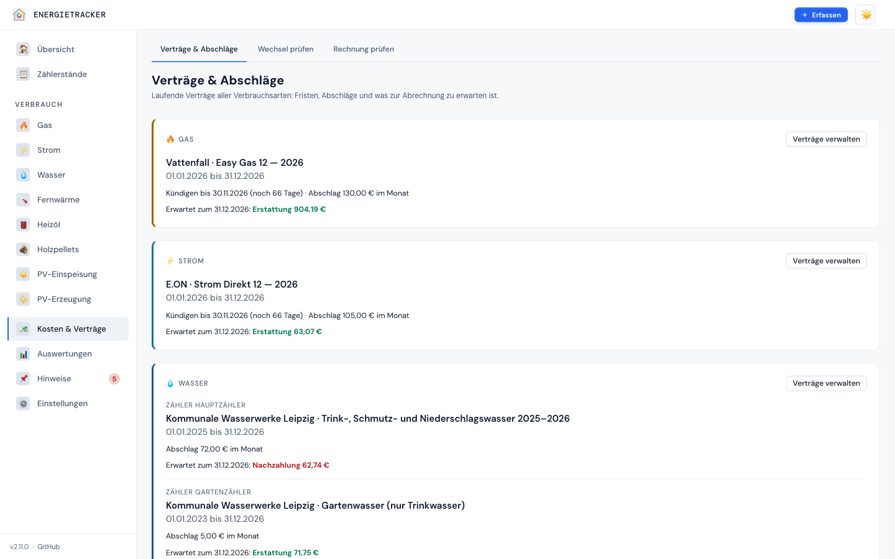

# UI-Referenz — Alle Ansichten

**Deutsch** · [English](../en/ui/01-views.md)

[← Kompendium-Index](../README.md)

> **Echte Screenshots.** Die folgenden Bilder sind **tatsächliche
> Bildschirmaufnahmen** der laufenden App mit dem mitgelieferten
> [Demo-Datensatz](../../demo-data/) (Light-Theme; Grundstock v1.9.2, Anmeldung,
> Sicherheitskarte und Rückfrage bei der Erfassung v2.6.0, Navigation v2.11.0). Wer sie
> selbst neu erzeugen will: Demo-Daten laden und die Views nacheinander
> aufnehmen — die App braucht dafür keinen Build-Schritt.

Die App ist eine Single-Page-Anwendung. Seit **v2.11.0** folgt die
Navigation den Fragen der Nutzer: sieben Bereiche statt 17 Einträgen.

| Bereich | Seiten |
|---|---|
| Übersicht | Kennzahlen, Tanks, Termine und Empfehlungen im Überblick |
| Zählerstände | alle Zähler in einem Durchgang |
| Verbrauch | eine Seite je aktive Verbrauchsart |
| Kosten & Verträge | Verträge & Abschläge · Wechsel prüfen · Rechnung prüfen |
| Auswertungen | Analyse · Prognose · Jahresbericht |
| Hinweise | Termine & Wartung · Empfehlungen (eine Zahl an der Seitenleiste) |
| Einstellungen | Allgemein · Wetterdaten |

Die Seiten eines Bereichs stehen als **Tabs** über der Ansicht. Menüname und
Seitentitel sind gleich, und der Tab des Browsers nennt die Ansicht. Frühere
Adressen (`#/tariffs`, `#/temperatures` …) bleiben gültig. Die Seitenleiste
zeigt nur die *aktiven* Verbrauchsarten (Einstellungen → Aktive
Verbrauchsarten) und folgt einer Änderung sofort.

**Mac:** Seitenleiste links. In der Kopfleiste steht **＋ Erfassen**:
Zählerstände, Lieferung und Peilstand bei Heizöl und Pellets, Termin.
Daneben der Umschalter für die Darstellung (wie das System, hell, dunkel).

**iPhone:** Unten liegt eine Tab-Leiste in der Daumenzone: Übersicht,
Verbrauch, **＋ Erfassen**, Kosten, Mehr.

- „Mehr" öffnet die Seitenleiste als Menü.
- Die Verbrauchsarten stehen auf ihrer Seite als Tabs.
- Dialoge erscheinen als Blatt von unten, Kopf- und Fußleiste stehen fest.
- Die Zurück-Geste schließt einen Dialog, statt die Seite zu verlassen.
- Tippziele sind mindestens 44 px groß, Eingaben 16 px; Safari zoomt dann
  nicht mehr bei jedem Fokus.
- Als Home-Bildschirm-App reicht die Seite bis unter Uhr und Home-Balken.

 

---

## 1. Übersicht (Dashboard)

Einstieg. 12-Monats-Kennzahlen je Art, Effizienzklasse **pro
Heizquelle**, Tank-Bestände (Öl/Pellets), **Strom-Saldo & Autarkie** bei
PV, kombinierter Verbrauchsverlauf (so viele Monate wie in den Einstellungen
unter *Monate auf Dashboard*, seit v2.9.0) und fällige Termine. Seit v2.10.0
steht unter der Effizienz die **energieausweis-nahe Kennzahl** (bei mehreren
Heizquellen für alle zusammen, Tooltip mit Bezugsfläche und Monaten); ein
unvollständiges Jahr bekommt keine Klasse, sondern einen Hinweis. Die
PV-Karte zeigt zusätzlich die **Ersparnis durch Eigenverbrauch** und, solange
weniger als zwölf Monate Daten aller drei Zähler haben, über wie viele Monate
die Quoten rechnen. Seit v2.7.0 steht
die Effizienzklasse nur in Ländern mit Skala (Deutschland); sonst zeigt die
Karte kWh/m²·a und nennt den Grund ([Länderprofile](../functional/14-laenderprofile.md)).
Seit v2.11.0 heißt ein fälliger Termin „seit 65 Tagen überfällig" statt
„jetzt". Die Kopf-Aktion „Temperaturen" entfällt; „Erfassen" steht global in
der Kopfleiste bzw. der Tab-Leiste.

---

## 2. Zählerstand-Erfassung (F1004)

Zentrale, mobil-freundliche Eingabemaske: alle aktiven kumulativen Zähler
(Gas/Strom/Wasser/Fernwärme/PV) mit jeweils dem letzten Stand als
Orientierung — ideal fürs monatliche Ablesen am Handy.

**Seit v2.6.0 mit Plausibilitätsprüfung:** Schon beim Tippen erscheint ein
Hinweis, wenn der neue Stand einen ungewöhnlichen Tagesverbrauch ergäbe
(mehr als das Dreifache des üblichen), kleiner als der letzte ist, in der
Zukunft liegt oder es für den Tag schon einen Stand gibt. Beim Speichern fragt
die App je auffälliger Karte nach (Titel: Verbrauchsart · Zähler); „Ersetzen"
aktualisiert den vorhandenen Stand statt einen zweiten anzulegen. Wer ablehnt,
behält die Eingabe, die Karte zeigt „Nicht gespeichert – bitte prüfen".
Details: [Zählerstände → Plausibilität](../functional/11-zaehlerstaende.md).

---

## 3. Verbrauchsansicht — kumulative Arten (Gas/Strom/Wasser/Fernwärme)

Pro Art identischer Aufbau: Jahr-Auswahl, Zähler-Auswahl, KPI-Leiste
(Verbrauch, Kosten, Abschläge mit Saldo der abgelesenen Monate, Tagesschnitt,
CO₂), Vertrags-/Saldo-Karte, Verbrauchschart mit Temperaturüberlagerung sowie
Monatstabelle mit gleitenden Mitteln (MA-3/MA-6) und Wetterbereinigung.

**Saldo-Karte (v2.8.0):** rechnet nach Kalender bis heute — „Verbraucht
(Stand heute)" zerlegt sich in Arbeitspreis und Grundpreis (abzüglich Boni),
darunter steht, bis wann gemessen und ab wann geschätzt ist. „Abschlag
bezahlt" zählt die Abschläge, wie sie abgebucht wurden. Weicht der erwartete
Saldo spürbar ab, schlägt die Karte einen Abschlag vor. Die KPI-Kacheln
summieren dagegen die abgelesenen Monate; liegt die letzte Ablesung im
laufenden Jahr zurück, heißt die Kachel „Abschläge bis ‹Datum›". Die Tabelle
**Verträge & Abschläge** führt je Vertrag Tarif, Abschlag, Verbraucht,
Bezahlt, Bonus, **Sonderzahlungen** (seit v2.5.1: Netto aus Kundensicht,
Einzelposten im Tooltip; nur bei Gas/Strom/Fernwärme) sowie Saldo heute
und erwarteten Saldo.

**Seit v2.9.0** rechnet die Karte tagesgenau: Ein Wechsel oder eine
Preisänderung zur Monatsmitte gilt ab ihrem Tag. Unter den Zahlen stehen
Hinweise, wenn sie zutreffen — der Vertrag ist abgelaufen und läuft ohne
Kündigung weiter (Status **VERLÄNGERT**, Enddatum = nächste Abrechnung), der
Kündigungsstichtag ist verpasst, oder eine eingetragene Preiserhöhung steht
bevor (in Deutschland mit dem Sonderkündigungsrecht nach § 41 Abs. 5 EnWG).
Das Banner „Ablesung überfällig" richtet sich nach der Einstellung
*Warnung nach* (Tage ohne Ablesung; Warnung ab ⅔, Alarm ab dem Wert).

**Unplausible Stände (v2.6.0):** Gibt es Ausreißer, einen fallenden Stand
ohne Zählertausch oder einen unbestätigten Verdacht aus Home Assistant, steht
oberhalb der Jahresauswahl ein Hinweis mit den betroffenen Ständen und einem
Link zum Zählertausch. In der Ablesetabelle tragen sie „PRÜFEN" bzw.
„UNPLAUSIBEL" (Tooltip mit der Begründung); einen Verdacht bestätigt ✅ —
erst dann zählt er. Der Ablese-Dialog stellt dieselben Rückfragen wie die
Zählerstand-Erfassung.

---

## 4. Verbrauchsansicht — lieferbasierte Arten (Heizöl/Pellets)

Statt Zählerständen: Tank-Karte und Lieferungstabelle (Datum, Menge, Preis,
Gesamt, Lieferant). Kein Vertrags-Bereich — die Tankrechnung ist die
Kostenbasis.

**Tankbuch (v2.10.0):** Die Tank-Karte zeigt Füllstand und den
**Bestandsverlauf** des gewählten Jahres — gerechnet durchgezogen, geschätzt
gestrichelt, bekannte Bestände als Punkte — und sagt darunter, bis wann aus
bekannten Beständen gerechnet ist. Hinweise erscheinen, wenn Stände nicht
zusammenpassen, der Tank rechnerisch leer ist oder noch keine Rechnung
möglich ist. Darunter die **Peilstände** mit „Peilstand erfassen" (Datum,
Stand, Notiz) und Löschen. Im Lieferdialog markiert **„Bis voll getankt"**
eine Lieferung als Stützstelle; die Tabelle zeigt sie mit „VOLL". Monate mit
geschätzten Tagen tragen in der Monatstabelle „≈"; die Spalte ct/kWh zeigt
den effektiven Preis.

---

## 5. Analyse (Heizsignatur)

HGT-Korrelations-Streudiagramm mit den Kurven **aller fünf** Modelle
(linear, polynomial, robust, segmentiert, sigmoid) und ihrem R²-Vergleich,
Jahresvergleich und Anomalien. Darüber stehen die Vertragserinnerungen in
drei Stufen; seit v2.9.0 nennen sie bei gepflegter Kündigungsfrist den
**Kündigungsstichtag** („Kündigung für … bis …, sonst läuft der Vertrag über
den … hinaus weiter"), sonst das Vertragsende.

Seit v2.8.0: Volle Punkte gehen in die Kurven ein, **hohle** sind eigene
Monate außerhalb des Fits (Teilmonat, zu wenig Heizgradtage oder Temperaturen),
**graue** liegen vor der Zäsur. Unter der Tabelle steht, dass R² die Anpassung
an die gezeigten Monate misst, keine Vorhersagegüte. Die Karte „Wirkung der
Maßnahme" sagt, ob der Unterschied vor/nach der Zäsur statistisch belegt ist,
mit 95-%-Bereich. Anomalien messen jeden Monat an seiner eigenen Erwartung
(Heizmodell bzw. derselbe Monat anderer Jahre). Bei Heizöl und Pellets steht
statt der Kurven ein Hinweis: Ihre Monatswerte sind nach Gradtagen verteilt.

---

## 6. Prognose

Modellauswahl (alle fünf), 12-Monats-Prognose als R²-gewichteter Blend
aus Regression und Saisonprofil, Kostenprognose mit Saldo offener
Verträge.

Seit v2.8.0 mit **Unsicherheitsband** (Bereich, in dem der Verbrauch in 80 %
der Jahre liegt) und einer Zeile zum Jahr („in 80 % der Jahre zwischen … und
…"). Darunter die Quelle der Heizgradtage (Klimanormal am Standort oder eigene
Historie) und Hinweise bei kurzer Historie. Die Spalte „Methode" sagt je
Monat, wie gerechnet wurde; Monate nach Vertragsende, in denen der letzte
Vertrag als Annahme weiterläuft, tragen ein Sternchen.

### Jahresbericht (seit v2.11.0 unter Auswertungen)

Ein Jahr als PDF: Übersicht je Verbrauchsart, Effizienz, Monatstabellen und
offene Empfehlungen. **Im Browser öffnen** zeigt das PDF in einem neuen Tab
(`yearly.pdf?inline=1`); in der Home-Bildschirm-App auf dem iPhone kam ein
Download oft nicht an. **Herunterladen** speichert es wie bisher. Bis v2.10
stand der Bericht in den Einstellungen.

---

## 7. Kosten & Verträge

### Verträge & Abschläge (v2.11.0)

Je Verbrauchsart und Zähler der laufende Vertrag:

- Anbieter, Tarif und Laufzeit bzw. „verlängert sich"
- **Kündigen bis** mit den verbleibenden Tagen, ab sechs Wochen vorher
  hervorgehoben; eine verpasste Frist in Rot
- der Abschlag je Monat
- was zur Abrechnung zu erwarten ist: Erstattung (grün) oder Nachzahlung
  (rot)

„Verträge verwalten" führt zur Vertragsliste der Verbrauchsart. Die Zahlen
kommen aus derselben Rechnung wie die Saldo-Karte der Verbrauchsart.

### Rechnung prüfen (Gas)

Bis v2.10 stand die Rechnungsprüfung am Ende der Gas-Seite, jetzt ist sie eine
Seite. Sie rechnet eine Gasrechnung nach: je Ablesung und Brennwertwechsel ein
Abschnitt mit m³ × Zustandszahl × Brennwert = kWh, wie die Zeilen der
Versorgerrechnung. Zähler und Zeitraum sind wählbar. Die Gas-Seite verweist
mit dem angezeigten Jahr hierher (`#/bill-check?meter=…&from=…&to=…`).

### Wechsel prüfen (Tarifvergleich)

Beantwortet die Frage, um die es im Energietracker geht: **Soll ich wechseln?**
Die Ansicht ist in zwei Blöcke geteilt, und die Reihenfolge ist Absicht.

#### Wechselentscheidung

Oben steht der **erwartete Jahresverbrauch** aus der Prognose — genau die Zahl,
die CHECK24, Verivox und andere Vergleichsportale als Eingabe verlangen. Sie
lässt sich mit einem Klick kopieren. Der Ablauf ist damit: Zahl mitnehmen,
draußen suchen, das gefundene Angebot als Schattenvertrag eintragen.

Eine Anbindung an Vergleichsportale gibt es bewusst nicht. Die Anwendung holt
keine Tarife von außen; der Nutzer trägt ein, was er gefunden hat.

Daneben steht der **Wechseltermin**. Er ergibt sich aus Vertragsende und
Kündigungsfrist; die Frist wird mit Restlaufzeit angezeigt und farblich
hervorgehoben, sobald es eng wird — sie ist das, was im Alltag verpasst wird.
Wer ein anderes Szenario durchrechnen will, setzt das Datum von Hand.

Maßgeblich ist dabei nicht der heute laufende Vertrag allein, sondern die
**Bindungskette**: Ist der Anschlussvertrag bereits abgeschlossen, ist der
Wechsel für die nächste Periode vollzogen, und der Termin richtet sich nach
dessen Ende. Die Ansicht weist einen solchen Anschluss ausdrücklich aus. Auch
die Vergleichsbasis folgt der Kette — jeder Monat rechnet mit dem Tarif, der
dann gilt, nicht mit dem des auslaufenden Vertrags. Eine Lücke von mehr als
einem Tag beendet die Kette; danach ist man frei.

Kündigungsfrist, Mindestlaufzeit und Preisgarantie werden **am Vertrag**
gepflegt (Vertragsverwaltung der jeweiligen Verbrauchsart). Ohne sie kann der
Vergleich keinen Termin errechnen und nicht vor einer ablaufenden Frist warnen.

Die Rangliste zeigt je Angebot:

| Spalte | Bedeutung |
|---|---|
| **1. Jahr** | Kosten der ersten zwölf Monate, Neukundenbonus bereits abgezogen |
| **ab 2. Jahr** | die dauerhaften Kosten, ohne einmalige Boni |
| **Differenz** | gegen den fortgeschriebenen Bestandsvertrag |
| **Lohnt ab** | der Jahresverbrauch, ab dem das Angebot den Bestandsvertrag schlägt |

**Sortiert wird nach „ab 2. Jahr".** Ein Lockangebot, das nur im ersten Jahr
billig ist, gewinnt die Rangfolge damit nicht — die Jahr-1-Zahl steht trotzdem
daneben, um sie mit der Portalanzeige abzugleichen.

Die Spalte **Lohnt ab** ist die ehrlichste Antwort auf eine unsichere Prognose.
Statt eine Ersparnis auf den Euro genau zu behaupten, nennt sie die Menge, ab
der die Rangfolge kippt: Liegt sie weit vom erwarteten Verbrauch weg, trägt die
Entscheidung auch dann, wenn die Prognose danebenliegt. Ergänzend steht unter
den Jahreskosten eine Spanne für ±10 % Verbrauch.

Das Diagramm legt die Angebote als Kostenverlauf **über** den Bestandsvertrag.
Monatlich statt als Jahressumme, weil man erst daran sieht, wo die Differenz
herkommt — bei Gas entsteht sie fast vollständig im Winter. Monate jenseits der
**Preisgarantie** werden gestrichelt gezeichnet: Dort ist der Preis eine
Annahme, keine Zusage.

Gerechnet wird über zwölf Monate ab Wechseltermin, saisonal gewichtet. Ein
Wechsel zum 1. Juli deckt damit trotzdem einen vollen Winter ab; eine
Zwölftelrechnung würde hier danebenliegen.

#### Rückblick auf echte Monate

Darunter, eingeklappt: dieselben Tarife auf den **tatsächlich gemessenen**
Verbrauch gelegt — „Was hätte Tarif X gekostet?". Das ist der Beleg. Wer sieht,
dass die Rechnung auf echten Daten aufgeht, glaubt auch der Prognose.

Echte Verträge beziehen sich auf **genau die Tage, die sie abdecken** —
das, was die Rechnung gebucht hat; Verträge mit kürzerer Laufzeit tragen ihre
Monatszahl als Marke und zusätzlich eine Hochrechnung auf die volle Periode.
**Schattenverträge gelten als Preisblatt für den ganzen Zeitraum** (seit
v2.9.0): Ein Angebot, das nur von April bis September eingetragen ist, sah
bisher billiger aus als dasselbe Angebot fürs ganze Jahr, weil ihm der Winter
fehlte.

Die Spalte **ct/Einheit** trägt die Vollkosten je kWh bzw. m³ — Arbeitspreis,
Grundpreis und Boni zusammen. Sie ist die einzige Größe, die von der Laufzeit
unabhängig ist, und damit der Maßstab für die Rangfolge. Verglichen werden
reine Tarifkosten; Abschläge und Sonderzahlungen sind Zahlungsströme gegen den
Saldo und bleiben außen vor (sie stehen in der Verbrauchsansicht).

#### Angebote pflegen

Ein Angebot wird mit den Feldern erfasst, die auf einem Portalergebnis
tatsächlich stehen: Arbeitspreis, Grundpreis, **Neukundenbonus als Betrag**
(nicht als Gutschriftsdatum — das kennt beim Anlegen niemand), Preisgarantie
und Kündigungsfrist. Als Startdatum ist der errechnete Wechseltermin
vorbelegt.

Angebote lassen sich anlegen, bearbeiten und löschen. In der Vertragsliste
tragen sie ein eigenes Kennzeichen, damit sie nicht mit einem laufenden
Vertrag verwechselt werden. Sie beeinflussen **weder Saldo noch Prognose noch
Vertragsstatus** — sie existieren nur für diesen Vergleich.

> **Wasser** bleibt ausgenommen: Das Drei-Komponenten-Modell (Trink-, Schmutz-
> und Niederschlagswasser) braucht eine eigene Rechnung. Heizöl und Pellets
> sind lieferbasiert — dort ist die Lieferrechnung die Kostenbasis.

---

## 8. Empfehlungen

Sieben statistische Regelfamilien (Mehrverbrauch-Trend, Sommer-Sockel,
Anomalie, Tank-Niveau, Vertragsende, Effizienz, …), nach Dringlichkeit
sortiert, einzeln ausblendbar. Rein datengetrieben, keine Werbung. Seit
v2.11.0 unter **Hinweise**; der Knopf heißt „30 Tage ausblenden" statt „✕".

---

## 9. Termine & Wartung

Wiederkehrende Termine (Heizungswartung, Schornsteinfeger,
Eichfristen — seit v2.9.0 mit eigener Kategorie für die Wärmezähler-Eichung). Fällige/überfällige erscheinen auf dem Dashboard; beim
Erledigen wird der nächste Termin gemäß Recurrence fortgeschrieben. Seit
v2.11.0 der erste Tab unter **Hinweise**; die Zahl an der Seitenleiste zählt
fällige Termine und offene Empfehlungen zusammen.

---

## 10. Wetterdaten (Einstellungen)

Seit v2.11.0 unter Einstellungen → Wetterdaten; die Adresse `#/temperatures`
bleibt. CSV-Import (Drag & Drop), Open-Meteo-Sync für den hinterlegten
Standort, Monatschart Min/Ø/Max. Grundlage jeder HGT-Auswertung. Seit v2.8.0
steht über dem Chart, bis wann Messwerte und ab wann Vorhersagen vorliegen;
die Option „Auch vorhandene ältere Werte durch Archivwerte ersetzen" räumt
Vorhersagen auf, die frühere Versionen wie Messwerte gespeichert haben. Mit
*Wetter automatisch füllen* (Einstellungen, Standard an) gleicht die App beim
Öffnen einmal am Tag selbst ab und lädt beim ersten Mal das Klimanormal. Steht der
Standort noch auf der Voreinstellung des Landes, sagt ein Hinweis das
(v2.7.0) — die Gradtagzahlen rechnen dann mit dem Wetter eines anderen Orts.

---

## 11. Einstellungen

Zwei Tabs seit v2.11.0: **Allgemein** und **Wetterdaten** (§10). Der
PDF-Jahresbericht ist nach Auswertungen gezogen; an seiner alten Stelle steht
ein Verweis. Nach Demo-Daten, Backup-Import oder Wiederherstellung startet die
App neu, damit Seitenleiste, Sprache und Zwischenspeicher zum neuen Stand
passen.

Oben die Karte **Sprache & Land** (v2.7.0): Sprache, Land, Währung und
Zeitzone, alle mit sofortiger Wirkung. Beim Wechsel des Landes zeigt ein
Dialog die Werte, die das Länderprofil ändern würde — bisher und neu
nebeneinander, mit der Quelle des CO₂-Faktors —, und bietet „Alle
übernehmen“, „Nur Land ändern“ oder „Abbrechen“. Bei den
Gas-Umrechnungsfaktoren lässt sich der Brennwert seit v2.7.0 in kWh/m³,
MJ/m³ oder GJ/Smc eingeben; für britische, italienische und niederländische
Rechnungen steht ein Hinweis dabei.

Seit v2.10.0: **CO₂-Faktoren** der Energieträger mit Quelle, alle je kWh
(Heizöl und Pellets waren mit g/L bzw. g/kg beschriftet, gerechnet wurde je
kWh; Wasser bleibt je m³ und ohne Quellenangabe), Strom
**je Jahr** als Tabelle; **Gebäude & Effizienz** mit *Beheizter Keller* und
*Warmwasser dezentral*. Trägt eine Installation noch die alten
Standardwerte, steht oben **„Neuere Standardwerte verfügbar"** mit bisher und
neu und dem Knopf „Neue Werte übernehmen". Ist nur der Standard-Gasfaktor
11,5 aktiv, weist die Gasfaktor-Tabelle darauf hin.

Alle Einstellungen gruppiert: Umrechnung & HGT, **Abrechnungszyklus
(TT-MM)**, Gebäude & Effizienz, Heizwerte, Prognosemodell, **Einbetten**
(seit v2.6.0: Adressen, die die App einbetten dürfen, etwa ein
Home-Assistant-Dashboard), aktive Verbrauchsarten, CSV-Export aller Arten,
Backup & Migration, Demo-Daten-Import (F1007), **🔐 Anmeldung & Zugriff**
(seit v2.6.0) und die **🏠 Home-Assistant-Anbindung (F1009)**
— API-Token verwalten, Zähler-Aliase pflegen und drei fertige Vorlagen
kopieren: REST-Command, Eintrag für die `secrets.yaml` und (seit v2.5.3) eine
Automatisierung aus den Aliasen, die vor jedem Push `has_value` prüft.
Zahlenfelder und Abrechnungsstichtage werden vor dem Speichern geprüft;
Fehler stehen rot am Feld.

**Backup & Restore (v2.6.0):** Ein Import wird erst vollständig geprüft und als
Vorschau gezeigt (was eingespielt wird, was mangels Inhalt unverändert bleibt);
ein fehlerhaftes Backup ändert nichts und nennt die Fundstellen. Darunter die
**gespeicherten Snapshots** mit Zeitpunkt, Anlass und Größe — herunterladen
(⬇️), einspielen (↩️, vorher sichert die App den jetzigen Stand) oder löschen.
Scheitert der Sicherungs-Snapshot, fragt die App, ob trotzdem eingespielt
werden soll.

**Anmeldung & Zugriff (v2.6.0):** zeigt den Modus (ohne Anmeldung, Passwort,
Proxy), schaltet die Passwort-Anmeldung ein, ändert das Passwort oder schaltet
sie wieder aus (mit dem bisherigen Passwort) und verwaltet **API-Schlüssel**
für Skripte (Lesen oder Verwalten, Klartext einmalig, zuletzt benutzt). Was per
Umgebungsvariable festgelegt ist, ist hier nur zu sehen. Die
Home-Assistant-Karte zeigt seit v2.6.0, wann zuletzt ein Wert mit dem Token
ankam, und warnt, wenn die Anmeldung an ist, aber kein Token existiert.

---

## 12. Zähler & Verträge — inkl. Topologie (F1006)

Zähler-/Geräteverwaltung inkl. Zählertausch (Device-Kette) und
Vertragspflege (Arbeits-/Grundpreis-Historie, Abschläge, Boni,
Sonderzahlungen). Seit v2.5.3 verlangt der **Zählertausch** den Endstand,
zeigt den letzten bekannten Stand und fasst den Tausch vor dem Ausführen
zusammen. Ein **Vertrag** braucht Anbieter oder Tarif und mindestens einen
Arbeitspreis; der Beginn ist mit dem Tag nach der laufenden Bindung vorbelegt,
und bevor ein neuer Vertrag einen laufenden ablöst, fragt die App nach. Seit
v2.9.0 nimmt die **Kündigungsfrist** Monate, Wochen oder Tage, dazu die
**Kündigungsweise** (automatisch, zum Vertragsende, jederzeit zum Monatsende,
jederzeit zu jedem Tag) und den Haken **„Verlängert sich ohne Kündigung"** —
herausnehmen, wenn gekündigt ist. Ein Zähler, bei dem *aktiv* abgewählt ist,
zählt weiter in allen Summen, verschwindet aber aus der Erfassung und aus den
Warnungen. Unter
den Arbeitspreisen eines Gasvertrags rechnet **„Preis je m³ umrechnen“**
(v2.7.0) einen Preis je m³ oder Smc in ct/kWh um und trägt ihn ein. Bei
Öl/Pellets ist hier nur die Tank-/Lagerverwaltung relevant — beim Anlegen
und Bearbeiten eines Tanks werden **Tank-Kapazität** und **Anfangsbestand**
erfasst (statt eines kumulativen Zählerstands), seit v2.10.0 optional der
**Preis des Anfangsbestands** (leer = Preis der ersten Lieferung). Ein
Stromzähler lässt sich als **Heizstrom (Wärmepumpe)** kennzeichnen — er zählt
dann in der Effizienzkennzahl. Bei kumulativen Zählern
lassen sich seit v2.6.0 die **Stellen des Zählwerks** pflegen — dann rechnet
die Auswertung einen Überlauf (99.999 → 0) richtig; die Gerätezeile zeigt
sie an.

**Meter-Topologie:** Subzähler werden unter ihrem Elternzähler eingerückt
dargestellt, Gruppen als aufklappbarer Sammeleintrag; ein **Merge-Wizard**
führt mehrere bestehende Zähler zu einer Gruppe zusammen. Pro Zähler lässt
sich hier auch der HA-Alias (`external_id`) setzen.

---

## 13. PV — Einspeisung & Erzeugung (F1005)

Eigene Ansicht für Photovoltaik: Einspeisezähler (Vergütung als Erlös),
Erzeugungszähler, **Strom-Saldo** (Netzbezug − Einspeisung) und
**Autarkiequote/Eigenverbrauch**. Seit v2.10.0 zeigt die Erzeugung
„Erzeugung" und vermiedenes CO₂ statt „Verbrauch" und Emission, ohne
Kostenkachel; im Tarifwechsel der Einspeisung steht die höhere Vergütung
vorn. PV-Verbrauchsarten haben keinen
Default-Zähler — wer keine Anlage hat, sieht keine Phantom-Zähler.

---

## 14. Anmeldung (v2.6.0, opt-in)

Nur bei eingeschalteter Anmeldung: ein schlichter Anmeldebildschirm mit
Passwortfeld und dem Hinweis, wie man bei vergessenem Passwort wieder
hereinkommt. Nach der Anmeldung bleibt der Browser 30 Tage angemeldet; die
Kopfleiste trägt dann einen Knopf **Abmelden** (er verwirft auch die
Offline-Daten dieses Browsers). Läuft eine Sitzung ab, erscheint der
Bildschirm statt einer Reihe von Fehlermeldungen. Einrichtung und Hintergründe:
[Sicherheit & Netzbetrieb](../technical/08-security.md).

**Offline-Hinweis:** Kommen Daten aus dem Offline-Speicher der installierten
App, zeigt die Kopfleiste „Offline – Stand vom …". Änderungen ohne Verbindung
meldet die App als „Keine Verbindung zum Energietracker – nichts gespeichert."

---

[← Kompendium-Index](../README.md)
