# UI-Referenz — Alle Ansichten

[← Kompendium-Index](../README.md)

> **Hinweis:** Die folgenden Bilder sind **schematische SVG-Mockups**,
> keine echten Pixel-Screenshots. Sie bilden Layout, Anordnung und
> Farblogik (reale CSS-Tokens) korrekt ab, sind aber von Hand gezeichnet.
> Echte Screenshots lassen sich lokal nach Anleitung in der
> [Installation](../technical/01-installation.md) erstellen.

Die App ist eine Single-Page-Anwendung mit fester **Topbar** (Logo,
Theme-Toggle) und einer **Sidebar**, die dynamisch aus den *aktiven*
Verbrauchsarten gebaut wird (Einstellungen → Aktive Verbrauchsarten).

---

## 1. Übersicht (Dashboard)

Einstieg. 12-Monats-Kennzahlen je Art, Effizienzklasse **pro
Heizquelle**, Tank-Bestände (Öl/Pellets), kombinierter
Verbrauchsverlauf, fällige Termine.

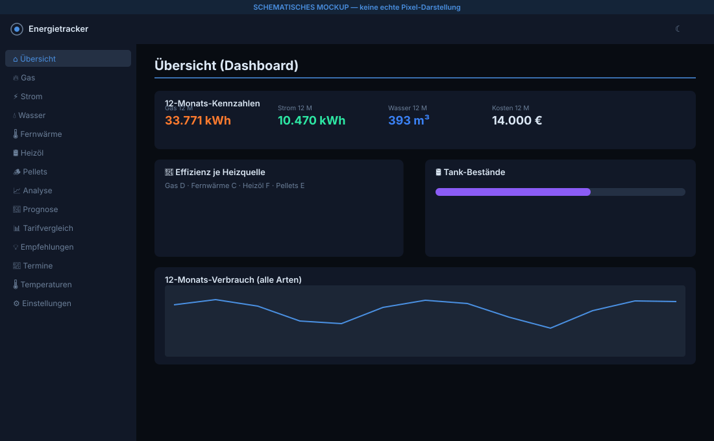

---

## 2. Verbrauchsansicht — kumulative Arten (Gas/Strom/Wasser/Fernwärme)

Pro Art identischer Aufbau: Jahr-Auswahl, Zähler-Auswahl, KPI-Leiste
(Verbrauch, Kosten, Saldo heute, erwarteter Saldo), Monatstabelle mit
gleitenden Mitteln (MA-3/MA-6) und Wetterbereinigung, Vertrags-/
Saldo-Karte.

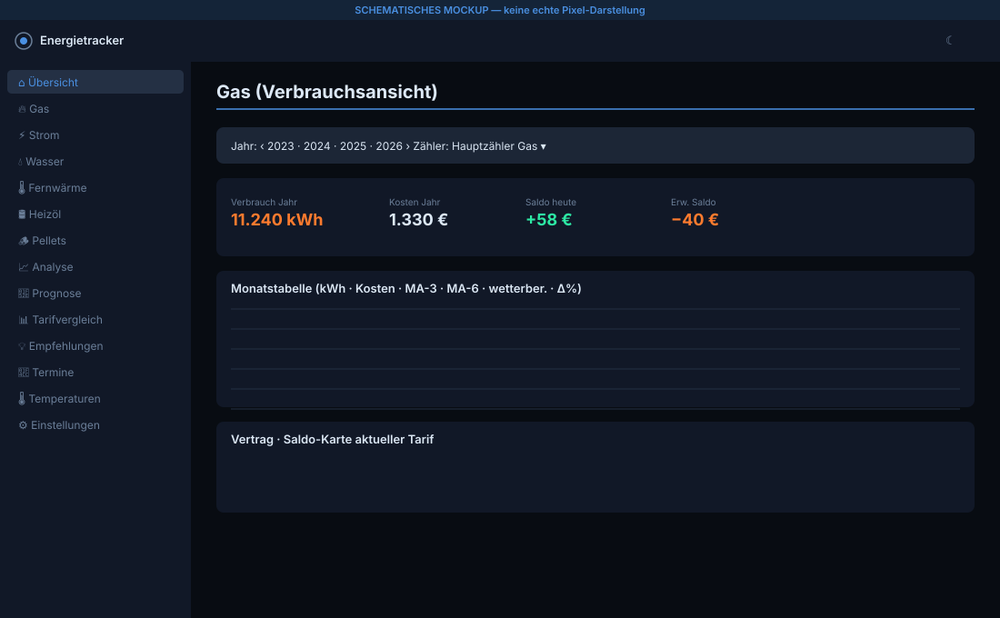

---

## 3. Verbrauchsansicht — lieferbasierte Arten (Heizöl/Pellets)

Statt Zählerständen: Tank-Bestandskurve (modelliert, kalibriert) und
Lieferungstabelle (Datum, Menge, Preis, Gesamt, Lieferant). Kein
Vertrags-Bereich — die Tankrechnung ist die Kostenbasis.

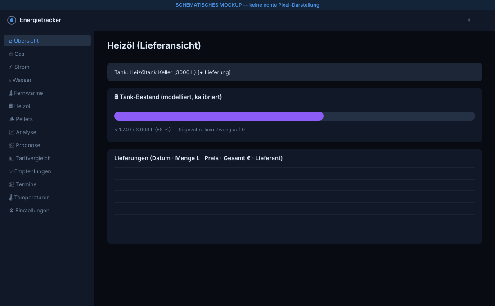

---

## 4. Analyse (Heizsignatur)

HGT-Korrelations-Streudiagramm mit Regressionsgerade, R²-Vergleich
**aller fünf** Modelle (linear, polynomial, robust, segmentiert,
sigmoid), Anomalien.

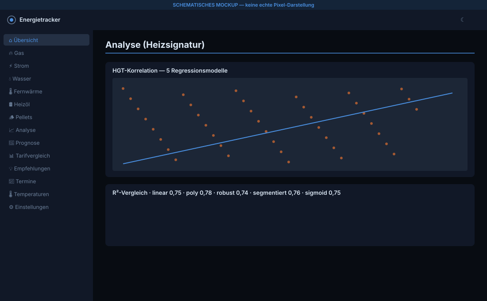

---

## 5. Prognose

Modellauswahl (alle fünf, seit v1.4.1 vollständig), 12-Monats-Prognose
als R²-gewichteter Blend aus Regression und Saisonprofil,
Kostenprognose mit Saldo offener Verträge.

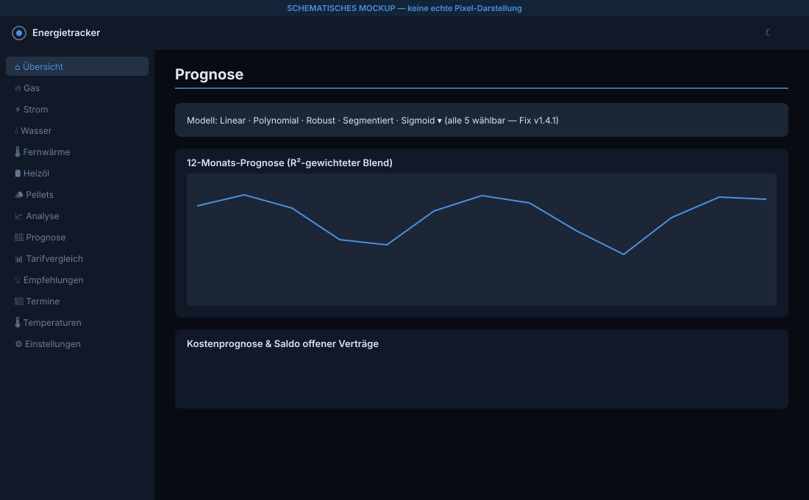

---

## 6. Tarifvergleich

Echte **und** Schattenverträge auf den Ist-Verbrauch gerechnet —
„Was hätte Tarif X gekostet?", ohne Saldo/Prognose zu verändern.

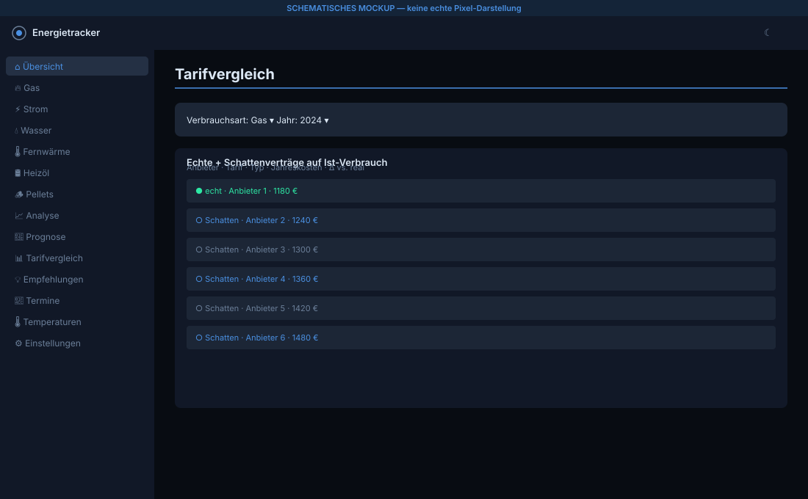

---

## 7. Empfehlungen

Sieben statistische Regelfamilien (Mehrverbrauch-Trend, Sommer-Sockel,
Anomalie, Tank-Niveau, Vertragsende, Effizienz, …), nach Dringlichkeit
sortiert, einzeln ausblendbar. Rein datengetrieben, keine Werbung.

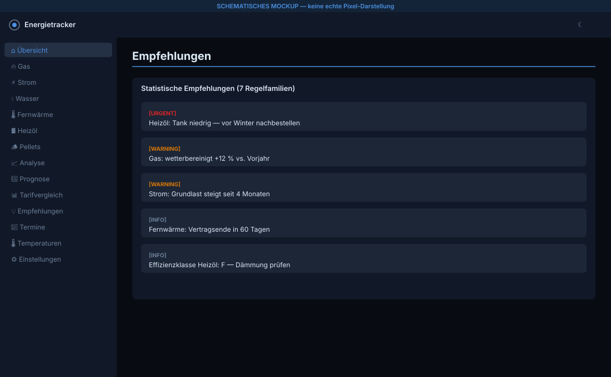

---

## 8. Termine & Wartung

Wiederkehrende Termine (Heizungswartung, Schornsteinfeger,
Eichfristen). Fällige/überfällige erscheinen auf dem Dashboard; beim
Erledigen wird der nächste Termin gemäß Recurrence fortgeschrieben.

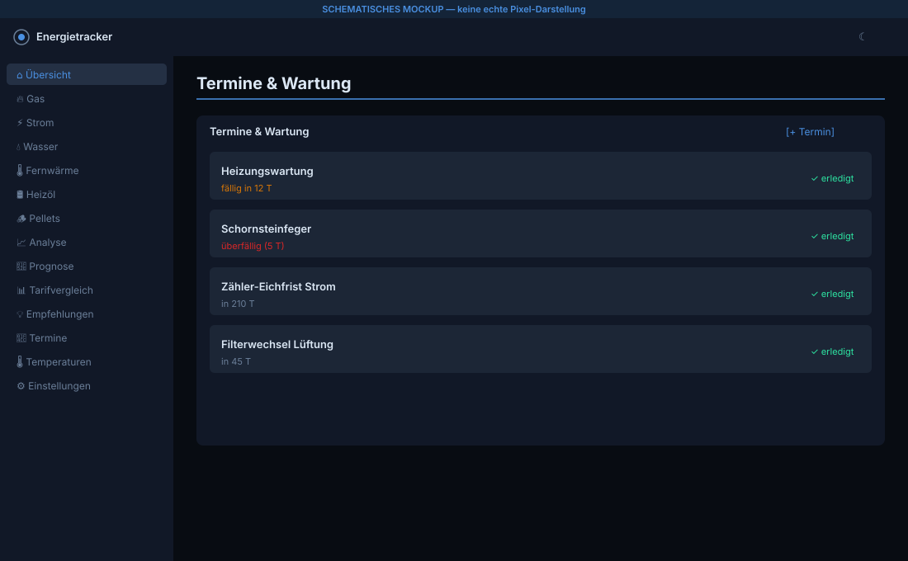

---

## 9. Temperaturen

CSV-Import (Drag & Drop), Open-Meteo-Sync für den hinterlegten
Standort, Monatschart Min/Ø/Max. Grundlage jeder HGT-Auswertung.

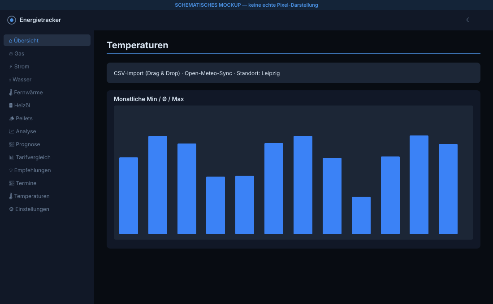

---

## 10. Einstellungen

Alle 40 Schlüssel gruppiert: Umrechnung & HGT, **Abrechnungszyklus
(TT-MM, Fix v1.4.2)**, Gebäude & Effizienz, Heizwerte, Prognosemodell,
aktive Verbrauchsarten, CSV-Export aller Arten, Backup & Migration,
Demo-Daten-Import (F1007) und die **🏠 Home-Assistant-Anbindung (F1009)**
— API-Token verwalten, Zähler-Aliase pflegen, fertiges HA-YAML kopieren.

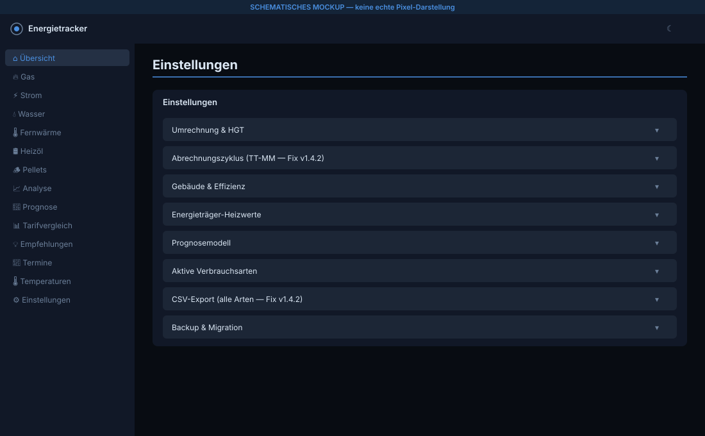

---

## 11. Zähler & Verträge

Zähler-/Geräteverwaltung inkl. Zählertausch (Device-Kette) und
Vertragspflege (Arbeits-/Grundpreis-Historie, Abschläge, Boni). Bei
Öl/Pellets ist hier nur die Tank-/Lagerverwaltung relevant.

**Meter-Topologie (F1006):** Subzähler werden unter ihrem Elternzähler
eingerückt dargestellt, Gruppen als aufklappbarer Sammeleintrag; ein
**Merge-Wizard** führt mehrere bestehende Zähler zu einer Gruppe
zusammen. Pro Zähler lässt sich hier auch der HA-Alias (`external_id`)
setzen.

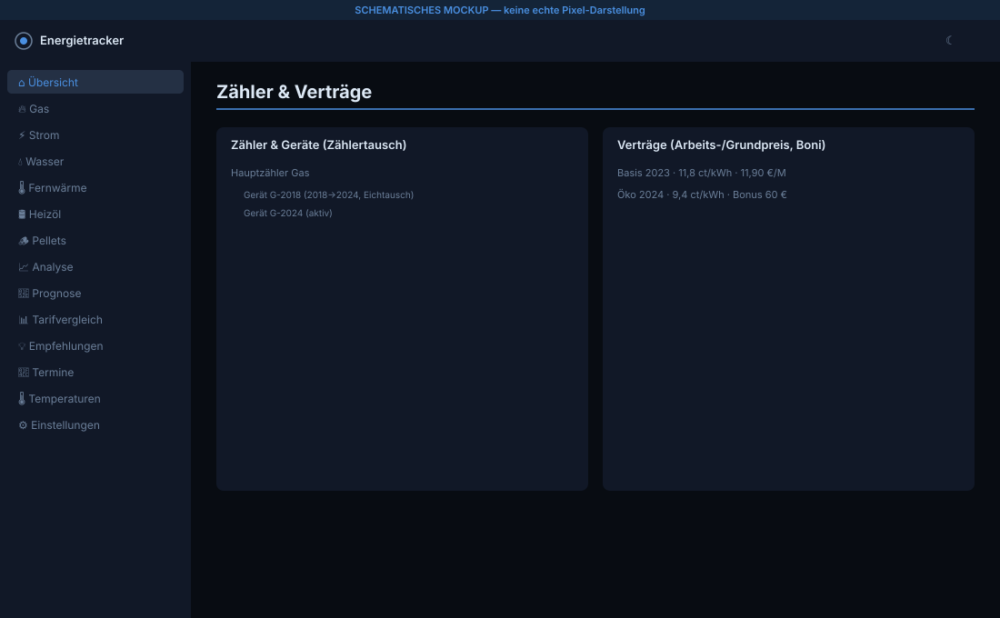

---

## 12. PV — Einspeisung & Erzeugung

Eigene Ansicht für Photovoltaik (F1005): Einspeisezähler (Vergütung als
Erlös), Erzeugungszähler, **Strom-Saldo** (Netzbezug − Einspeisung) und
**Autarkiequote/Eigenverbrauch**. PV-Verbrauchsarten haben keinen
Default-Zähler — wer keine Anlage hat, sieht keine Phantom-Zähler.

*(Für diese Ansicht liegt noch kein schematisches Mockup vor — der Aufbau
entspricht der kumulativen Verbrauchsansicht, ergänzt um Strom-Saldo- und
Autarkie-Kennzahlen. Fachliche Details: [PV](../functional/12-pv.md).)*

---

[← Kompendium-Index](../README.md)
